# Leveraging GANs to Generate Tabular Synthetic Data

[TOC]


# Executive Summary

## Project Definition

**What is the context?**

Advanced analytics is transforming all industries and is inherently data hungry. In health care data privacy rules detract data sharing for collaboration. Synthetic data, that retains the original characteristics and model compatible, can make data sharing easy and enable analytics for health care data.

**What is the need for change? Why now?**

Conventionally statistical methods have been used, but with limited success. Current deidentification techniques are not sufficient to mitigate re-identification risks. Emerging technologies in Deep Learning such as GAN are very promising to solve this problem.

**What ONE question, if answered, would solve the problem?**

How can you certify that the generated data is as similar and as useful as original data for the intended uses?

**What is the desired end use?**

- Derive insights
- Use for new product design
- Use for software quality improvement


# Introduction

Optum deals with sensitive healthcare data that has Personal identifiable Information (PII) of 100M+ people and it is expanding every day. The healthcare industry is particularly sensitive as Patient Identifiable Information data is strictly regulated by the Health Insurance Portability and Accountability Act (HIPPA) of 1996. Healthcare firms need to keep customer data secure while leveraging it to innovate research and drive growth in the firm. However, current data sharing practices (to ensure de-identification) have resulted in wait times for data access as long as 3 months. This has proved to be a hindrance to fast innovation at Optum. The need of the hour is to reduce the time for data access and enable innovation while protecting the information of patients. The key question to answer here is:


​                                       **"How can we safely and efficiently share healthcare data that is useful?"**

**Complication**

The key questions involve the inherent trade-off between safety and efficiency. With the inception of big data, efficiency in the data sharing process is of paramount importance. Availability and accessibility of data ensure rapid prototyping and lay down the path for quick innovation in the healthcare industry. Efficient data sharing also unlocks the full potential of analytics and data sciences through use cases like the diagnosis of cancer, predicting response for drug therapy, vaccine developments, drug discovery through bioinformatics. Apart from medical innovation, efficient data sharing helps to bridge the shortcomings in the healthcare system through salesforce effectiveness, managing supply chain and improve patient engagement. While efficient data sharing is crucial, the safety of patient's data can not be ignored. Existing regulations like HIPPA and recent privacy laws like the California Consumer Privacy Act are focused on maintaining the privacy of sensitive information. More advanced attacks are being organized by hackers and criminals aimed at accessing personal information. As per IBM's report on cost data breaches, the cost per record is ~$150. But the goodwill and trust lost by the companies, cannot be quantified So, the balance between data sharing and privacy is tricky.

# History of the Project

Existing de-identification techniques involve two main techniques 1) Anonymization Techniques 2) Differential Privacy. Almost every firm relies on these techniques to deal with sensitive information in PII data. These techniques have proven to be successful in the past and thus act as low hanging fruit for any organization.

1. Anonymization techniques: These techniques try to remove the columns which contain sensitive information. Methods include deleting columns, masking elements, quasi-identifiers, k-anonymity, l-diversity, and t-closeness.

2. Differential privacy: This is a perturbation technique which adds noise to columns which introduce randomness to data and thus maintain privacy. It is a mechanism to help to maximize the aggregate utility of databases ensuring high levels of privacy for the participants by striking a balance between utility and privacy.

However, these techniques are not cutting edge when it comes to maintaining privacy and data sharing. Rocher et al have proven that 99.98 percent of Americans (in a sample size of the population of Massachusetts) would be correctly re-identified in any dataset using as few as 15 demographic attributes. They conclude that "even heavily sampled anonymized datasets are unlikely to satisfy the modern standards for anonymization set forth by GDPR and seriously challenge the technical and legal adequacy of the de-identification release-and-forget model.

**Proposition**

Currently, the field of AI which is being given a lot of importance is Deep Learning. It addresses the critical aspect of data science in this age through universality theorem (identifying function form) and representation learning (correct features). Of late, generative modeling has seen a rise in popularity. In particular, a relatively recent model called Generative Adversarial Networks or GANs introduced by Ian Goodfellow et al. shows promise in producing realistic samples. While this is a state-of-the-art deep learning models to generate new synthetic data, there are few challenges which we need to overcome.

| Salient Features                                         | Challenges                                                   |
| -------------------------------------------------------- | ------------------------------------------------------------ |
| Neural Network is cutting edge algorithm in industry     | Trained to solve one specific task, can it fit all use cases? |
| Generate image using CNN architecture                    | Can we generate table from relational databases?             |
| Generate fake images of human faces that looks realistic | Would it balance the trade-off between maintaining utility and privacy of data |
| Requires high computational infrastructure like GPUs     | How to implement GAN for big data?                           |

# Methodology

In order to validate the efficacy of GANs to serve our purpose, we propose a methodology for thorough evaluation of synthetic data generated by GANs.


## Synthetic Data Generation

This method is the state of the art in reducing the reidentification risk. As we observed earlier, Data anonymization if effective but reduces the utility, Differential privacy adds small noise but has very bad model compatibility. However, Synthetic data, can be tuned to add privacy without losing either the utility, neither exposing privacy of individual data points.  As the  data doesn't represent any real entity, the disclosure of sensitive private data is eliminated. If the information available in the released synthetic data matches with any real entity participated in the original data then it is purely a co-incidence which gives individuals plausible deniability

A synthetic dataset is a repository of data that is generated programmatically.

- It can be numerical, binary, or categorical (ordinal or non-ordinal),
- The **number of features and length of the dataset** should be arbitrary
- It should preferably be **random** and the user should be able to choose a wide variety of **statistical distribution** to base this data upon i.e. the underlying **random process can be precisely controlled and tuned**,
- If it is used for classification algorithms, then the **degree of class separation** should be controllable to make the learning problem easy or hard
- Random noise can be interjected in a controllable manner
- For a regression problem, a complex, **non-linear generative process** can be used for sourcing the data


## Statistical Similarity

The team has to make sure that the generated datasets are statistically similar to the original data to preserve its utility. The generated dataset should have minimal loss when compared to the original data. For both categorical and continuous value columns, the algorithms should be robust enough to not only preserve the multimodal distribution for individual columns, but also the joint distribution of the columns. the algorithm should detect intricate relationships between columns and preserve them in the generated synthetic data working equally well on balanced as well as imbalanced datasets.

We will be evaluating the datasets as follows:

**Descriptive Statistics**

+ Central Tendencies (Mean, Median and Mode)
+ Standard Deviation
+ Skewness
+ Kurtosis
+ Unique Values

**Principle Component Analysis**

Principal Component Analysis or PCA is a linear feature extraction technique. It performs a linear mapping of the data to a lower-dimensional space in such a way that the variance of the data in the low-dimensional representation is maximized. It does so by calculating the eigenvectors from the covariance matrix. The eigenvectors that correspond to the largest eigenvalues (the principal components) are used to reconstruct a significant fraction of the variance of the original data.

In simpler terms, PCA combines your input features in a specific way that you can drop the least important feature while still retaining the most valuable parts of all of the features. As an added benefit, each of the new features or components created after PCA are all independent of one another.

**t-Distributed Stochastic Neighbor Embedding (t-SNE)**

t-Distributed Stochastic Neighbor Embedding (t-SNE) is a non-linear technique for dimensionality reduction that is particularly well suited for the visualization of high-dimensional datasets. It is extensively applied in image processing, NLP, genomic data and speech processing. To keep things simple, here’s a brief overview of working of t-SNE

- The algorithms starts by calculating the probability of similarity of points in high-dimensional space and calculating the probability of similarity of points in the corresponding low-dimensional space. The similarity of points is calculated as the conditional probability that a point A would choose point B as its neighbor if neighbors were picked in proportion to their probability density under a Gaussian (normal distribution) centered at A.
- It then tries to minimize the difference between these conditional probabilities (or similarities) in higher-dimensional and lower-dimensional space for a perfect representation of data points in lower-dimensional space.
- To measure the minimization of the sum of difference of conditional probability t-SNE minimizes the sum of [Kullback-Leibler divergence](https://en.wikipedia.org/wiki/Kullback–Leibler_divergence) of overall data points using a gradient descent method.

**Note**: Kullback-Leibler divergence or KL divergence is is a measure of how one probability distribution diverges from a second, expected probability distribution.

In simpler terms, t-Distributed stochastic neighbor embedding (t-SNE) minimizes the divergence between two distributions: a distribution that measures pairwise similarities of the input objects and a distribution that measures pairwise similarities of the corresponding low-dimensional points in the embedding.

In this way, t-SNE maps the multi-dimensional data to a lower dimensional space and attempts to find patterns in the data by identifying observed clusters based on similarity of data points with multiple features. However, after this process, the input features are no longer identifiable, and you cannot make any inference based only on the output of t-SNE. Hence it is mainly a data exploration and visualization technique.

**PCA vs t-SNE**

Although both PCA and t-SNE have their own advantages and disadvantages, some key differences between PCA and t-SNE can be noted as follows:

- t-SNE is computationally expensive and can take several hours on million-sample datasets where PCA will finish in seconds or minutes.
- PCA it is a mathematical technique, but t-SNE is a probabilistic one.
- Linear dimensionality reduction algorithms, like PCA, concentrate on placing dissimilar data points far apart in a lower dimension representation. But in order to represent high dimension data on low dimension, non-linear manifold, it is essential that similar data points must be represented close together, which is something t-SNE does not PCA.
- Sometimes in t-SNE different runs with the same hyperparameters may produce different results hence multiple plots must be observed before making any assessment with t-SNE, while this is not the case with PCA.
- Since PCA is a linear algorithm, it will not be able to interpret the complex polynomial relationship between features while t-SNE is made to capture exactly that.

Below Diagram provides a more detailed approach to the methodology outlined above.

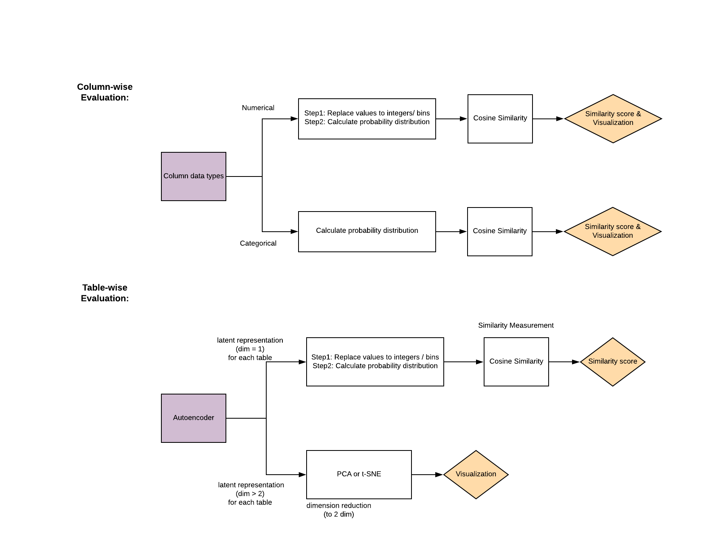


## Model Compatibility

1. #### Overview

   The synthetic data generated by GAN algorithms can be shared with internal business, academic researchers and third parties to tackle business problems. These stakeholders can then use machine learning algorithms on synthetic data to perform future predictions and create strategies as per their needs. In order to serve these needs, the synthetic data generated should have the same utlity as the original data and provide fairly similar prediction if not exactly same. Thus, it's crucial to evaluate if models generated using synthetic data are compatibile with original data? In this module, we will build different machine learning algorithms on 2 different use cases; a) Length of Stay b) Mortality prediction. The description of use cases can be found under <b> Use cases</b> section. These use cases are selected to evaluate both regression and classification models.

   #### Methodology

   1. <b> One hot encoding (optional): </b> In case there are any categorical variables required for prediction, we first need to perform one hot encoding. This is done to make sure we don't miss out any categories in test dataset after splitting data into train and test. Example, in case of ethnicity column, there are multiple types like White, Hispanic, Asian, African etc. If we split data into train and test before performing one hot encoding, then there are chances that no Hispanic is present in test data and only present in train data. This can lead to problems while evaluating accuracy of models.
   2. <b> Split data into train and test: </b> The analytical data set generated as per the use cases is first split into 2 parts i.e. train and test in the ratio of 80:20. While splitting data set, stratified sampling is performed using the dependent / target variable, duration of stay in use case 1 (length of stay) and expiry flag in use case 2 (mortality prediction).
   3. <b> Generate Synthetic Data: </b> Train dataset is used as an input to GAN algorithms to generate synthetic data of same name of rows. We generated synthetic data using TGAN and CTGAN which was then used to build models.
   4. <b> Standarize variables (optional): </b> Numerical variables are present on different scales and some variables cna influence the prediction results more than others. Example, Age and Salary are both numeric variables however, range of salary is much bigger than range of age and thus can impact the prediction results. In order to account for this, we standardized all variables with mean 0 and standard deviation 1. This is same as z-score formula.
   5. <b> Model building: </b> Using original train data and synthetic train data (generated by GAN algorithm). For use case 1 (Length of Stay), we used regression algorithms like Regression Tree, Random Forest, XGBoost, Support Vector Machine and K-Nearest Neighbor. For use case 2 (Mortality Prediction), we used classification algrotihms like Logistic Regression, XGBoost and Neural Network. Variety in use cases allows us to evaluate performance of synthetic data on various machine learning algorithms. In classification, due to imbalanced class of target variable, we used parameters within algorithms to assign appropriate weightage to each class.
   6. <b> Hyperparameter tuning: </b> 5-fold cross validation is performed along with grid search to perform hyperparameter tuning and selected best combination to improve the models. The metrics to evaluate can be different for different use case example, for mortality prediction, focus is on recall because we want to make sure we predict the patients who are going to die and take actions to save lives.
   7. <b> Prediction: </b> Finally, test data is used for prediction based on models generated and range of metrics were reported to compare performance. For classification, metrics like accuracy, precision, recall, f1-score and AUC-ROC. For regression, metrics like Mean Squared Error, Root Mean Squared Error, Mean Absolute Error, Mean Absolute Percentage Error.


Above image gives us a better idea of the overall process we are going to follow here.

- With the existing data Sources, the team will formulate analytical datasets common use cases with the data such as
  - Predicting length of stay in the ICU
  - Predicting Hospitality Mortality Rate
- These datasets will be run through various machine learning algorithms ranging from simple, ensemble to Neural networks to evaluate their performance on holdout data to compare their usefulness in real world usage

## Reidentification Risk

Along with Statistical similarity and Model compatibility, we need to ensure to minimize reidentification risk for the data points. Current anonymization techniques directly mask user demographics information to protect privacy, but bad actors can still join this data with other databases to identify individuals.

Original data has the best utility but as we mask more and more demographics information for privacy and regulatory reasons, the information provided by the dataset decreases. This in turn slows down research and development which could've potentially saved lives.

Sone of the current industry practices to prevent reidentification include:

**Data Anonymization**
Data anonymization means directly masking the important demographic and personally identifiable attributes from the dataset. Few techniques include:

1. **Removal:** This process involves removing entire fields of data to reduce the risk of linking it to any source.

2. **Redaction:** This is used in many forms of government communication. It’s a simple form of removing sensitive information – someone will print out a hard copy of a document and manually mark out sensitive or identifying information before passing it off to another party.

3. **Encryption:** For the most security, data anonymization isn’t meant to be able to be reversed, but some people and organizations still use encryption as their means of anonymization. Encryption uses technology to render sensitive information as unreadable or unintelligible and can only be read after application of a decryption key, which must be kept separate from the encrypted files. Because there is a decryption key at all, however, there is a higher risk of potentially exposing or accessing sensitive information.


## Privacy Risk

Data breaches have been on the rise. United Healthcare / Optum deals with the PII (personally-identifiable information) of about 100M patients**. Hence there is a need to ensure that the data shared with the analyst working under does not jeopardize the privacy.

The solution to generate synthetic data has been gaining great traction, but it is still at a nascent stage in terms of research and deployment. A common problem is the idea of coming up with metrics that define the level of privacy achieved in a synthetic dataset, that are easily explainable.

### Common Options to reduce Privacy Risk

#### **Reduce the number of columns by removing identifier columns:**

Risks: Very common columns like SSN or Patient ID which are unique to a record need to be removed and these definitely reduce the Privacy Risk dramatically as they can be used to join with external tables and mine information. But in practice, these identifier information are not very useful in the use cases for Optum’s research initiatives. The question then becomes - what other columns do we need to drop in order to reduce our Privacy Risk? There is no way to measure which columns make a dataset sensitive.

#### **Reduce the number of rows:**

Risks: We still do not have a quantifiable metric to say how much of Privacy Risk was reduced. The larger risk here is that we arbitrarily remove a fraction of the dataset, this might lead to the dataset becoming less useful. We need to remove rows in a way that retains the usefulness of data, while reducing the risk. Note that every single datapoint that is retained is 100% exposed and can be used by bad actors to mine information (by joining with external tables)

#### **Synthesize new data that resembles original data**

Risks: There is a potential that our synthetic data generation tool presents data that is still relatively close or 100% similar to our original data points if we try to maximize the utility of the dataset too much. We need a metric to still quantify the risk that we accept in these scenarios.

The goal of this whitepaper is to define how Optum can define the Privacy Risk in a synthetically created medical dataset. We would like to walk through a new metric - **‘Privacy At Risk (PaR)’**, how it can be used to define risk in multiple situations, and how PaR values can be used to effectively assess situations and enable quicker data-sharing practices within Optum.

### Privacy At Risk (PaR) Metric

We are predominantly concerned about bad actors being able to join our datasets with the synthetic dataset with outside information to gain access to our PII information. Hence, if there is an opportunity to confuse the bad actor in a way they cannot link a synthetic datapoint to an original datapoint, that is the ideal scenario for us.

**The PaR Metric works** by leveraging this idea of confusion. How many data points in our set can be confused for with other people/other records? The higher the confusion, the lesser the chance of a person being re-identified. The focus is primarily on whether including a certain record increases the chance of exposing a person/record and the degree of the exposure.

The Synthetic Data Generation process by itself brings in noise into the data, in a way that maximizes utility while also minimizing the chances of data looking like the original data (hence increasing the confusion aspect)

But there is still a possibility of the synthetic data presenting exact clones of the original data points when overfitted while modelling. We need to be able to catch the situations

But what about situations where a synthetic datapoint is x% similar? (x: 0-99). The problem with this approach would mean we need to set thresholds pertaining to every situation. We overcome this problem by bringing the problem down to a relative scale within the dataset, by comparing External and Internal Similarity to assess the level of confusion as a binary variable.

#### External Similarity[¶](#External-Similarity)

For every datapoint in the original dataset, we would like to see how similar data points in the synthetic dataset are using distance/similarity metrics. For our analysis, we primarily use Euclidean distance after one-hot encoding.

For every data point in the Original Dataset, we need to look at what records in the synthetic dataset are the most similar. This is the idea of ‘External Similarity’.

Let’s say for Person A in Original Dataset: Record 1 in synthetic dataset is 100% similar. This means that our synthetic data generation process has been practically useless for this user’s privacy. The bad actor can still completely leverage the information in the synthetic data to find this user and mine information.


But we can observe Record 3 is only 5% similar, the chances of a bad actor using Record 3 to find Person A is extremely low.

But let’s now look at Record 3. We have an 80% similarity. Intuitively we may think this record is risky for us. But how do we draw a threshold to say what constitutes a risky data point and not? Is it really a risky data point, rather?


In this example you can see that although Person A is 80% similar with Record 2; We can also note that Person A is 90% similar to Person D. This is the idea of ‘Internal Similarity’

What this essentially means is there is a higher chance of connecting Person A with Person B rather than connecting Person A with the synthetic Record 3.

Let’s now look at the counter-scenario:


Now we can see the closest resemblance to A inside the Original Dataset is D again, but they are only 10% similar. So that means Person A is already a stand-out unique record. On top of this, our Synthetic Dataset Record 2 is now 80% similar. So when a bad actor gets access to Record 2, there is a high chance they can connect it with Person A and nobody else without any confusion. We need to avoid these scenarios.

*Summarizing,*

- Internal Similarity > External Similarity : Ideal Data Point for us; Bad actors cannot attribute a data point to a single person/original record.
- External Similarity > Internal Similarity: Risky Data Point for us; The record in synthetic dataset is so unique that the synthetic data record can only point to one user record and hence increases the privacy risk of that data point.
- Hence Privacy Risk = Number of Risky Points / (Number of Ideal Points + Number of Risky Points)

**PaR is a conservative metric**

A Privacy at Risk value of 6% does not mean 6% of the records are exposed to bad actors. It only means that there is a higher potential of a bad actor trying to interpret the synthetic information to a real record/person with 6% of the records. The inherent assumption here is that all the records in the original dataset are potentially vulnerable.

### Distance / Similarity Metrics

Determining which synthetic data records are similar to the original dataset

#### **1. Personal Information Dataset: A dataset that consists of one row per person**

In this case, one record constitutes a single real person (as in our examples) and one person has only one record in the table.

We use our synthetic data generation techniques to come up with an equal number of *'fake'* people for the synthetic dataset.

So the question becomes : Which of the fake people's information can be used to connect back to the original person and mine their information? Hence we need to find out how similar are original person information these fake people.

We compute similarity using Distance Metrics in this analysis.

There are a number of Distance Metrics to choose from - Euclidean, Manhattan, Gower Distance (which can handle categorical and continuous variables) and so on - but for our analysis, we prefer to use the simple Euclidean distance after one-hot encoding the data.

A lower value of Euclidean Distance means a higher degree of similarity and vice versa.


We go about computing the distance between every single datapoint in the Original Dataset with every other point in the Synthetic Dataset.

These are all the **External Distances** we obtain as a matrix of size: Length of Original Dataset x Length of Synthetic Dataset

We also need to compute the Internal Distances so that we can compare the External Distance vs Internal Distance for every real Person in the dataset.

**Internal Distances** matrix of size: Length of Original Dataset x Length of Original Dataset

A note: Normalization is extremely important here

#### Closest Person (Record) Matters here

We only wish to look at the closest/most similar records given a real person in the Original Dataset. The way bad actors can obtain information about this real person is by leveraging a very similar looking record and connect it to a real person's information outside.

But defining 'close' is subjective. A simple approach would be to use n=1 ie. only look at the closest person in the synthetic dataset (External Similarity), and the closest other person in the original dataset (Internal Similarity)

There's always an option to extend this into a radius of close people. By setting n=5, we can always look at the closest 5 people in Original and Synthetic datasets to achieve an idea of how close are records on average.


#### Feature Sensitivity - Weighted Distance Metrics

Distance metrics, by default, may not account for domain knowledge about what defines similarity. Hence, a weighted distance metric might yield better results for a defined problem, given domain knowledge.

In our scenario, we are dealing with Mortality information of Patients in ICU Wards. We know that information like Gender, Ethnicity and Age can often be used to join with External Datasets and mine patient's personally identifiable information.

Hence, we might modify the Euclidean Distance to add a lower weight for features of Gender, Age and Ethnicity. When we add lower weights for highly sensitive fields, we report higher similarity and we will be better able to catch risky situations often.


### 2. Multiple Records per User (Patient Journey Scenario)

This case will be dealt with differently with respect to Internal Similarity.

In this scenario, when we compare a single record with every other record in the same Original Dataset - we are not really answering the question of whether there is another person who really resembles this person/record. The problem here is each person might have multiple records. Hence when we compute Internal Similarity, we may end up finding 'similar people' always when those are all records belonging to the same person.

Hence the solution is to only look at records belonging to other users / patients in our use case. We use the Patient ID information to determine which records belong to which user. Hence:

***Internal Similarity is the distance of a given datapoint to every other datapoint belonging to a different user.\***


# Why GANs?

## Introduction

A generative adversarial network (GAN) is a class of machine learning systems invented by **Ian Goodfellow** in 2014. GAN uses algorithmic architectures that use two neural networks, pitting one against the other (thus the “adversarial”) in order to generate new, synthetic instances of data that can pass for real data.


GANs consist of Two neural networks contest with each other in a game. Given a training set, this technique learns to generate new data with the same statistics as the training set. The two Neural Networks are named Generator and a Discriminator.

## GAN Working Overview

**Generator**
The generator is a neural network that models a transform function. It takes as input a simple random variable and must return, once trained, a random variable that follows the targeted distribution. The generator randomly feeds actual image and generated images to the Discriminator. The generator starts with Generating random noise and changes its outputs as per the Discriminator. If the Discriminator is successfully able to identify that generate input is fake, then then its weights are adjusted to reduce the error.

**Discriminator**
The Discriminators job is to determine if the data fed by the generator is real or fake. The discriminator is first trained on real data, so that it can identify it to acceptable accuracy. If the Discriminator is not trained properly, then it in turn will not be accurately able to identify fake images thus poorly training the Generator.

This is continued for multiple iterations till the discriminator can identify the real/fake images purely by chance only.

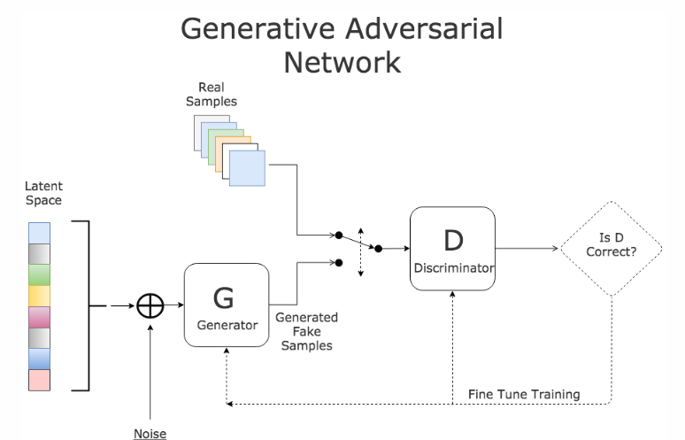

- **Algorithm:**
  Now lets see how GANs algorithm works internally.

- - The generator randomly feeds real data mixed with generated fake data for the discriminator
  - To begin, in first few iterations, the generator produces random noise which the discriminator is very good at detecting that the produced image is fake.
  - Every iteration, the discriminator catches a generated image as fake, the generator readjusts its weights to improve itself. much like the Gradient Descent algorithm
  - Over time, after multiple iterations, the generator becomes very good at producing images which can now fool the discriminator and pass as real ones.
  - Now, its discriminators turn to improve its detection algorithm by adjusting its network weights.
  - This game continues till a point where the discriminator is unable to distinguish a real image from      fake and can only guess by chance.


# Existing Research in Synthetic Data Generation

## TGAN

This methodology has been created from the work provided in this paper:<br>
[Synthesizing Tabular Data using Generative Adversarial Networks](https://arxiv.org/pdf/1811.11264.pdf)<br><br>
and this python package<br>
[https://pypi.org/project/tgan/](https://pypi.org/project/tgan/)

Generative adversarial networks (GANs) implicitly learn the probability distribution of a dataset and can draw samples from the distribution. Tabular GAN (TGAN) is a  a generative adversarial network which can generate tabular databy learning distribution of the existing training datasets and can generate samples which are . Using the power of deep neural networks.

TGAN focuses on generating tabular data with mixed variable types (multinomial/discrete and continuous) and propose TGAN. To achieve this, we use LSTM with attention in order to generate data column by column. To asses, we first statistically evaluate the synthetic data generated by TGAN.

The paper also evaluates Machine learning models performance against traditional methods like modelling a multivariate probability or randomization based models.

### Data preparation

For a table containing discrete and continuous random variables, They follow some probability distribution. Each row in the table is a sample from this distribution, whihch is sampled independently and the algorithms learn a generative model such that samples generated from this model can satisfy two conditions:<br>
+ A Machine Learning model using the Synthetic table achieves similar accuracy on the test table
+ Mutual information between an arbitrary pait of variables is similar

**Numerical Variables**<br>
For the model to learn the data effectively, a reversible transformation is applied. The a numerical variables are converted into a scalar in the range (1, 1) and a multinomial distribution, and convert a discrete variable into a multinomial distribution.

Often, numerical variables in tabular datasets follows multimodal distribution. [Gaussian Kernal density estimation](https://jakevdp.github.io/PythonDataScienceHandbook/05.13-kernel-density-estimation.html) is used to estimate these number of noes in the continuous variable. To sample values from these, a [gaussian mixture model](https://scikit-learn.org/stable/modules/mixture.html) is used.

**Categorical Variables** - Improvement needed <br>
categorical variables are directly converted to to one-hot-encoding representation and add noise to binary variables

In TGAN, the the discriminator D tries to distinguish whether the data is from the real distribution, while the generator G generates synthetic data and tries to fool the discriminator. the algorithm uses a Long Short Term Memory(LSTM) as generator and a Multi Layer Perceptron (MLP) as a discriminator.

### Implementation


```python
import warnings
warnings.filterwarnings('ignore')

import pandas as pd
import tensorflow as tf
from tgan.model import TGANModel
from tgan.data import load_demo_data
```


```python
def tgan_run(data, cont_columns):
    tgan = TGANModel(continuous_columns)
    return tgan.fit(data)

def tgan_samples(model, num_samples):
    return tgan.sample(100000)
```

### Results


## CTGAN

CTGAN is a GAN-based method to model tabular data distribution and sample rows from the distribution. CTGAN implements mode-specific normalization to overcome the non-Gaussian and multimodal distribution (Section 4.2). We design a conditional generator and training-by-sampling to deal with the imbalanced discrete columns (Section 4.3). And we use fully-connected networks and several recent techniques to train a high-quality model.

**Several unique properties of tabular data challenge the design of a GAN model.**
+ Mixed data types Real-world tabular data consists of mixed types. To simultaneously generate a mix of discrete and continuous columns, GANs must apply both softmax and tanh on the output.
+ Non-Gaussian distributions: In images, pixels’ values follow a Gaussian-like distribution, which can be normalized to [−1, 1] using a min-max transformation. A tanh function is usually employed in the last layer of a network to output a value in this range. Continuous values in tabular data are usually non-Gaussian where min-max transformation will lead to vanishing gradient problem.
+ Multimodal distributions. We use kernel density estimation to estimate the number of modes in a column. We observe that 57/123 continuous columns in our 8 real-world datasets have multiple modes. Srivastava et al. [21] showed that vanilla GAN couldn’t model all modes on a simple 2D dataset; thus it would also struggle in modeling the multimodal distribution of continuous columns.
+ Learning from sparse one-hot-encoded vectors. When generating synthetic samples, a generative model is trained to generate a probability distribution over all categories using softmax, while the real data is represented in one-hot vector. This is problematic because a trivial discriminator can simply distinguish real and fake data by checking the distribution’s sparseness instead of considering the overall realness of a row.
+ Highly imbalanced categorical columns. In our datasets we noticed that 636/1048 of the categorical columns are highly imbalanced, in which the major category appears in more than 90% of the rows. This creates severe mode collapse. Missing a minor category only causes tiny changes to the data distribution that is hard to be detected by the discriminator. Imbalanced data also leads to insufficient training opportunities for minor classes.

When feeding data to the GAN algorithm, CTGAN samples so that all categories are correctly represented. Specifically, the goal is to resample efficiently in a way that all the categories from discrete attributes are sampled evenly (but not necessary uniformly) during the training process, and to recover the (not-resampled) real data distribution during test

These three things need to be incorporated:
+ Modify the input for conditional vector creation
+ The generated rows should preserve the condition
+ The conditional generator should learn the real data conditional distribution

### Implementation


```python
import pandas as pd
import tensorflow as tf

from ctgan import load_demo
from ctgan import CTGANSynthesizer
```


```python
data = load_demo()
discrete_columns = ['workclass','education', 'marital-status', 'occupation', 'relationship', 'race', 'sex','native-country', 'income']
ctgan = CTGANSynthesizer()
ctgan.fit(data, discrete_columns)
```

### Results


## Differentially Private GAN (WIP)

Source: [https://arxiv.org/pdf/1802.06739.pdf](https://arxiv.org/pdf/1802.06739.pdf)

One common issue in above proposed methodologies in GANs is that the density of the learned generative distribution could concentrate on the training data points, meaning that they can easily remember training samples due to the high model complexity of deep networks. This becomes a major concern when GANs are applied to private or sensitive data such as patient medical records, and the concentration of distribution may divulge critical patient information. Differentially Private GANs is achieved by adding carefully designed noise to gradients during the learning procedure.

DPGAN focuses on preserving the privacy during the training procedure instead of adding noise on the final parameters directly, which usually suffers from low utility.  Noise is added to the gradient of the Wasserstein distance with respect to the training data.

**Note:**   [Wasserstein distance](https://en.wikipedia.org/wiki/Wasserstein_metric) is a distance function defined between probability distributions on a given metric space

The algorithm guarantees that the parameters of discriminator and generator have differential privacy with respect to the sample training points. The algorithm inputs noise e in the generator parameters which enables this privacy, however one needs to perform a grid search over a large range of noise parameter **e** to get best results.

## PATE-GAN (WIP)

Source: [https://arxiv.org/pdf/1906.09338.pdf](https://arxiv.org/pdf/1906.09338.pdf)

Generative Adversarial Networks (GAN) provide a powerful method for using real data to generate synthetic data but it does not provide any rigorous privacy guarantees. PATE GAN modifies the existing GAN algorithm in a way that does guarantee privacy

PATE GAN consists of two generator blocks called student block and teacher block on top of the existing generator block. With traditional privacy techniques, it is possible for the Generator to reconstruct the original data even after adding noise. PATE GAN prevents this by breaking down the generator into three stages. After the generator creates the data and adds noise, there is an ensemble block which factors in majority voting to create the input. After this there is a student block which aggregates the inputs from the teacher blocks and generates the final data.

The synthetic data is (differentially) private with respect to the original data DP-GAN: The key idea is that noise is added to the gradient of the discriminator during training to create differential privacy guarantees. Our method is similar in spirit; during training of the discriminator differentially private training data is used, which results in noisy gradients, however, we use the mechanism introduced in A noticeable difference is that the adversarial training is no longer symmetrical: the teachers are now being trained to improve their loss with respect to G but G is being trained to improve its loss with respect to the student S which in turn is being trained to improve its loss with respect to the teachers.


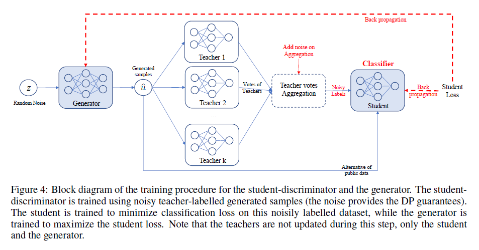

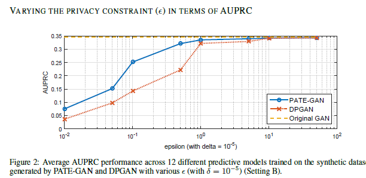

## G-PATE (WIP)
Theoretically, the generator in GAN has the potential of generating an universal distribution, which is a superset of the real distribution, so it is not necessary for the student discriminator to be trained on real records. However, such a theoretical bound is loose. In practice, if a generator does generate enough samples from the universal distribution, there would be a convergence issue. On the other hand, when the generator does converge, it no longer covers the universal distribution, so the student generator may fail to learn the real distribution without seeing real records.

It is not necessary to ensure differential privacy for the discriminator in order to train a differentially private generator. As long as we ensure differential privacy on the information flow from the discriminator to the generator, it is sufficient to guarantee the privacy property for the generator. Therefore, instead of focusing on ensuring differential privacy for the whole GAN framework, we design a novel framework to guarantee that all information flowed from the discriminator to the generator satisfies differential privacy.

Compared to PATE-GAN, our approach has two advantages. First, we improve the use of privacy budget by applying it to the part of the model that actually needs to be released for data generation. Second, our discriminator can be trained on real data because itself does not need to satisfy differential privacy. The teacher discriminators do not need to be published, so they can be trained with non-private algorithms.

In addition, we design a gradient aggregator to collect information from teacher discriminators and combine them in a differentially private fashion.
Unlike PATE-GAN, G-PATE does not require any student discriminator. The teacher discriminators are directly connected to the student generator. The gradient aggregator sanitizes the information flow from the teacher discriminators to the student generator to ensure differential privacy The privacy property is achieved by sanitizing all information propagated from the discriminators to the generator.


# Use Cases

## MIMIC-III Dataset

We used MIMIC-III data for this project as it is an open source dataset and contains multiple tables which can be combined to prepare use cases. Data can be accesed on link provided below and in order to access data, few certifications are required which can be obtained by completing trainings on website. Medical Information Mart for Intensive Care Unit (MIMIC) III: Open source dataset developed by the MIT Lab comprising de-identified health data is a comprehensive clinical dataset of 40,000+ patients admitted in ICU. Few salient features of this databases include:

- **26 tables:** Comprehensive clinical dataset with different tables
- **40,000+ patients:** Data associated with multiple admissions of patients
- **65,000+ ICU admissions:** Admitted in ICUs at Beth Israel Deaconess Medical Centre, Boston, from 2001 to 2012
- **PII data:** Includes patient sensitive details like demographics, diagnosis, laboratory tests, medications etc.
- **Use cases:** Can be used for multiple analysis like clinical data (prescriptions), claims data (payer), members data (patient)

For this project, we focus on using specific tables from this database and create 2 different use cases which can be found in following section.

Source: https://mimic.physionet.org/gettingstarted/overview/


## Use Cases

### Use Case 1: Length of Stay

Predicting the length of stay in ICU using 4 out of 26 tables


Use case: Out of variety of possible use cases from MIMIC III dataset we focus on single use case to predict the number of days a patient stays in the ICU to further generate synthetic data. This usecase seemed important to us because its always a benefit for payer to predict the tendency of the length of stay of a patient. It helps in changing the premium charged by the payer according to the comparison of predictions and baseline (the defined no. of days covered by a particular plan of the patient). For this use case the model utilises the total number of diagnosis that occured for different disease category for each patient.

To build this use case we focus on primarily 4 tables.

1. <b> Patients:</b> Every unique patient in the database (defines SUBJECT_ID)
   <b> Columns like:</b> SUBJECT_ID, GENDER (count of rows: 46520 count of columns: 7)
2. <b> Admissions:</b> Every unique hospitalization for each patient in the database (defines HADM_ID)
   <b> Columns like:</b> SUBJECT_ID, HADM_ID, HOSPITAL_EXPIRE_FLAG, MARITAL_STATUS, ETHNICITY, ADMISSION_TYPE (count of rows: 58976 count of columns: 18 )
3. <b> ICUSTAYS:</b> Every unique ICU stay in the database (defines ICUSTAY_ID)
   <b> Columns like:</b> SUBJECT_ID, HADM_ID, LOS (count of rows: 61532 count of columns: 11 )
4. <b> Diagnosis_ICD:</b> Hospital assigned diagnoses, coded using the International Statistical Classification of Diseases and Related Health Problems (ICD) system
   <b> Columns like:</b> SUBJECT_ID, HADM_ID, NUMDIAGNOSIS (count of rows: 651047 count of columns: 5)

#### Methodology

1. <b> Load csv files:</b> Read the comma seperated files donwloaded from link (https://mimic.physionet.org/gettingstarted/overview/)
2. <b> Merge tables: </b> Use 'SUBJECT_ID' to merge tables like ADMISSIONS, PATIENTS and ICU_STAYS and finally concatenate 'SUBJECT_ID' and 'HADM_ID' to form 'final_id' as composite key.
3. <b> Prepare diagnosis dataset: </b> DIAGNOSIS_ICD table is used to map the disease category type using the first three code digits if ICD-9 code. The mapping is used to convert the unique 6984 ICD-9 codes into 18 different disease area categories and finally concatenate 'SUBJECT_ID' and 'HADM_ID' to form 'final_id' as composite key..
4. <b> Pivot up diagnosis dataset: </b> After the mapping the disease categories using ICD-9 codes, the datset is pivoted up at the level of the 18 disease categories and the total count of diagnosis is being populated across 'final_id'
5. <b> Merge pivoted diagnosis datset to the main dataset: </b> Finally, the above generated dataset is then merged to the main dataset using the 'final_id' as the key.

Note: 6984 ICD-9 codes: The diagnosis dataset contains unique International Classification of Disease (ICD-9) codes
      18 primary categories: We consider categories of conditions for the predictive modeling
Finally only the relevant columns required for the analysis are selected and we use the dataset for the synthetic data generation.
The final data has 116354 rows and 27 columns.


#### Final data includes

- <b> Level of data:</b> Each instance in the final data set is unique admission for each patient and is defined by concatination of 'SUBJECT_ID' and 'HADM_ID' to form 'final_id'

- <b> Target Variables:</b> 'LOS' (length of stay) is used as target variable

- <b> Predictor variables:</b> 18 columns of different diagnosis category are used as predictor varibales.
      These 18 categories are:
      "certain conditions originating in the perinatal period"
      "complications of pregnancy, childbirth, and the puerperium",
      "congenital anomalies",
      "diseases of the blood and blood-forming organs",
      "diseases of the circulatory system",
      "diseases of the digestive system",
      "diseases of the genitourinary system",
      "diseases of the musculoskeletal system and connective tissue",
      "diseases of the nervous system",
      "diseases of the respiratory system",
      "diseases of the sense organs",
      "diseases of the skin and subcutaneous tissue",
      "endocrine, nutritional and metabolic diseases, and immunity disorders",
      "external causes of injury and supplemental classification",
      "infectious and parasitic diseases",
      "injury and poisoning",
      "mental disorders",
      "neoplasms" and
      "symptoms, signs, and ill-defined conditions".

- <b> Other descriptive variables:</b>

  "ADMISSION_TYPE", "INSURANCE", "ETHNICITY", "HOSPITAL_EXPIRE_FLAG", "GENDER" and "EXPIRE_FLAG"


**Code (data wrangling performed in R)**

1. Import required libraries and read csv files
2. Function for data preparation

**1. Import required libraries and read csv files**


```python
install.packages('reshape')
library(reshape2)
library(dplyr)
```

**2. Function for data preparation**


```R
# Note this code was written in R
# This code uses the filenames of admission, patients, icustays and diagnosis dataset as the input to the function usecase_1


usecase_1 <- function(admissions,patients,icustays,diagnosis)
{

    #################### Loading datasets ##############################################

    adm <-read.csv(admissions)
    pat <- read.csv(patients)
    icu <- read.csv(icustays)
    diagn <- read.csv(diagnosis)
    map <- read.csv("mapping.csv")

    #################### Selecting specifc columns #####################################

    adm <- adm[,2:ncol(adm)]
    pat <- pat[,2:ncol(pat)]
    icu <- icu[,2:ncol(icu)]
    pres <- pres[,2:ncol(pres)]

    #################### Merging various tables ########################################

    merged_1<- merge(x=adm,y=pat,by.x = c("SUBJECT_ID"), by.y=c("SUBJECT_ID"))
    merged_2<- merge(x=merged_1,y=icu,by.x = c("SUBJECT_ID"), by.y=c("SUBJECT_ID"))

    #################### Data wrangling on Diagnosis dataset ###########################

    diagnosis_unique <- data.frame(unique(diagn$ICD9_CODE)
    names(diagnosis_unique)[1] <-"icd9"
    merged_diag<- merge(x=diagnosis_unique,y=map,by.x = c("icd9"), by.y=c("icd"))
    final_map <- merged_diag[,c(1,4)]
    diagn_final <- merge(x=final_map,y=diagn,by.x = c("icd9"), by.y=c("ICD9_CODE"))
    diagn_final$final_id <-paste(diagn_final$SUBJECT_ID,diagn_final$HADM_ID, sep="_")
    diagn_final$count <-1
    diagn_final <- diagn_final[,c(2,7,8)]

    #################### Pivoting up Diagnosis dataset #################################

    step1<- dcast(data = diagn_final, formula = final_id ~ icd_chp, fun.aggregate = sum, value.var = "count")
    merged_2$final_id <-paste(merged_2$SUBJECT_ID,merged_2$HADM_ID.x, sep="_")

    #################### Merging pivotted up diagnosis dataset with main dataset #######

    merged_3<- merge(x=merged_2,y=step1,by.x = c("final_id"), by.y=c("final_id"))
    merged_3 <- merged_3[,c(1,7,10,14,18,20,25,35,36:54)]
    merged_3 <- merged_3%>%filter(LOS!="NA")
}

# Finally write the database to be used as an input for various GAN algorithms
write.csv(merged_3,"full_database_los_v1.csv")
```

### Use Case 2: Mortality Prediction

Another use case which we implemented using MIMIC-III dataset is for mortality prediction. This use case is inspired by Kaggle kernel (reference below) where one can predict mortality just by the number of interactions betweeen patient and hospital as predictors through count of lab tests, prescriptions, and procedures. It can be used to evaluate privacy risk with the help of PII columns like GENDER, ETHNICITY, MARITAL_STATUS and also serves as classification problem where we have to predict if patient will expire or not for a single hospital admission.

Reference: https://www.kaggle.com/drscarlat/predict-hospital-mortality-mimic3

**Tables Used**

1. Patients - Every unique patient in the database (defines SUBJECT_ID)
   Columns like: SUBJECT_ID, GENDER
2. Admissions - Every unique hospitalization for each patient in the database (defines HADM_ID)
   Columns Like: SUBJECT_ID, HADM_ID, HOSPITAL_EXPIRE_FLAG, MARITAL_STATUS, ETHNICITY, ADMISSION_TYPE
3. CallOut - Information regarding when a patient was cleared for ICU discharge and when the patient was actually discharged
   Columns Like: SUBJECT_ID, HADM_ID, NUMCALLOUT (count of rows)
4. CPTEvents - Procedures recorded as Current Procedural Terminology (CPT) codes
   Columns Like: SUBJECT_ID, HADM_ID, NUMCPTEVENTS (count of rows)
5. Diagnosis_ICD - Hospital assigned diagnoses, coded using the International Statistical Classification of Diseases and Related Health Problems (ICD) system
   Columns Like: SUBJECT_ID, HADM_ID, NUMDIAGNOSIS (count of rows)
6. Inputevents_CV  - Intake for patients monitored using the Philips CareVue system while in the ICU
   Columns Like: SUBJECT_ID, HADM_ID, NUMINPUTEVENTS (count of rows)
7. Labevents - Laboratory measurements for patients both within the hospital and in out patient clinics
   Columns Like: SUBJECT_ID, HADM_ID, NUMLABEVENTS (count of rows)
8. Noteevents - Deidentified notes, including nursing and physician notes, ECG reports, imaging reports, and discharge summaries.
   Columns Like: SUBJECT_ID, HADM_ID,  NUMNOTEVENTS (count of rows)
9. Outputevents - Output information for patients while in the ICU
   Columns Like: SUBJECT_ID, HADM_ID, NUMOUTEVENTS (count of rows)
10. Prescriptions - Medications ordered, and not necessarily administered, for a given patient
    Columns Like: SUBJECT_ID, HADM_ID, NUMRX (count of rows)
11. Procedureevents_mv - Patient procedures for the subset of patients who were monitored in the ICU using the iMDSoft MetaVision system.
    Columns Like: SUBJECT_ID, HADM_ID, NUMPROCEVENTS (count of rows)
12. MICROBIOLOGYEVENTS - Microbiology measurements and sensitivities from the hospital database
    Columns Like: SUBJECT_ID, HADM_ID, NUMMICROLABEVENTS (count of rows)
13. Procedures_icd - Patient procedures, coded using the International Statistical Classification of Diseases and Related Health Problems (ICD) system
    Columns Like: SUBJECT_ID, HADM_ID, NUMPROC (count of rows)
14. Transfers - Patient movement from bed to bed within the hospital, including ICU admission and discharge
    Columns Like: SUBJECT_ID, HADM_ID, NUMTRANSFERS (count of rows)

**Final data includes**

- <b> Level of data:</b> Each instance in the final data set is one admission and is defined by 'SUBJECT_ID', 'HADM_ID'
- <b> Target Variables:</b> 'HOSPITAL_EXPIRY_FLAG' is used as target variable
- Predictor variables: 'ADMISSION_TYPE', 'MARITAL_STATUS', 'ETHNICITY', 'HOSPITAL_EXPIRE_FLAG', 'GENDER', 'NUMCALLOUT', 'NUMCPTEVENTS', 'NUMDIAGNOSIS', 'NUMOUTEVENTS', 'NUMRX', 'NUMPROCEVENTS', 'NUMMICROLABEVENTS', 'NUMPROC', 'NUMTRANSFERS', 'NUMINPUTEVENTS', 'NUMLABEVENTS', 'NUMNOTEVENTS'

**Methodology**

1. <b> Load csv files:</b> Read the comma separated files downloaded from link (https://mimic.physionet.org/gettingstarted/overview/)
2. <b> Roll up tables:</b> We need count of various events or interactions between patients and hospital. In order to do this, group by or aggregate the tables at 'SUBJECT_ID' and 'HADM_ID' level and take count of number of rows for each. This will give total count of events related to single hospital admission.
3. <b> Merge tables: </b> Use 'SUBJECT_ID' and 'HADM_ID' as composite key to merge all tables together and create final analytical data set.

**Code**

1. Import required libraries and read csv files
2. Function to roll up tables
3. Merge all tables
4. Exploratory Analysis

**Import required libraries and read csv files**


```python
import pandas as pd
import matplotlib.pyplot as plt
from sklearn.model_selection import train_test_split
import warnings
warnings.filterwarnings('ignore')
```


```python
patients = pd.read_csv("data/patients.csv")
admissions = pd.read_csv("data/admissions.csv")
callout = pd.read_csv("data/callout.csv")
cptevents = pd.read_csv("data/cptevents.csv")
diagnosis = pd.read_csv("data/diagnoses_icd.csv")
outputevents = pd.read_csv("data/outputevents.csv")
rx = pd.read_csv("data/prescriptions.csv")
procevents = pd.read_csv("data/procedureevents_mv.csv")
microlabevents = pd.read_csv("data/microbiologyevents.csv")
proc = pd.read_csv("data/procedures_icd.csv")
transfers = pd.read_csv("data/transfers.csv")
inputevents = pd.read_csv("data/inputevents_cv.csv")
labevents = pd.read_csv("data/labevents.csv")
noteevents = pd.read_csv("data/noteevents.csv")
```

**Function to roll up tables**


```python
def rollup_sub_adm(df,col):
    df=df.groupby(['SUBJECT_ID','HADM_ID']).agg({'ROW_ID':'count'})
    df.reset_index(inplace=True)
    df.columns=['SUBJECT_ID','HADM_ID',col]
    print(col,":",df.shape)
    return df
```


```python
callout=rollup_sub_adm(callout,'NUMCALLOUT')
cptevents=rollup_sub_adm(cptevents,'NUMCPTEVENTS')
diagnosis=rollup_sub_adm(diagnosis,'NUMDIAGNOSIS')
outputevents=rollup_sub_adm(outputevents,'NUMOUTEVENTS')
rx=rollup_sub_adm(rx,'NUMRX')
procevents=rollup_sub_adm(procevents,'NUMPROCEVENTS')
microlabevents=rollup_sub_adm(microlabevents,'NUMMICROLABEVENTS')
proc=rollup_sub_adm(proc,'NUMPROC')
transfers=rollup_sub_adm(transfers,'NUMTRANSFERS')
inputevents=rollup_sub_adm(inputevents,'NUMINPUTEVENTS')
labevents=rollup_sub_adm(labevents,'NUMLABEVENTS')
noteevents=rollup_sub_adm(noteevents,'NUMNOTEVENTS')
```

    NUMCALLOUT : (28732, 3)
    NUMCPTEVENTS : (44148, 3)
    NUMDIAGNOSIS : (58976, 3)
    NUMOUTEVENTS : (52008, 3)
    NUMRX : (50216, 3)
    NUMPROCEVENTS : (21894, 3)
    NUMMICROLABEVENTS : (48740, 3)
    NUMPROC : (52243, 3)
    NUMTRANSFERS : (58976, 3)
    NUMINPUTEVENTS : (31970, 3)
    NUMLABEVENTS : (58151, 3)
    NUMNOTEVENTS : (58361, 3)

**Merge all tables**


```python
mortality=admissions[['SUBJECT_ID','HADM_ID','ADMISSION_TYPE','MARITAL_STATUS','ETHNICITY','HOSPITAL_EXPIRE_FLAG']]
mortality.loc[pd.isnull(mortality['MARITAL_STATUS']),'MARITAL_STATUS'] ='UNKNOWN (DEFAULT)'
mortality = mortality.merge(patients[['SUBJECT_ID','GENDER']],how='left',on='SUBJECT_ID')
mortality = mortality.merge(callout,how='left',on=['SUBJECT_ID','HADM_ID'])
mortality = mortality.merge(cptevents,how='left',on=['SUBJECT_ID','HADM_ID'])
mortality = mortality.merge(diagnosis,how='left',on=['SUBJECT_ID','HADM_ID'])
mortality = mortality.merge(outputevents,how='left',on=['SUBJECT_ID','HADM_ID'])
mortality = mortality.merge(rx,how='left',on=['SUBJECT_ID','HADM_ID'])
mortality = mortality.merge(procevents,how='left',on=['SUBJECT_ID','HADM_ID'])
mortality = mortality.merge(microlabevents,how='left',on=['SUBJECT_ID','HADM_ID'])
mortality = mortality.merge(proc,how='left',on=['SUBJECT_ID','HADM_ID'])
mortality = mortality.merge(transfers,how='left',on=['SUBJECT_ID','HADM_ID'])
mortality = mortality.merge(inputevents,how='left',on=['SUBJECT_ID','HADM_ID'])
mortality = mortality.merge(labevents,how='left',on=['SUBJECT_ID','HADM_ID'])
mortality = mortality.merge(noteevents,how='left',on=['SUBJECT_ID','HADM_ID'])
mortality = mortality.fillna(0)
```


```python
#Exporing data
mortality.to_csv('mortality_full_data.csv',index=False)
```

**Exploratory Analysis**


```python
mortality.shape
```


    (58976, 19)


```python
mortality.columns
```


    Index(['SUBJECT_ID', 'HADM_ID', 'ADMISSION_TYPE', 'MARITAL_STATUS',
           'ETHNICITY', 'HOSPITAL_EXPIRE_FLAG', 'GENDER', 'NUMCALLOUT',
           'NUMCPTEVENTS', 'NUMDIAGNOSIS', 'NUMOUTEVENTS', 'NUMRX',
           'NUMPROCEVENTS', 'NUMMICROLABEVENTS', 'NUMPROC', 'NUMTRANSFERS',
           'NUMINPUTEVENTS', 'NUMLABEVENTS', 'NUMNOTEVENTS'],
          dtype='object')


```python
mortality.groupby('HOSPITAL_EXPIRE_FLAG').size().plot.bar()
plt.show()
```

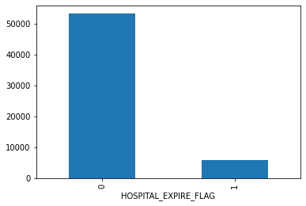


```python
mortality.groupby('GENDER').size().plot.bar()
plt.show()
```

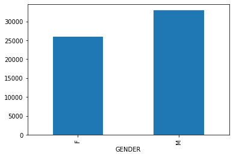


```python
mortality.groupby('MARITAL_STATUS').size().plot.bar()
plt.show()
```

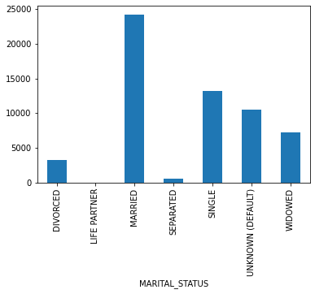


```python
mortality.groupby('ADMISSION_TYPE').size().plot.bar()
plt.show()
```

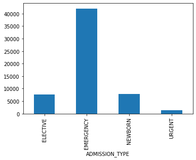


```python
mortality.groupby('NUMLABEVENTS').size().plot.hist(bins=50)
plt.show()
```

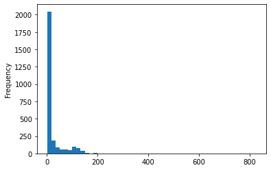


```python
mortality.dtypes
```


    SUBJECT_ID                int64
    HADM_ID                   int64
    ADMISSION_TYPE           object
    MARITAL_STATUS           object
    ETHNICITY                object
    HOSPITAL_EXPIRE_FLAG      int64
    GENDER                   object
    NUMCALLOUT              float64
    NUMCPTEVENTS            float64
    NUMDIAGNOSIS              int64
    NUMOUTEVENTS            float64
    NUMRX                   float64
    NUMPROCEVENTS           float64
    NUMMICROLABEVENTS       float64
    NUMPROC                 float64
    NUMTRANSFERS              int64
    NUMINPUTEVENTS          float64
    NUMLABEVENTS            float64
    NUMNOTEVENTS            float64
    dtype: object


### Use Case 2: Mortality Prediction

Another use case which we implemented using MIMIC-III dataset is for mortality prediction. This use case is inspired by Kaggle kernel (reference below) where one can predict mortality just by the number of interactions between patient and hospital as predictors through count of lab tests, prescriptions, and procedures. It can be used to evaluate privacy risk with the help of PII columns like GENDER, ETHNICITY, MARITAL_STATUS and also serves as classification problem where we have to predict if patient will expire or not for a single hospital admission.

Reference: https://www.kaggle.com/drscarlat/predict-hospital-mortality-mimic3

**Tables Used**

1. Patients - SUBJECT_ID, GENDER
2. Admissions - SUBJECT_ID, HADM_ID, HOSPITAL_EXPIRE_FLAG, MARITAL_STATUS, ETHNICITY, ADMISSION_TYPE
3. CallOut - SUBJECT_ID, HADM_ID, NUMCALLOUT (count of rows)
4. CPTEvents - SUBJECT_ID, HADM_ID, NUMCPTEVENTS (count of rows)
5. Diagnosis_ICD - SUBJECT_ID, HADM_ID, NUMDIAGNOSIS (count of rows)
6. Inputevents_CV - SUBJECT_ID, HADM_ID, NUMINPUTEVENTS (count of rows)
7. Labevents - SUBJECT_ID, HADM_ID, NUMLABEVENTS (count of rows)
8. Noteevents - SUBJECT_ID, HADM_ID, NUMNOTEVENTS (count of rows)
9. Outputevents - SUBJECT_ID, HADM_ID, NUMOUTEVENTS (count of rows)
10. Prescriptions - SUBJECT_ID, HADM_ID, NUMRX (count of rows)
11. Procedureevents_mv - SUBJECT_ID, HADM_ID, NUMPROCEVENTS (count of rows)
12. microbilogyevents - SUBJECT_ID, HADM_ID, NUMMICROLABEVENTS (count of rows)
13. Procedures_icd - SUBJECT_ID, HADM_ID, NUMPROC (count of rows)
14. Transfers - SUBJECT_ID, HADM_ID, NUMTRANSFERS (count of rows)

**Final data includes**

- **Level of data:** Each instance in the final data set is one admission and is defined by 'SUBJECT_ID', 'HADM_ID'
- **Target Variables:** 'HOSPITAL_EXPIRY_FLAG' is used as target variable
- **Predictor variables:** 'ADMISSION_TYPE', 'MARITAL_STATUS', 'ETHNICITY', 'HOSPITAL_EXPIRE_FLAG', 'GENDER', 'NUMCALLOUT', 'NUMCPTEVENTS', 'NUMDIAGNOSIS', 'NUMOUTEVENTS', 'NUMRX', 'NUMPROCEVENTS', 'NUMMICROLABEVENTS', 'NUMPROC', 'NUMTRANSFERS', 'NUMINPUTEVENTS', 'NUMLABEVENTS', 'NUMNOTEVENTS'

**Methodology**

1. **Load csv files:** Read the comma seperated files donwloaded from link (https://mimic.physionet.org/gettingstarted/overview/)
2. **Roll up tables:** We need count of various events or iteractions between patients and hospital. In order to do this, group by or aggregate the tables at 'SUBJECT_ID' and 'HADM_ID' level and take count of number of rows for each. This will give total count fo events related to single hospital admission.
3. **Merge tables:** Use 'SUBJECT_ID' and 'HADM_ID' as composite key to merge all tables together and create final analytical data set.

**Code**

1. Import required libraries and read csv files
2. Function to roll up tables
3. Merge all tables
4. Exploratory Analysis

**1. Import required libraries and read csv files**

```python
import pandas as pd
import matplotlib.pyplot as plt
from sklearn.model_selection import train_test_split
import warnings
warnings.filterwarnings('ignore')
```


```python
patients = pd.read_csv("data/patients.csv")
admissions = pd.read_csv("data/admissions.csv")
callout = pd.read_csv("data/callout.csv")
cptevents = pd.read_csv("data/cptevents.csv")
diagnosis = pd.read_csv("data/diagnoses_icd.csv")
outputevents = pd.read_csv("data/outputevents.csv")
rx = pd.read_csv("data/prescriptions.csv")
procevents = pd.read_csv("data/procedureevents_mv.csv")
microlabevents = pd.read_csv("data/microbiologyevents.csv")
proc = pd.read_csv("data/procedures_icd.csv")
transfers = pd.read_csv("data/transfers.csv")
inputevents = pd.read_csv("data/inputevents_cv.csv")
labevents = pd.read_csv("data/labevents.csv")
noteevents = pd.read_csv("data/noteevents.csv")
```

**2. Function to roll up tables**


```python
def rollup_sub_adm(df,col):
    df=df.groupby(['SUBJECT_ID','HADM_ID']).agg({'ROW_ID':'count'})
    df.reset_index(inplace=True)
    df.columns=['SUBJECT_ID','HADM_ID',col]
    print(col,":",df.shape)
    return df
```


```python
callout=rollup_sub_adm(callout,'NUMCALLOUT')
cptevents=rollup_sub_adm(cptevents,'NUMCPTEVENTS')
diagnosis=rollup_sub_adm(diagnosis,'NUMDIAGNOSIS')
outputevents=rollup_sub_adm(outputevents,'NUMOUTEVENTS')
rx=rollup_sub_adm(rx,'NUMRX')
procevents=rollup_sub_adm(procevents,'NUMPROCEVENTS')
microlabevents=rollup_sub_adm(microlabevents,'NUMMICROLABEVENTS')
proc=rollup_sub_adm(proc,'NUMPROC')
transfers=rollup_sub_adm(transfers,'NUMTRANSFERS')
inputevents=rollup_sub_adm(inputevents,'NUMINPUTEVENTS')
labevents=rollup_sub_adm(labevents,'NUMLABEVENTS')
noteevents=rollup_sub_adm(noteevents,'NUMNOTEVENTS')
```

    NUMCALLOUT : (28732, 3)
    NUMCPTEVENTS : (44148, 3)
    NUMDIAGNOSIS : (58976, 3)
    NUMOUTEVENTS : (52008, 3)
    NUMRX : (50216, 3)
    NUMPROCEVENTS : (21894, 3)
    NUMMICROLABEVENTS : (48740, 3)
    NUMPROC : (52243, 3)
    NUMTRANSFERS : (58976, 3)
    NUMINPUTEVENTS : (31970, 3)
    NUMLABEVENTS : (58151, 3)
    NUMNOTEVENTS : (58361, 3)

**3. Merge all tables**


```python
mortality=admissions[['SUBJECT_ID','HADM_ID','ADMISSION_TYPE','MARITAL_STATUS','ETHNICITY','HOSPITAL_EXPIRE_FLAG']]
mortality.loc[pd.isnull(mortality['MARITAL_STATUS']),'MARITAL_STATUS'] ='UNKNOWN (DEFAULT)'
mortality = mortality.merge(patients[['SUBJECT_ID','GENDER']],how='left',on='SUBJECT_ID')
mortality = mortality.merge(callout,how='left',on=['SUBJECT_ID','HADM_ID'])
mortality = mortality.merge(cptevents,how='left',on=['SUBJECT_ID','HADM_ID'])
mortality = mortality.merge(diagnosis,how='left',on=['SUBJECT_ID','HADM_ID'])
mortality = mortality.merge(outputevents,how='left',on=['SUBJECT_ID','HADM_ID'])
mortality = mortality.merge(rx,how='left',on=['SUBJECT_ID','HADM_ID'])
mortality = mortality.merge(procevents,how='left',on=['SUBJECT_ID','HADM_ID'])
mortality = mortality.merge(microlabevents,how='left',on=['SUBJECT_ID','HADM_ID'])
mortality = mortality.merge(proc,how='left',on=['SUBJECT_ID','HADM_ID'])
mortality = mortality.merge(transfers,how='left',on=['SUBJECT_ID','HADM_ID'])
mortality = mortality.merge(inputevents,how='left',on=['SUBJECT_ID','HADM_ID'])
mortality = mortality.merge(labevents,how='left',on=['SUBJECT_ID','HADM_ID'])
mortality = mortality.merge(noteevents,how='left',on=['SUBJECT_ID','HADM_ID'])
mortality = mortality.fillna(0)
```


<div>
<style scoped>
    .dataframe tbody tr th:only-of-type {
        vertical-align: middle;
    }

```python
#Exporing data
mortality.to_csv('mortality_full_data.csv',index=False)
```

**4. Exploratory Analysis**


```python
mortality.shape
```


    (58976, 19)


```python
mortality.columns
```


    Index(['SUBJECT_ID', 'HADM_ID', 'ADMISSION_TYPE', 'MARITAL_STATUS',
           'ETHNICITY', 'HOSPITAL_EXPIRE_FLAG', 'GENDER', 'NUMCALLOUT',
           'NUMCPTEVENTS', 'NUMDIAGNOSIS', 'NUMOUTEVENTS', 'NUMRX',
           'NUMPROCEVENTS', 'NUMMICROLABEVENTS', 'NUMPROC', 'NUMTRANSFERS',
           'NUMINPUTEVENTS', 'NUMLABEVENTS', 'NUMNOTEVENTS'],
          dtype='object')


```python
mortality.groupby('HOSPITAL_EXPIRE_FLAG').size().plot.bar()
plt.show()
```


```python
mortality.groupby('GENDER').size().plot.bar()
plt.show()
```


```python
mortality.groupby('MARITAL_STATUS').size().plot.bar()
plt.show()
```


```python
mortality.groupby('ADMISSION_TYPE').size().plot.bar()
plt.show()
```


```python
mortality.groupby('NUMLABEVENTS').size().plot.hist(bins=50)
plt.show()
```


```python
mortality.dtypes
```


    SUBJECT_ID                int64
    HADM_ID                   int64
    ADMISSION_TYPE           object
    MARITAL_STATUS           object
    ETHNICITY                object
    HOSPITAL_EXPIRE_FLAG      int64
    GENDER                   object
    NUMCALLOUT              float64
    NUMCPTEVENTS            float64
    NUMDIAGNOSIS              int64
    NUMOUTEVENTS            float64
    NUMRX                   float64
    NUMPROCEVENTS           float64
    NUMMICROLABEVENTS       float64
    NUMPROC                 float64
    NUMTRANSFERS              int64
    NUMINPUTEVENTS          float64
    NUMLABEVENTS            float64
    NUMNOTEVENTS            float64
    dtype: object


# Results

## Scalability Tests - WIP


In this section we check how the execution time increases when the data size increases for the two algorithms TGAN and CTGAN.

When testing both the modules, the most time consuming part of the process seems to be the training time for e TGAN and CTGAN algorithms. This is understandable as GANS are basically two neural networks who are competing against each other to outdo the other. This back and forth, as well as the backpropagation to adjust the weights requires a lot of time and resources and we wanted to understand the exact time taken by these in case we wanted to scale them for future applications.

We approach testing these algorithms in the following way. We have two data types we are working with, mainly Continuous and categorical datasets. We want to record execution times for both of these types of columns. We also want to observe how the training time varies with increasing number of rows and columns.

We take a two datasets both having 100,000 rows and 25 columns. One dataset has all Categorical columns and one of them has only numeric columns. We want to vary the number of rows and columns and time the algorithm to check the execution time for both the algorithms.


TGAN

**Categorical Data**

Increasing Number of Rows

Increasing Number of columns


**Numerical Data**

Increasing Number of Rows

Increasing Number of columns


CT-GAN

**Categorical Data**

Increasing Number of Rows

Increasing Number of columns


**Numerical Data**

Increasing Number of Rows

Increasing Number of columns


## Statistical Similarity

To calculate the similarity between two tables, our methodology transfers the problem into calculating how different the synthetic data generated by GAN algorithm is from the original data. The smaller the difference between two data sets, the more similar they are with each other. In this methodology, the similarity between the synthetic data and original data will be evaluated in two perspectives: the corresponding columns and the relationships between all columns in each tables. The diagram of the metrics is shown below:

### Overview of Datasets and results

Original datasets:


### Similarity Results with GAN Algorithms Overview:


### Column-wise Similarity Evaluation

### Distribution Similarity - Cosine Similarity and KL-divergence

*Description and Rationale for **KL-divergence***

Quantifying the difference between two distributions can be referred to calculating the statistical distance between them. However this can be challenging as it can be difficult to interpret the measure.  Instead, we can use a more common measurement, *Kullback-Leibler Divergence* (KL-divergence), to measure the distribution similarity between the pair-columns in both original table and synthetic table. KL-divergence quantifies how much information is lost when we compare the synthetic column distribution with original one. More specifically, the KL-divergence is just a slight modification of our formula for entropy and essentially, in our case, is the expectation of the log difference between the probability of data in the original column distribution(p) with the synthetic column distribution(q). The formula is below:

For the probability distribution of continuous variable:

(A **continuous random variable** is defined as one which takes an infinite number of possible values.)

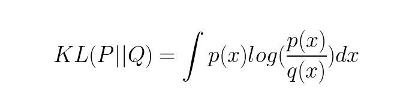

For the probability distribution of discrete variable:

(A **discrete random variable** is defined as one which may take on only a countable number of distinct values and thus can be quantified.)

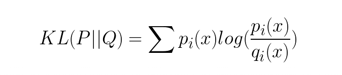

KL divergence is not symmetric, which means that how different two distributions compared to each other is usually not the same. In this case, KL divergence would be used to calculate how different the synthetic data generated is from the original data. The intuition for KL divergence score is that when the probability for an event from p is large, but the probability for the same event in q is small, then it would result in a large divergence.

KL divergence can be used to measure continuous or discrete probability distributions, but in the latter case the integral of the events is calculated in stead of the sum of the probabilities of the discrete events. It requires the input data to have a sum of 1, it would not be a proper probability distribution otherwise. Therefore, transformation step before calculating the KL divergence is required, which converts the original column-wise data to an array of probability values of different events.

For discrete columns:

**Step 1:** Convert original data to probability values

**Step2:** Calculate the Cosine Similarity and KL divergence (if applicable)


**Different techniques required for discrete and continuous data:**

Different from how it is for discrete data, it is impossible to generate a specific and accurate probability value for each data points in the sample of continuous data. The probability of continuous data is defined as the area under the pdf curve, so theoretically the probability of each data point is 0. In our use case, the 'length of Stay' is the only continuous variable because both day and the time during the day are considered in this variable. We will round the values of length of stay to make it all integers for better calculating the the similarity of probability distribution. The probability values will be ordered based on the number of length stayed, the number of length stayed that does not show up in the rounded data would be assigned 0 as its probability. For example, if there is no patient staying in the ICU around 6 days, the probability of the value "6" will be assigned as 0.

*Limitation of **KL-divergence**:*

Even though KL divergence is a good measurement for common cases, it is restricted to be used on two distributions that have the same length of probability distribution. In the case when the generated discrete column has less number of events from the original one, we need to make sure including all events into the probability distribution of the synthetic one by adding 0 as the probability of the omitted event. According to KL-divergence's formula, the probability sequence put in should not contain zero, it would output infinity other wise.

Considering the special property of continuous data, we propose using cosine similarity for calculating the probability list of the continuous data, in order to maintain the closest probability distribution towards the original data.

*Description and Rationale for **Cosine Similarity***

Cosine similarity is a measure of similarity between two non-zero vectors of an inner product space that measures the cosine of the angle between them. The formula referenced from wiki page is shown below, where A and B in our case is the array of frequency probabilities of each unique value in the synthetic column and original column respectively:

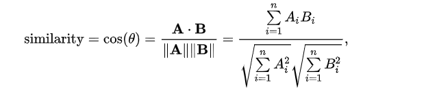


For continuous columns:

**Step 1: **Transform numerical data into values of bins

**Step 2:** Convert original data to probability values

**Step3:** Calculate the Cosine Similarity


*Demo:*

1. **Discrete** column demo

KL divergence and frequency distribution of "insurance" pair-columns on **POC dataset** generated by **tGAN**:


KL divergence and frequency distribution of "insurance" pair-columns on **POC dataset** generated by **ctGAN**:

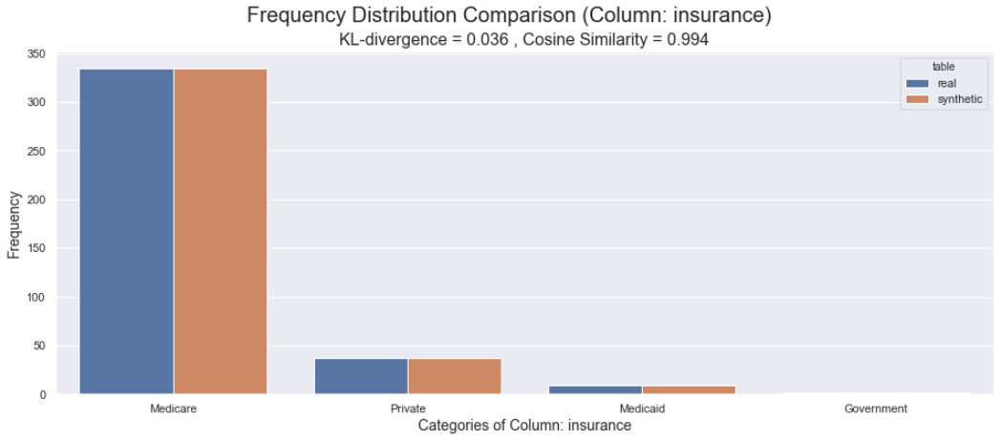


2. **Continuous** column demo

KL-divergence score and distributions of 'Length of Stay' pair-columns on dataset generated by **tGAN**:

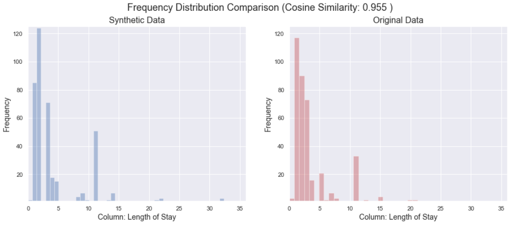

KL-divergence score and distributions of 'Length of Stay' pair-columns on dataset generated by **ctGAN**:

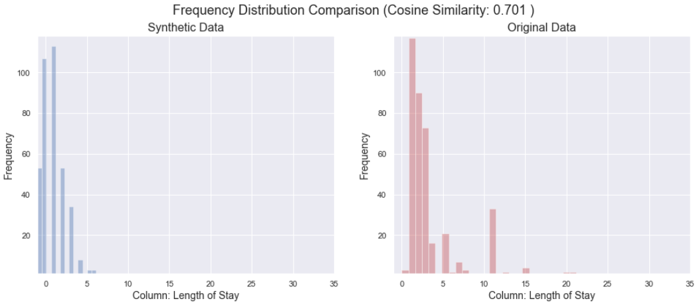


*Conclusion:*

Regardless whether the column is discrete or continuous, every column generated by tGAN and ctGAN is highly similar statistics-wise to the original one. More specifically, tGAN outperforms ctGAN in terms of its column-wise similarity by showing a higher value of Cosine similarity score.


*Limitations:*


### Table-wise Similarity Evaluation

#### 2.1 Dimension Reduction Metric

Dimensionality reduction techniques are proposed to compress high-dimensional table in a way that generates a lower dimensional representation of original table, which further enables similarity score calculation and visualization of the relationships among columns in a table.

#### 2.1.1 Auto-encoder

*Description and Rationale for Autoencoder*

Autoencoder is considered as a data compression algorithm and has long been thought to be a potential avenue for solving the problem of unsupervised learning, i.e. the learning of useful representations without the need for labels. Stated from [Keras team](https://blog.keras.io/building-autoencoders-in-keras.html) about Autoencoder,  autoencoders are not true unsupervised learning technique (which would imply a different learning process together), they are self-supervised technique, a specific instance of supervised learning where the targets are exactly the input data or generated from the input data.

In our case, the aim of an autoencoder is to learn a representation (embedding) of the relationships among multiple features in our table by setting the input and target data the same. Because Neural Networks can slowly approximate any function that maps inputs to outputs through an iterative optimization process called training. The embedding space has fewer dimensions (columns) than the feature data in a way that captures some latent structure of the feature data set.


**Step1:** Train an Autoencoder

Autoencoder can be broken in to 2 parts:

- **Encoder**: this part of the network compresses the input into an assigned number of vectors, which in our case for tabular data is the number of columns. The space represented by these fewer number of vectors is often called the *latent-space* or *bottleneck*. These compressed data that represent the original input are together called an “embedding” of the input.
- **Decoder**: this part of the network tries to reconstruct the input using only the embedding of the input. When the decoder is able to reconstruct the input exactly as it was fed to the encoder, you can say that the encoder is able to produce the best embeddings for the input with which the decoder is able to reconstruct well!


In order to make sure both synthetic table and original table are transformed exactly in the same process, we will train the auto-encoder using the original dataset and then predict on the synthetic dataset using the model built.


**Step2:** Extracting Embeddings from Autoencoder Network

After training the Autoencoder,  extract the embedding for an example from the network. Extract the embedding by using the feature data as input, and read the outputs of the encoder layer. The embedding should contain information about reproducing the original input data, but stored in a compact way.

For the purpose of generating a similarity score, we would assign the dimension of embedding to be 1 so that we can use Cosine similarity or Euclidean distance to calculate the similarity. However, for visualization, we can choose either using autoencoder to compress both tables separately to a lower dimensional (but more than 2) embedding and then use PCA to further compress the data to 2 dimension or using autoencoder to compress both tables directly to 2 dimensional embeddings. In this document, we will demonstrate later with the former method for the purpose of metric diversity.


**Step3:** Measuring Similarity from Embeddings

Next we would quantify the similarity for pairs of examples by using their embedding vectors.

We now have embeddings for the pair of tables. A similarity measure takes these embeddings and returns a number measuring their similarity. Remember that embeddings are simply vectors of numbers. To find the similarity between two vectors A=[a1,a2,...,an] and B=[b1,b2,...,bn], we can use Cosine Similarity that we mentioned before. It is a better measurement than Euclidean distance because it considers the angle of the vectors by putting them on a high dimensional space for comparison. And it outputs a score that ranges from 0 to 1 where 0 means that two vectors are oriented completely differently and 1 means that two vectors are oriented identically. This makes the comparison of the performances between different GAN algorithms easier.

Because there would be synthetic tables that have a different number of rows than the original table, we would consider the distribution as how we do for column-wise distribution evaluation instead of the pure values of the embeddings. We would take similar steps for

*Demo:*

Cosine similarity score using 5-dim latent representation from autoencoder using on dataset generated by **ctGAN**: 0.963.

*Limitations:*

1) The challenge applying Autoencoder with tabular data is the fact that each column represents its unique type of distribution. In other words, data types such as categories, ID numbers, ranks, binary values are all smashed into one sample table.

2) an autoencoder assume that all features (columns) in the table determines the similarity at the same degree, which means that this isn't the optimal choice when certain features could be more important than others in determining similarity.


#### 2.1.2 PCA and t-SNE

For visualization, PCA or t-SNE can be used to generate a lower dimensional data and then visualize them to compare.

Principal Component Analysis (PCA) is a linear feature extraction technique. It performs a linear mapping of the data to a lower-dimensional space in such a way that the variance of the data in the low-dimensional representation is maximized. It does so by calculating the eigenvectors from the covariance matrix. The eigenvectors that correspond to the largest eigenvalues (the principal components) are used to reconstruct a significant fraction of the variance of the original data.

t-Distributed Stochastic Neighbor Embedding (t-SNE) is a tool to visualize high-dimensional data. It converts similarities between data points to joint probabilities and tries to minimize the Kullback-Leibler divergence between the joint probabilities of the low-dimensional embedding and the high-dimensional data. However, t-SNE in Scikit learn has a cost function that is not convex according to Scikit learn [documentation](https://scikit-learn.org/stable/modules/generated/sklearn.manifold.TSNE.html), which makes two visualizations of two tables generated by the same transformation function not comparable. Because they use different initializations for the transformation, we would get different results.

Therefore, in this document, we would use PCA as techniques for visualization comparison. t-SNE is still a great technique recommended for visualizing high-dimensional data because it is a probabilistic technique compared to PCA that is a  mathematical one. Linear dimensionality reduction algorithms, like PCA, concentrate on placing dissimilar data points far apart in a lower dimension representation. But in order to represent high dimension data on low dimension, non-linear manifold, it is essential that similar data points must be represented close together, which is something t-SNE does not PCA.


For visualization:

Step 1: Train autoencoder for a 5-dim embedding using original table, and then predict on synthetic table.

Step 2: Extract the embeddings of original table and synthetic table respectively

Step 3: Train a PCA transformation using the original embedding for reducing the dimension to 2, and use the same transformation for the synthetic embedding.

Step 4: Visualize the results of PCA with two scatter plots


*Demo:*

t-SNE visual result using 5-dim latent representation from autoencoder on **POC dataset** generated by **tGAN**:

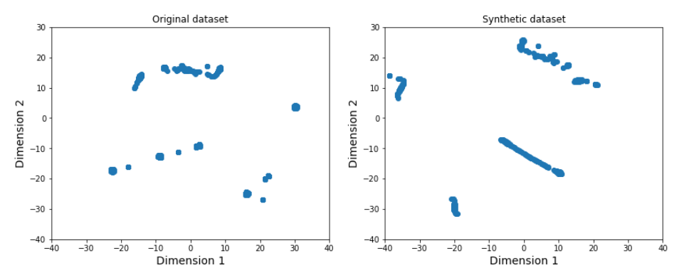

PCA visual result using 5-dim latent representation from autoencoder on **POC dataset** generated by **tGAN**:

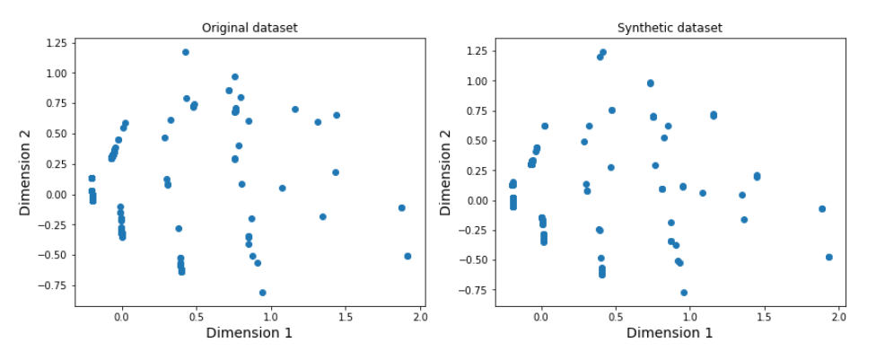


t-SNE visual result using 5-dim latent representation from autoencoder on **POC dataset** generated by **ctGAN**:

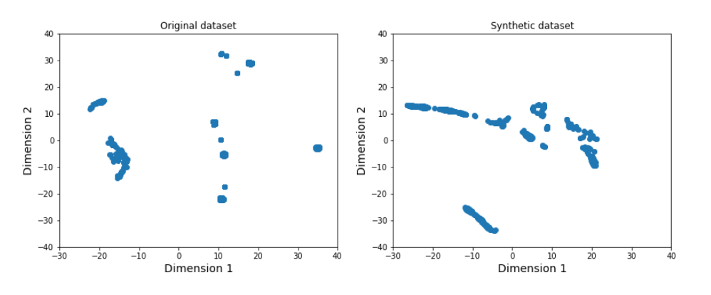

PCA visual result using 5-dim latent representation from autoencoder on **POC dataset** generated by **ctGAN**:

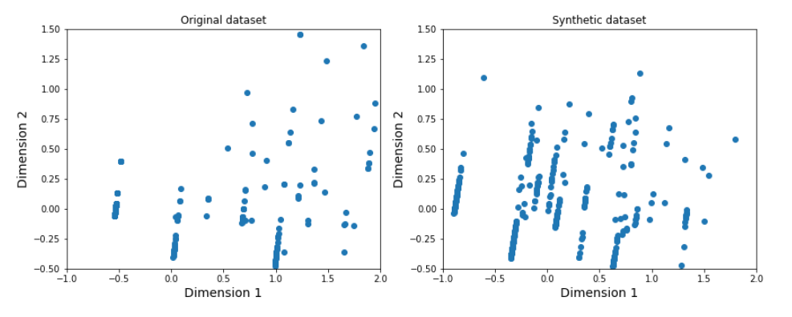


### 2.2 Clustering Similarity Metric (WIP)


Gower distance + clustering + mutual information calculation

https://scikit-learn.org/stable/modules/generated/sklearn.metrics.mutual_info_score.html

**Step1: Calculate Gower Distance Matrix**


**Step 2: Define the number of Clusters (Elbow Curve)**


The k-means clustering algorithm requires the number of clusters (k) to be assigned manually. The elbow method is the most common method to validate the number of clusters. The idea of the elbow method is to run k-means clustering on the dataset for a range of values of k, and for each value of k calculate the sum of squared errors (SSE). Then plot a line chart of the SSE for each value of k. If the line chart looks like an arm, then the "elbow" on the arm is the value of k that is the best. The idea is that we want a small SSE, but that the SSE tends to decrease toward 0 as we increase k. So our goal is to choose a small value of k that still has a low SSE, and the elbow usually represents where we start to have diminishing returns by increasing k.


**Step 3: Clustering Modeling**


**Step 4: Evaluating Clustering result (mutual information)**


## Privacy Risk Module

#### PaR Use Case

```python
import pandas as pd
import numpy as np
from sklearn import preprocessing
from scipy.spatial import distance, distance_matrix
from sklearn.metrics import pairwise_distances
from datetime import datetime
```

```python
#Load up datasets
original = pd.read_csv('./mortality_full_data.csv')
tgan = pd.read_csv('./mortality_tgan_1.csv')
```

#### Use Case - Patient Mortality in ICUs

This use case is inspired by Kaggle kernel (reference below) where one can predict mortality just by the number of interactions between patient and hospital as predictors through count of lab tests, prescriptions, and procedures. It can be used to evaluate privacy risk with the help of Pll columns like GENDER, ETHNICITY, MARITAL_STATUS and also serves as classification problem where we have to predict if patient will expire or not for a single hospital admission.

**Original Data**


**TGAN Data**


```python
tgan = tgan.apply(lambda x: round(x) if x.name in ['NUMCALLOUT', 'NUMCPTEVENTS', 'NUMDIAGNOSIS', 'NUMOUTEVENTS', 'NUMRX',
       'NUMPROCEVENTS', 'NUMMICROLABEVENTS', 'NUMPROC', 'NUMTRANSFERS',
       'NUMINPUTEVENTS', 'NUMLABEVENTS', 'NUMNOTEVENTS'] else x)
```

```python
original_uid = original['SUBJECT_ID'].values

original = original[['ADMISSION_TYPE', 'MARITAL_STATUS',
       'ETHNICITY', 'HOSPITAL_EXPIRE_FLAG', 'GENDER', 'NUMCALLOUT',
       'NUMCPTEVENTS', 'NUMDIAGNOSIS', 'NUMOUTEVENTS', 'NUMRX',
       'NUMPROCEVENTS', 'NUMMICROLABEVENTS', 'NUMPROC', 'NUMTRANSFERS',
       'NUMINPUTEVENTS', 'NUMLABEVENTS', 'NUMNOTEVENTS']]


tgan = tgan[['ADMISSION_TYPE',
       'MARITAL_STATUS', 'ETHNICITY', 'HOSPITAL_EXPIRE_FLAG', 'GENDER',
       'NUMCALLOUT', 'NUMCPTEVENTS', 'NUMDIAGNOSIS', 'NUMOUTEVENTS', 'NUMRX',
       'NUMPROCEVENTS', 'NUMMICROLABEVENTS', 'NUMPROC', 'NUMTRANSFERS',
       'NUMINPUTEVENTS', 'NUMLABEVENTS', 'NUMNOTEVENTS']]
```

```python
#Prepares data for use in the Privacy Risk Calculations
#Parameters: Original Dataset, Synthetic Data, List of Columns to use
#Returns processed Original Dataset, Synthetic Dataset, Column-Levels Mapping
def prepData(original, tgan, col_list=None):


    #Select Columns from Original and Synthetic Dataset
    if col_list is not None:
        tgan = tgan[col_list]
        original = original[col_list]

    #One-Hot Encode and Normalize the Original Dataset
    x = pd.get_dummies(original).values #returns a numpy array
    min_max_scaler = preprocessing.MinMaxScaler()
    x_scaled = min_max_scaler.fit_transform(x)
    original_df = pd.DataFrame(x_scaled)
    original_df.columns = pd.get_dummies(original).columns

    #One-Hot Encode and Normalize the Synthetic Dataset
    x = pd.get_dummies(tgan).values #returns a numpy array
    min_max_scaler = preprocessing.MinMaxScaler()
    x_scaled = min_max_scaler.fit_transform(x)
    synth_df = pd.DataFrame(x_scaled)
    synth_df.columns = pd.get_dummies(tgan).columns

    #Number of Categorical Feature Levels that were dropped because Synthetic Dataset did not report them
    print("{0} columns levels were dropped because they were not observed in synthetic data ".format(str(len(original_df.columns) - len(synth_df.columns))))

    #Adding column names back
    synth_df.columns = pd.get_dummies(synth_df).columns
    original_df = original_df[synth_df.columns]


    #Feature - Feature Level Mapping (Useful to map One-Hot Encoded feature levels and associate it to a certain feature)
    col_mapping = {}

    if col_list is None:
        for col in original.columns:

            col_mapping[col] = [x for x in original_df.columns if x.startswith(col)]
    else:
        for col in col_list:
            col_mapping[col] = [x for x in original_df.columns if x.startswith(col)]


    return original_df, synth_df, col_mapping


```


```python
#Prepare Data for PaR estimation
original_df, synth_df, col_mapping = prepData(original, tgan, col_list = None)

#Dispose the raw data to clear memory
del original, tgan
```

34 columns levels were dropped because they were not observed in synthetic data

```python
#Check if all columns are the same in both datasets
original_df.columns == synth_df.columns
```


```python
#Parameters: Original Dataset, Synthetic Dataset, Number of Closest Points to Analyze, Original IDs/Indexes, Verbose Flag
def estimatePAR(original_df, synth_df, top_n, original_uid = None, verbose=0 ):

    #Timer
    now = datetime.now()

    #Compute External Distances
    externals = pairwise_distances(np.asarray(original_df), np.asarray(synth_df), n_jobs=-1)
    del synth_df
    externalDistance = [np.sort(externals[i])[:top_n].mean() for i in range(0, len(original_df))]
    del externals
    now3 = datetime.now()
    if verbose == 1:
        print('External Similarities Completed: Time: {0}'.format(str(now3-now)))

    #Compute Internal Distances
    withins = pairwise_distances(np.asarray(original_df), np.asarray(original_df) )

    #Handling the Patient Journey vs Patient Info type of datasets wrt Internal Similarity
    if original_uid is not None:
        #Track uids
        original_uidf = pd.DataFrame({'uid':original_uid, 'index':original_df.index})
        uidDict = []
        for id in original_uidf.uid.unique():
            uidDict.append(original_uidf[original_uidf.uid==id]['index'].values)

        del original_uidf

        #Track all records associated with this patient, remove and compare only to others.
        withinDistance = [np.sort(np.delete(withins[i], [v for v in uidDict if i in v][0]))[:top_n].mean() for i in range(0, len(original_df))]
        del withins

    else:
        withinDistance = [np.sort(np.delete(withins[i], i))[:top_n].mean() for i in range(0, len(original_df))]
        del withins

    now2 = datetime.now()
    if verbose == 1:
        print('Internal Similarities Completed: Time: {0}'.format(str(now2-now)))

    #Add all info into a results dataset
    df_d = pd.DataFrame()
    df_d['synthetic'] = externalDistance #d_synthetics
    df_d['within'] = withinDistance #d_withins

    # 'Closer' variable tells whether Within Similarity is lower than External Similarity ie. Internal Distance greater than
    # External - Closer being 1 means this is a risky datapoint.
    df_d['closer'] = df_d.within >= df_d.synthetic

    #Lift measures the increase in Risk as a ratio of Internal Distance / External Distance. A Lift < 1 means not Risky.
    #Higher values of Lift mean those data points in Original Dataset are at a risk of being re-identified
    df_d['lift'] = df_d.within / df_d.synthetic

    #Report all the At Risk IDs in Original Dataset
    atRiskIds = df_d[df_d['closer']==True].sort_values(by="lift", ascending=False).index

    now4 = datetime.now()
    if verbose == 1:
        print("Total Time:{0}".format(str(now4-now)))

    #Compute the Privacy At Risk Value
    par = df_d['closer'].mean()*100
    print("Privacy At Risk: {0}% ".format(par))

    return df_d, atRiskIds, par, now4-now
```


```python
results, atrisk, par, time = estimatePAR(original_df, synth_df, 1, original_uid, 1)
results.to_csv('results-tgan.csv')
pd.DataFrame({'atrisk':atrisk}).to_csv('results-tgan-atrisk.csv')

results2, atrisk2, par2, time2 = estimatePAR(original_df, synth_df, 1, original_uid=None, verbose=1)
```


```python
pd.DataFrame({'atrisk':atrisk2}).to_csv('results-tgan-atrisk.csv')
del results2, atrisk2
len(atrisk)
```

> 3623

Here we can see the results. The Privacy At Risk value for the synthetic data generation turns out to be 6.2%. This means that conservatively, 6.2% ie 3623 of the people/records in Original Dataset can potentially be re-identified back to the original information using our synthetic dataset. Hence, the objective always would be to reduce the Privacy At Risk value while maximizing utility.

We can also observe the AtRisk variable. This gives us the list of Original data points/People that can be potentially exposed based on the PaR calculation. We leverage this later to reduce the PaR for the process.

**Finding the Sensitive Columns**

Users of a dataset often have an understanding of which columns are vulnerable to attacks. For example, Gender, Age and Zipcode are often potential sources used to join with other databases in order to mine information. But in a new dataset, there might always be other fields that we might not expect to be sensitive, but turn out to be sensitive in the way they make a person/record unique

```python
results2, atrisk2, par2, time2 = estimatePAR(original_df, synth_df, 1, original_uid=None, verbose=1)
```


```PYTHON
def runSensitivityAnalysis(original_df, synth_df, original_uid, col_mapping, initialPAR):
    sensitivityDf = pd.DataFrame()
    sensitivityDf['column'] = col_mapping.keys()

    newPARs = []
    for x in col_mapping.keys():

        newColumns = []
        newCols = col_mapping.keys() - [x]
        for col in newCols:
            newColumns += col_mapping[col]

        x,y, par, time = estimatePAR(original_df[newColumns], synth_df[newColumns], 1, original_uid=None)
        newPARs.append(par)
        del x,y, par

    sensitivityDf['new_PAR'] = newPARs
    sensitivityDf['sensitivity_lift'] = (initialPAR - sensitivityDf['new_PAR'])*100/initialPAR

    return sensitivityDf

sens_df = runSensitivityAnalysis(original_df, synth_df, original_uid, col_mapping, 6.14317)
sens_df['sensitivity_lift'] = (6.143 - sens_df['new_PAR'] )*100/6.143
sens_df.sort_values(by="sensitivity_lift", ascending=False)
```


**Interpreting the Sensitivity Lift Scores**

We can see that Marital Status, Ethnicity and Number of Diagnoses have the highest Sensitivity Lift. A score of 30% means that including a column increases the Privacy At Risk Score by 30% ie. Including the MARITAL_STATUS field will increase the Privacy At Risk Score by 30%

We can also observe NUMINPUTEVENTS has a Sensitivity Lift of -90%. This means including the column reduces the Privacy Risky by 90%. This could be because Number of Input Events tracks every recorded event within the ICU and hence might be a random value not pertaining to a certain user thus increasing the confusion aspect.

**A useful tool in ascertaining necessity of certain features during data distribution**

Given that we know including fields such as Gender, Marital Status, Number of Diagnoses, we can use this information to take a quantitative decision on whether these information needs to be distributed. The stakeholders need to weigh the increase in PaR of 30% for including the Marital Status field versus the need for the Marital Status field to be consumed by Analysts.

**Removing At Risk points**

Once we have understood which original data points are at risk, we can act on it by removing the synthetic data records that can potentially expose these points. We have access to the At Risk data points from the 'estimatePAR' function.

**Edge Case: One original person/record can have multiple synthetic data points very close to it** We deal with this scenario by looking at all the synthetic data points that are closer to the original datapoint that the closest Within Distance for that datapoint (ie. Distance of Closest Other Original Record). We then remove all data points associated with the Risky data points.

```PYTHON
results = pd.read_csv('results-tgan.csv')
results.head()
```


```PYTHON
atrisk = pd.read_csv('results-tgan-atrisk.csv')['atrisk'].values
atrisk
```

>array([28626, 23278,  9981, ..., 30788,  1644, 22787], dtype=int64)


```PYTHON
withinDistances = results.iloc[pd.read_csv('results-tgan-atrisk.csv')['atrisk'].values, 2:3]['within'].values
withinDistances
```

>array([1.00158487, 1.01350409, 1.41741934, ..., 0.09605177, 0.08350501,   0.11007349])

```PYTHON
def removeRisk(original_df, synth_df, atrisk, top_remove, multipleCloseFlag=False, withins=None):

    #Set up a percentile for how many points you wanna remove : Eg: 10%
    n = round(len(atrisk)*top_remove/100)
    atrisk = atrisk[:n]

    riskyPoints = original_df.iloc[atrisk, :]

    synth_risks = []

    distances = pairwise_distances(np.asarray(riskyPoints), np.asarray(synth_df))

    if multipleCloseFlag == False:
        for i in range(0, len(atrisk)):
            synth_risks += list(np.where(distances[i] == np.amin(distances))[0])
    else:
        for i in range(0, len(atrisk)):
            synth_risks += list(np.where(distances[i] < withins[i])[0])

    estimatePAR(original_df, synth_df.drop(synth_risks), 1, None, verbose=1)

    return synth_df.drop(synth_risks)
```


```PYTHON
removeRisk(original_df, synth_df, atrisk, 100, True, withinDistances
```


We can see that PaR has now decreased to 0%! This is because we set the top_remove percent to be 100% ie. Remove all synthetic datapoints associated with the original records put at risk. But zero Privacy Risk might not always mean good for us.

### Other Notes on Privacy Risk De-Exposing

#### Tradeoff between Utility and Privacy

There is always a tradeoff whenever we remove data points from the synthetic data points. At the cost of improving the Privacy, we will sacrifice some utility with respect to the dataset. We can experiment with the top_remove parameter, which decides what % of the Risky Data points will be dealt with - We can observe the new PaR values on de-exposing 10% of Risky Data points, 50% of Risky Data points and so on.

An understanding of what is the accepted level of Privacy and Utility is required to make decisions here on which synthetic data generation process works best for the situation.

#### Using Lift values to remove data points

Another useful metric to base the decision of removing synthetic data points can be based on the sensitivity_lift parameter. This is a ratio of the Within Distance and the External Distance. A higher ratio means a higher risk of a certain datapoint being exposed. This requires intervention from the stakeholders as to what should be the right threshold ie. De-expose original data points having a Sensitivity Lift value above 2

#### Scalability of the Module

The Privacy Risk module at this stage is computationally expensive. Multiple Cross-Joins are required between the Original and Synthetic Datasets through the PaR Estimation, Sensitivity Analysis and the Privacy Risk Removal parts.

**Privacy At Risk Estimation**

The PaR Estimation (estimatePAR) function performs two cross joins and hence is a function of the dataset size. In Big-O notation, the Order of the Function would be: O(2 x n2).

With a dataset size of 58,000 rows, the PaR module ran for 10:53 minutes on the AWS setup without handling for Patient Journey Edge Cases (multiple records per patient). Handling for the Patient Journey case, the PaR module took ~4 hours.

**Feature Sensitivity Analysis**

This is the most time-consuming module. The Order of the runSensitivityAnalysis is of the magnitude O(33 x n2) in Big-O notation; 33 being the number of columns. It's in additinally proportional to the number of columns to test, apart from the square of the dataset size, in terms of time complexity.

Without handling for the Patient Journey use case, the Feature Sensitivity Analysis will on average run for about 6 hours. While handling the edge case, the time to run quickly jumps up to 5.5 days.

**Removal of Risky data points**

This is comparable to the Privacy At Risk Estimation, as we have one simple cross-join on a subset of the data and a Privacy At Risk Estimation at the end to assess the improvement. Time to run the module is comparable to PaR Estimation.

### Future Steps

**Improving the Scalability of the Privacy Risk Module**

The module is currently highly time and resource intensive. More parallelization of the functions can result in significant reduction of the time complexity.

**Connect the Privacy Risk and Utility Modules to automate decisions on trade-off**

By connecting the two modules, we will be able to run multiple iterations to understand what is the best balance between Privacy Risk and Utility that can be achieved through the Synthetic Data Generation Process. A requirement for this would be to reduce the time complexity of the module, so that we can perform multiple iterations at scale.

**Integration of Differential Privacy Metrics**


## Model Compatibility

### Use Case 2 - Mortality Prediction

#### Code

1. Importing required libraries and csv data for use case 2 (mortality prediction): There are 6 main libraries required to run this module. It includes pandas, sklearn, keras (Neural Network), scikitplot, matplotlib, and xgboost. We are using data set created under <b> Use case </b> section for Use case 2 - Mortality prediction.
2. Filter data and one hot encoding: Data contains fields like SUBJECT_ID and HADM_ID which are unique to each rows and doesn't contribute towards predicting the mortality. Also, we have columns like ETHNICITY and MARITAL_STATUS which are also not good predictors and thus can be removed. After filtering these columns, we need to one hot encod remaining ctaegorical columns like ADMISSION_TYPE and GENDER.
3. Startified sampling for train test split: HOSPITAL_EXPIRE_FLAG is our target variable and is not balanced. The imbalance ratio is 10:1 i.e. there are 10 non expired patients corresponding to each expired patient in dataset. In order to account for this imabalnce and make sure this ratio is maintained in train and test, we used stratified sampling
4. Generate synthetic data: Post splitting dataset into train and test, we need to generate synthetic data using original train data. This task will be perfomed using TGAN and CTGAN in separate script. We will simply read the synthetic data generated by GAN algorithms in this script.
5. Data correction: The data generated by GAN algorithm treat numeric columns as continous columns rather than only integer values. As it try to replicate the distribution of data, it generate decimal values like 2.45 and also negative values like -2 for these numeric columns. In our use case, we can have only integer values and thud we need to corret data before building models.
6. Model fit function: Function created to train the model and predict using test data
7. Standardize and Hyperparameter tuning: Before implementing machine learning algorithms, we need to standardize data to bring different predictor variables to same scale. This is done to reduce bias caused by variables with high range as compared to other variables. Post which we implemneted Logistic Regression, XGBoost and Neural Network (Multi Layer Perceptron), along with hyperparamter tuning using 5-fold cross validation to select best hyperparamters for model. Also, algorithms are tuned in a way to account for imbalanced data using paramters within function. For detailed understanding , refer to official sklearn documentation. Example Logistic Regression function under sklearn contain parameter for 'class_weight' which can be used to specify imbalanced data.
   - Original data
   - TGAN synthetic data
   - CTGAN synthetic data
8. Compare metrics: There are number of metrics which can be used to compare the performance of classification models. We are reporting testing accuracy, precision, recall, f1-score and AUC-ROC. However, in case of mortality prediction, we want to make sure we predict patients who are going to die and save lives. So recall for binary class 1 (indicating death) is of utmost importance here. The hyperparameters are also tuned to increase the recall of models.

#### 1. Importing required libraries and csv data for use case 2 (mortality prediction)

Need to first install and then import libraries. There are 6 main libraries required to run this module. It includes pandas, sklearn, keras (Neural Network), scikitplot, matplotlib, and xgboost. We are using data set created under <b> Use case </b> section for Use case 2 - Mortality prediction.


```python
from sklearn import tree, neighbors, datasets, linear_model, svm, naive_bayes
from sklearn.model_selection import cross_val_score, train_test_split
from sklearn.model_selection import cross_validate,GridSearchCV
from sklearn import metrics, linear_model
from sklearn.preprocessing import StandardScaler
from sklearn.feature_extraction import DictVectorizer
from sklearn.utils.multiclass import unique_labels
import scikitplot as skplt
import matplotlib.pyplot as plt
from matplotlib.colors import ListedColormap
from mpl_toolkits.mplot3d import Axes3D
import xgboost as xgb
import numpy as np
import pandas as pd
import warnings
from keras import models, regularizers, layers, optimizers, losses
from keras.wrappers.scikit_learn import KerasClassifier
import tensorflow as tf
warnings.filterwarnings('ignore')
```


```python
mortality= pd.read_csv("mortality_full_data.csv")
```

#### 2. One hot encoding

We don't need SUBJECT_ID and HADM_ID as they define the level of data and are unique for each row. We can remove them and other columns which cannot impact the mortality of patient. Example ETHNICITY and MAIRTAL_STATUS have no influence on mortality and can be removed.


```python
#One Hot encoding
mortality_pred=mortality.drop(columns=['SUBJECT_ID','HADM_ID','ETHNICITY','MARITAL_STATUS'])
mortality_pred=pd.get_dummies(mortality_pred,prefix=['ADMISSION_TYPE','GENDER'])
```

#### 3. Stratified sampling for train test split

HOSPITAL_EXPIRE_FLAG is our target variable and is not balanced. The imbalance ratio is 10:1 i.e. there are 10 non expired patients corresponding to each expired patient in dataset. In order to account for this imabalnce and make sure this ratio is maintained in train and test, we used stratified sampling


```python
mortality_pred.groupby('HOSPITAL_EXPIRE_FLAG').size().plot.bar()
plt.show()
```


```python
# Split data using target variable
train, test = train_test_split(mortality_pred, test_size=0.20, random_state=42,stratify=mortality_pred['HOSPITAL_EXPIRE_FLAG'])
```


```python
train.groupby('HOSPITAL_EXPIRE_FLAG').size().plot.bar()
plt.show()
```


```python
test.groupby('HOSPITAL_EXPIRE_FLAG').size().plot.bar()
plt.show()
```


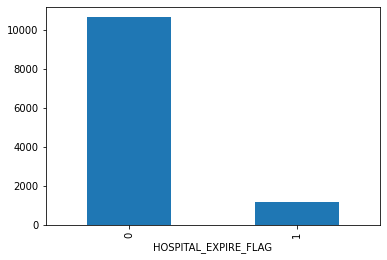


```python
# Writing csv files to disk
train.to_csv('mortality_train.csv',index=False)
test.to_csv('mortality_test.csv',index=False)
```

#### 4. Generate synthetic data

After splitting data set into train and test, we need to generate synthetic data using train data set. We used TGAN and CTGAN for generating synthetic data and will use them in following code to build models.


```python
# Reading data files
train = pd.read_csv("mortality_train.csv")
test = pd.read_csv("mortality_test.csv")
train_tgan=pd.read_csv("mortality_train_tgan.csv")
train_ctgan=pd.read_csv("mortality_train_ctgan.csv")
```

#### 5. Data Correction

The columns like NUMDIAGNOSIS, NUMRX, etc. consist of number of interactions and are present as integer values. There is no possibility of these values being continous or decimal like 2.45. At the same time there is no possibilty of negative values as number of prescriptions cannot be negative for any patients. However, the data generated by GAN algorithm treat these columns as continous columns rather than only integer values. As it try to replicate the distribution of data, it generate decimal values like 2.45 and also negative values like -2 for number of prescriptions. In order to maintain consistency between original data and synthetic data, we round the decimal places to nearest integer and also change all negative number to 0.


```python
train_tgan=train_tgan.round(0)
train_tgan[train_tgan < 0] = 0
train_tgan.head()
```


```python
train_ctgan=train_ctgan.round(0)
train_ctgan[train_ctgan < 0] = 0
train_ctgan.head()
```


#### 6. Model fit function

Function created to predict using various machine learning algorithms for classification problems. It takes following inputs:

1. Algorithm (alg)
2. Predictors in train data (x_train)
3. Predictors in test data(x_test)
4. Target variable in train data (y_train)
5. Target variables in test data (y_test)

This function will generate following outputs:

1. Trainig accuracy
2. Testing accuracy
3. Classification report: Contains precision, recall and f1-score for both classes
4. Confusion matrix
5. AUC-ROC: Area under the curve for receiver operating characteristic curve
6. ROC plot
7. Precision-Recall Curve
8. Lift Chart
9. Cumulative Gain chart


```python
# Calculate important metrics like testing accuracy, roc-auc, f1-measure
def model_fit(alg,x_train,x_test,y_train,y_test):
    #fit model
    alg.fit(x_train,y_train)
    #predict using model
    train_predictions=alg.predict(x_train)
    #print report
    print("Training Accuracy: ",round(metrics.accuracy_score(
                y_train.values,train_predictions),2))
    # Predict using testing dataset
    y_test_predict=alg.predict(x_test)
    y_test_predict_prob=alg.predict_proba(x_test)[:,1]
    y_test_predict_prob_both=alg.predict_proba(x_test)
    # Calculate accuracy score on predicted values
    print("Testing Accuracy: ", round(metrics.accuracy_score(
                y_test,y_test_predict),2)," \n")
    print("Classification Report:")
    print(metrics.classification_report(y_test.values,
                y_test_predict))
    print("Confusion Matrix: ")
    print("Actual Predicted")
    labels = list(unique_labels(y_test.values, y_test_predict))
    print(pd.DataFrame(metrics.confusion_matrix(y_test.values,
                    y_test_predict),columns=labels,index=labels))
    print("ROC-AUC: ", round(metrics.roc_auc_score(
                y_test.values,y_test_predict_prob),2))
    # ROC plot
    skplt.metrics.plot_roc(y_test.values, y_test_predict_prob_both)
    plt.show()
    # Precision recall curve
    skplt.metrics.plot_precision_recall(y_test, y_test_predict_prob_both)
    plt.show()
    # Plot Lift chart
    #skplt.metrics.plot_lift_curve(y_test, y_test_predict_prob_both)
    #plt.show()
    # Cumulative gain chart
    #skplt.metrics.plot_cumulative_gain(y_test, y_test_predict_prob_both)
    #plt.show()
```

#### 7.1 Building Models -  Original data


```python
features=['NUMCALLOUT', 'NUMCPTEVENTS', 'NUMDIAGNOSIS',
       'NUMOUTEVENTS', 'NUMRX', 'NUMPROCEVENTS', 'NUMMICROLABEVENTS',
       'NUMPROC', 'NUMTRANSFERS', 'NUMINPUTEVENTS', 'NUMLABEVENTS',
       'NUMNOTEVENTS', 'ADMISSION_TYPE_ELECTIVE', 'ADMISSION_TYPE_EMERGENCY',
       'ADMISSION_TYPE_NEWBORN', 'ADMISSION_TYPE_URGENT', 'GENDER_F',
       'GENDER_M']
x_train = train[features]
y_train = train['HOSPITAL_EXPIRE_FLAG']
x_test = test[features]
y_test = test['HOSPITAL_EXPIRE_FLAG']
```

#### Standardize variables


```python
scaler = StandardScaler()
scaler.fit(x_train)
x_train_scaled=scaler.transform(x_train)
x_test_scaled=scaler.transform(x_test)
```

#### Logistic Regression

When it comes to explainability and basics of classifications, Logistic Regression is famous algorithm used by data scientists around the world. We are using sklearn package to implement this algorithm and to account for imbalanced class, we used class_weight ='balanced' parameter. In order to identify best hyperparameters, we are performing 5-fold cross validation along with grid search. Cross validation gives best combination of hyperparameters while maximizing the area under the ROC curve. Best combination from grid search is then used as final hyperparameters for the model.


Reference: https://scikit-learn.org/stable/modules/generated/sklearn.linear_model.LogisticRegression.html


```python
param_test ={'C':[0.001, 0.01, 0.1, 1, 10, 100],
             'penalty':('l1','l2')}
lr=linear_model.LogisticRegression(random_state=10,multi_class='ovr', class_weight='balanced')
gsearch=GridSearchCV(estimator=lr,
                        param_grid=param_test,
                        scoring='roc_auc',
                        n_jobs=-1,
                        iid=True,
                        cv=5)
gsearch.fit(x_train_scaled,y_train)
print("Best Score:",gsearch.best_score_)
print("Best parameters:",gsearch.best_params_)
```

    Best Score: 0.8268811058211591
    Best parameters: {'C': 100, 'penalty': 'l1'}


```python
# Model with best parameter
logistic_regression = linear_model.LogisticRegression(C=100,penalty='l1',
                                                      multi_class='ovr',
                                                      class_weight='balanced')
print('Logistic regression model \n')
model_fit(logistic_regression,x_train_scaled,x_test_scaled,y_train,y_test)
```

    Logistic regression model
    
    Training Accuracy:  0.73
    Testing Accuracy:  0.73
    
    Classification Report:
                  precision    recall  f1-score   support
    
               0       0.97      0.72      0.83     10625
               1       0.24      0.80      0.37      1171
    
        accuracy                           0.73     11796
       macro avg       0.61      0.76      0.60     11796
    weighted avg       0.90      0.73      0.78     11796
    
    Confusion Matrix:
    Actual Predicted
          0     1
    0  7628  2997
    1   229   942
    ROC-AUC:  0.83


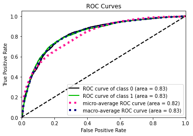 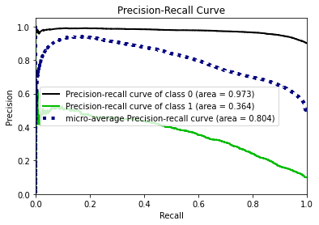


#### XGBoost

XGBoost is a decision tree based algorithm which leverages the concept of boosting and regularization to improve the accuracy of model. XGBoost is not present in sklearn package, however it has sklearn based API which can be easily used in python. To account for imbalanced class, we used scale_pos_weight =12 parameter to assign more weight to class with less data because the ratio in which classes are present is 1:12. In order to identify best hyperparameters, we are performing 5-fold cross validation along with grid search. Cross validation gives best combination of hyperparameters while maximizing the area under the ROC curve. Best combination from grid search is then used as final hyperparameters for the model.

Reference: https://xgboost.readthedocs.io/en/latest/python/python_api.html#module-xgboost.sklearn


```python
# Grid Search for best parameters
param_test = {'max_depth':list(range(4,7,1)),
                'learning_rate':list(np.arange(0.2,0.4,0.1)),
                'n_estimator':list(range(100,120,5))}
gsearch=GridSearchCV(estimator=xgb.XGBClassifier(learning_rate =0.1,
                            n_estimators=140,
                            subsample=0.8,
                            colsample_bytree=0.8,
                            njobs=-1,
                            seed=123,
                            scale_pos_weight=9),
                            param_grid=param_test,
                            scoring='roc_auc',
                            n_jobs=-1,
                            iid=True,
                            cv=5)
gsearch.fit(x_train_scaled,y_train)
print("Best Score:",gsearch.best_score_)
print("Best parameters:",gsearch.best_params_)
```

    Best Score: 0.8889800560078044
    Best parameters: {'learning_rate': 0.2, 'max_depth': 4, 'n_estimator': 100}


```python
# Model with best parameter
xgboost = xgb.XGBClassifier(n_jobs=-1,random_state=123,
                learning_rate =0.2,
                n_estimators=100,
                max_depth=4,
                subsample=0.8,
                colsample_bytree=0.8,
                scale_pos_weight=12)
print('XGBoost model \n')
model_fit(xgboost,x_train_scaled,x_test_scaled,y_train,y_test)
```

    XGBoost model
    
    Training Accuracy:  0.8
    Testing Accuracy:  0.79
    
    Classification Report:
                  precision    recall  f1-score   support
    
               0       0.98      0.79      0.87     10625
               1       0.30      0.83      0.44      1171
    
        accuracy                           0.79     11796
       macro avg       0.64      0.81      0.66     11796
    weighted avg       0.91      0.79      0.83     11796
    
    Confusion Matrix:
    Actual Predicted
          0     1
    0  8351  2274
    1   195   976
    ROC-AUC:  0.9


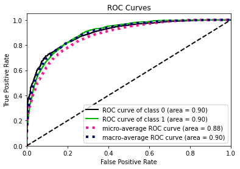 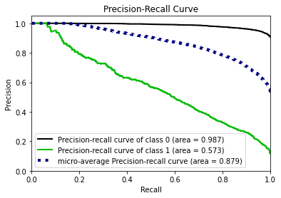


#### Neural Network

Deep Learning is state of the art when it come to machine learning algorithms. We wanted to implement a neural network to evaluate the utility of synthetic data for new age researchers. Th architecture we have used is below:

Input dimension: 18 neurons<br>
1st Layer: 500 neurons + relu activation function<br>
2nd Layer: Batch normalization<br>
3rd Layer: 500 neurons + relu activation function<br>
4th Layer: Drop out of neurons<br>
5th Layer: 500 neurons + relu activation function<br>
6th Layer: Batch normalization<br>
7th Layer: 500 neurons + relu activation function<br>
8th Layer: Drop out of neurons<br>
9th Layer: Sigmoid activation function<br>

The neural network is using binary cross entropy as loss function and is optimized to maximize area under the ROC curve.

Reference: https://keras.io/getting-started/sequential-model-guide/


```python
def nn_model():
    model = models.Sequential()
    model.add(layers.Dense(500, activation='relu',
                           input_dim=18))
    model.add(layers.BatchNormalization())
    model.add(layers.Dense(500, activation='relu'))
    model.add(layers.Dropout(0.3))
    model.add(layers.Dense(500, activation='relu'))
    model.add(layers.BatchNormalization())
    model.add(layers.Dense(500, activation='relu'))
    model.add(layers.Dropout(0.3))
    model.add(layers.Dense(1, activation='sigmoid'))
    model.compile(loss='binary_crossentropy',
                      optimizer='adam',
                      metrics=[tf.keras.metrics.AUC()])
    #model.fit(x_train_scaled, y_train, epochs=50, batch_size=500)
    return model
```


```python
NN = KerasClassifier(build_fn=nn_model, epochs=50, batch_size=200, verbose=0, class_weight={0:1,1:12})
model_fit(NN,x_train_scaled,x_test_scaled,y_train,y_test)
```

    Training Accuracy:  0.84
    Testing Accuracy:  0.81
    
    Classification Report:
                  precision    recall  f1-score   support
    
               0       0.97      0.81      0.89     10625
               1       0.32      0.78      0.45      1171
    
        accuracy                           0.81     11796
       macro avg       0.64      0.80      0.67     11796
    weighted avg       0.91      0.81      0.84     11796
    
    Confusion Matrix:
    Actual Predicted
          0     1
    0  8657  1968
    1   261   910
    ROC-AUC:  0.87


 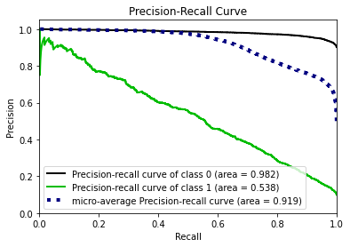


#### 7.2 Building Models -  TGAN data


```python
features=['NUMCALLOUT', 'NUMCPTEVENTS', 'NUMDIAGNOSIS',
       'NUMOUTEVENTS', 'NUMRX', 'NUMPROCEVENTS', 'NUMMICROLABEVENTS',
       'NUMPROC', 'NUMTRANSFERS', 'NUMINPUTEVENTS', 'NUMLABEVENTS',
       'NUMNOTEVENTS', 'ADMISSION_TYPE_ELECTIVE', 'ADMISSION_TYPE_EMERGENCY',
       'ADMISSION_TYPE_NEWBORN', 'ADMISSION_TYPE_URGENT', 'GENDER_F',
       'GENDER_M']
x_train = train_tgan[features]
y_train = train_tgan['HOSPITAL_EXPIRE_FLAG']
x_test = test[features]
y_test = test['HOSPITAL_EXPIRE_FLAG']
```

#### Standardize the variables


```python
scaler = StandardScaler()
scaler.fit(x_train)
x_train_scaled=scaler.transform(x_train)
x_test_scaled=scaler.transform(x_test)
```

#### Logistic Regression


```python
param_test ={'C':[0.001, 0.01, 0.1, 1, 10, 100],
             'penalty':('l1','l2')}
lr=linear_model.LogisticRegression(random_state=10,multi_class='ovr', class_weight='balanced')
gsearch=GridSearchCV(estimator=lr,
                        param_grid=param_test,
                        scoring='roc_auc',
                        n_jobs=-1,
                        iid=True,
                        cv=5)
gsearch.fit(x_train_scaled,y_train)
print("Best Score:",gsearch.best_score_)
print("Best parameters:",gsearch.best_params_)
```

    Best Score: 0.7813205247298578
    Best parameters: {'C': 0.01, 'penalty': 'l1'}


```python
# Model with best parameter
logistic_regression = linear_model.LogisticRegression(C=0.01,penalty='l1',
                                                      multi_class='ovr',
                                                     class_weight='balanced')
print('Logistic regression model \n')
model_fit(logistic_regression,x_train_scaled,x_test_scaled,y_train,y_test)
```

    Logistic regression model
    
    Training Accuracy:  0.7
    Testing Accuracy:  0.68
    
    Classification Report:
                  precision    recall  f1-score   support
    
               0       0.97      0.67      0.79     10625
               1       0.21      0.81      0.34      1171
    
        accuracy                           0.68     11796
       macro avg       0.59      0.74      0.57     11796
    weighted avg       0.90      0.68      0.75     11796
    
    Confusion Matrix:
    Actual Predicted
          0     1
    0  7116  3509
    1   217   954
    ROC-AUC:  0.81


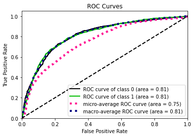 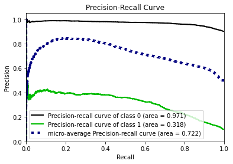


#### XGBoost


```python
# Grid Search for best parameters
param_test = {'max_depth':list(range(4,7,1)),
                'learning_rate':list(np.arange(0.2,0.4,0.1)),
                'n_estimator':list(range(100,120,5))}
gsearch=GridSearchCV(estimator=xgb.XGBClassifier(learning_rate =0.1,
                            n_estimators=140,
                            subsample=0.8,
                            colsample_bytree=0.8,
                            njobs=-1,
                            seed=123,
                            scale_pos_weight=12),
                            param_grid=param_test,
                            scoring='roc_auc',
                            n_jobs=-1,
                            iid=True,
                            cv=5)
gsearch.fit(x_train_scaled,y_train)
print("Best Score:",gsearch.best_score_)
print("Best parameters:",gsearch.best_params_)
```

    Best Score: 0.8219386820900801
    Best parameters: {'learning_rate': 0.2, 'max_depth': 4, 'n_estimator': 100}


```python
# Model with best parameter
xgboost = xgb.XGBClassifier(n_jobs=-1,random_state=123,
                learning_rate =0.2,
                n_estimators=100,
                max_depth=4,
                subsample=0.8,
                colsample_bytree=0.8,
                scale_pos_weight=12)
print('XGBoost model \n')
model_fit(xgboost,x_train_scaled,x_test_scaled,y_train,y_test)
```

    XGBoost model
    
    Training Accuracy:  0.74
    Testing Accuracy:  0.7
    
    Classification Report:
                  precision    recall  f1-score   support
    
               0       0.97      0.69      0.81     10625
               1       0.23      0.83      0.36      1171
    
        accuracy                           0.70     11796
       macro avg       0.60      0.76      0.58     11796
    weighted avg       0.90      0.70      0.76     11796
    
    Confusion Matrix:
    Actual Predicted
          0     1
    0  7304  3321
    1   198   973
    ROC-AUC:  0.84


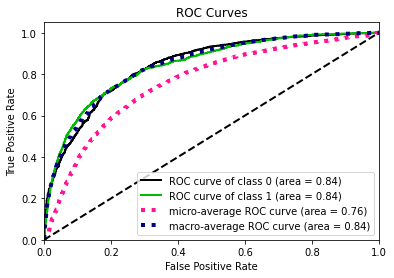 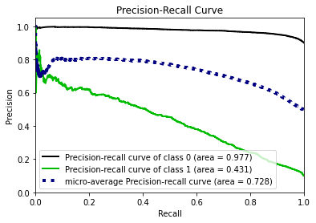


#### Neural Network


```python
def nn_model():
    model = models.Sequential()
    model.add(layers.Dense(500, activation='relu',
                           input_dim=18))
    model.add(layers.BatchNormalization())
    model.add(layers.Dense(500, activation='relu'))
    model.add(layers.Dropout(0.3))
    model.add(layers.Dense(500, activation='relu'))
    model.add(layers.BatchNormalization())
    model.add(layers.Dense(500, activation='relu'))
    model.add(layers.Dropout(0.3))
    model.add(layers.Dense(1, activation='sigmoid'))
    model.compile(loss='binary_crossentropy',
                      optimizer='adam',
                      metrics=[tf.keras.metrics.AUC()])
    #model.fit(x_train_scaled, y_train, epochs=50, batch_size=500)
    return model
```


```python
NN = KerasClassifier(build_fn=nn_model, epochs=50, batch_size=100, verbose=0, class_weight={0:1,1:12})
model_fit(NN,x_train_scaled,x_test_scaled,y_train,y_test)
```

    Training Accuracy:  0.75
    Testing Accuracy:  0.69
    
    Classification Report:
                  precision    recall  f1-score   support
    
               0       0.97      0.67      0.80     10625
               1       0.22      0.82      0.34      1171
    
        accuracy                           0.69     11796
       macro avg       0.59      0.75      0.57     11796
    weighted avg       0.90      0.69      0.75     11796
    
    Confusion Matrix:
    Actual Predicted
          0     1
    0  7148  3477
    1   208   963
    ROC-AUC:  0.82


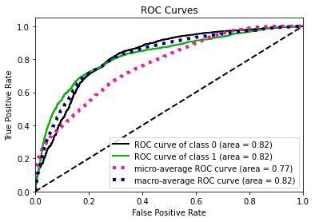 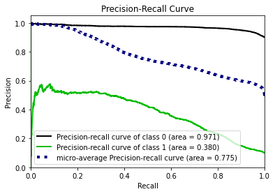


#### 7.3 Building Models -  CTGAN data


```python
features=['NUMCALLOUT', 'NUMCPTEVENTS', 'NUMDIAGNOSIS',
       'NUMOUTEVENTS', 'NUMRX', 'NUMPROCEVENTS', 'NUMMICROLABEVENTS',
       'NUMPROC', 'NUMTRANSFERS', 'NUMINPUTEVENTS', 'NUMLABEVENTS',
       'NUMNOTEVENTS', 'ADMISSION_TYPE_ELECTIVE', 'ADMISSION_TYPE_EMERGENCY',
       'ADMISSION_TYPE_NEWBORN', 'ADMISSION_TYPE_URGENT', 'GENDER_F',
       'GENDER_M']
x_train = train_ctgan[features]
y_train = train_ctgan['HOSPITAL_EXPIRE_FLAG']
x_test = test[features]
y_test = test['HOSPITAL_EXPIRE_FLAG']
```

#### Standardize variables


```python
scaler = StandardScaler()
scaler.fit(x_train)
x_train_scaled=scaler.transform(x_train)
x_test_scaled=scaler.transform(x_test)
```

#### Logistic Regression


```python
param_test ={'C':[0.001, 0.01, 0.1, 1, 10, 100],
             'penalty':('l1','l2')}
lr=linear_model.LogisticRegression(random_state=10,multi_class='ovr', class_weight='balanced')
gsearch=GridSearchCV(estimator=lr,
                        param_grid=param_test,
                        scoring='roc_auc',
                        n_jobs=-1,
                        iid=True,
                        cv=5)
gsearch.fit(x_train_scaled,y_train)
print("Best Score:",gsearch.best_score_)
print("Best parameters:",gsearch.best_params_)
```

    Best Score: 0.8016729735853085
    Best parameters: {'C': 0.01, 'penalty': 'l2'}


```python
# Model with best parameter
logistic_regression = linear_model.LogisticRegression(C=0.01,penalty='l2',
                                                      multi_class='ovr',
                                                     class_weight='balanced')
print('Logistic regression model \n')
model_fit(logistic_regression,x_train_scaled,x_test_scaled,y_train,y_test)
```

    Logistic regression model
    
    Training Accuracy:  0.7
    Testing Accuracy:  0.64
    
    Classification Report:
                  precision    recall  f1-score   support
    
               0       0.96      0.62      0.75     10625
               1       0.19      0.80      0.30      1171
    
        accuracy                           0.64     11796
       macro avg       0.58      0.71      0.53     11796
    weighted avg       0.89      0.64      0.71     11796
    
    Confusion Matrix:
    Actual Predicted
          0     1
    0  6578  4047
    1   240   931
    ROC-AUC:  0.78


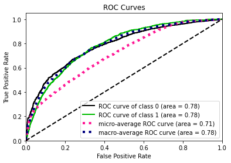 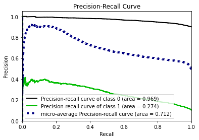


#### XGBoost


```python
# Grid Search for best parameters
param_test = {'max_depth':list(range(4,7,1)),
                'learning_rate':list(np.arange(0.2,0.4,0.1)),
                'n_estimator':list(range(100,120,5))}
gsearch=GridSearchCV(estimator=xgb.XGBClassifier(learning_rate =0.1,
                            n_estimators=140,
                            subsample=0.8,
                            colsample_bytree=0.8,
                            njobs=-1,
                            seed=123,
                            scale_pos_weight=9),
                            param_grid=param_test,
                            scoring='roc_auc',
                            n_jobs=-1,
                            iid=True,
                            cv=5)
gsearch.fit(x_train_scaled,y_train)
print("Best Score:",gsearch.best_score_)
print("Best parameters:",gsearch.best_params_)
```

    Best Score: 0.8273329818422657
    Best parameters: {'learning_rate': 0.2, 'max_depth': 4, 'n_estimator': 100}


```python
# Model with best parameter
xgboost = xgb.XGBClassifier(n_jobs=-1,random_state=123,
                learning_rate =0.2,
                n_estimators=100,
                max_depth=4,
                subsample=0.8,
                colsample_bytree=0.8,
                scale_pos_weight=12)
print('XGBoost model \n')
model_fit(xgboost,x_train_scaled,x_test_scaled,y_train,y_test)
```

    XGBoost model
    
    Training Accuracy:  0.72
    Testing Accuracy:  0.67
    
    Classification Report:
                  precision    recall  f1-score   support
    
               0       0.97      0.66      0.78     10625
               1       0.21      0.82      0.33      1171
    
        accuracy                           0.67     11796
       macro avg       0.59      0.74      0.56     11796
    weighted avg       0.89      0.67      0.74     11796
    
    Confusion Matrix:
    Actual Predicted
          0     1
    0  6973  3652
    1   214   957
    ROC-AUC:  0.82


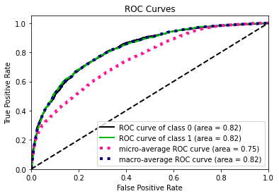 


#### Neural Network


```python
def nn_model():
    model = models.Sequential()
    model.add(layers.Dense(500, activation='relu',
                           input_dim=18))
    model.add(layers.BatchNormalization())
    model.add(layers.Dense(500, activation='relu'))
    model.add(layers.Dropout(0.3))
    model.add(layers.Dense(500, activation='relu'))
    model.add(layers.BatchNormalization())
    model.add(layers.Dense(500, activation='relu'))
    model.add(layers.Dropout(0.3))
    model.add(layers.Dense(1, activation='sigmoid'))
    model.compile(loss='binary_crossentropy', optimizer='adam',
                      metrics=[tf.keras.metrics.AUC()])
    return model
```


```python
NN = KerasClassifier(build_fn=nn_model, epochs=50, batch_size=100, verbose=0, class_weight={0:1,1:12})
model_fit(NN,x_train_scaled,x_test_scaled,y_train,y_test)
```

    Training Accuracy:  0.74
    Testing Accuracy:  0.65
    
    Classification Report:
                  precision    recall  f1-score   support
    
               0       0.96      0.64      0.77     10625
               1       0.19      0.77      0.31      1171
    
        accuracy                           0.65     11796
       macro avg       0.58      0.71      0.54     11796
    weighted avg       0.89      0.65      0.72     11796
    
    Confusion Matrix:
    Actual Predicted
          0     1
    0  6797  3828
    1   267   904
    ROC-AUC:  0.79


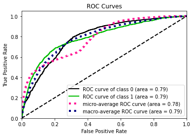 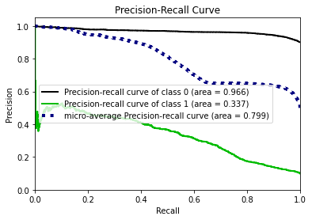


### Results

| Model               | Data            | Accuracy | Precision | Recall | F1-score | AUC-ROC |
| ------------------- | --------------- | -------- | --------- | ------ | -------- | ------- |
| Logistic Regression | Original        | 0.73     | 0.24      | 0.80   | 0.37     | 0.83    |
| Logistic Regression | TGAN Synthetic  | 0.68     | 0.21      | 0.81   | 0.34     | 0.81    |
| Logistic Regression | CTGAN Synthetic | 0.64     | 0.19      | 0.80   | 0.30     | 0.78    |
| XGBoost             | Original        | 0.79     | 0.30      | 0.83   | 0.44     | 0.90    |
| XGBoost             | TGAN Synthetic  | 0.70     | 0.23      | 0.83   | 0.36     | 0.84    |
| XGBoost             | CTGAN Synthetic | 0.67     | 0.21      | 0.82   | 0.33     | 0.82    |
| Neural Network      | Original        | 0.81     | 0.32      | 0.78   | 0.45     | 0.87    |
| Neural Network      | TGAN Synthetic  | 0.69     | 0.22      | 0.82   | 0.34     | 0.82    |
| Neural Network      | CTGAN Synthetic | 0.65     | 0.19      | 0.77   | 0.31     | 0.79    |

### Conclusion

All models were optimized to improve AUC-ROC metric and since we are predicting whether a patient will expire in single admit or no, we need to focus on recall at the same time. From the above table, we can conclude that there is  difference between AUC-ROC metric for synthetic data for a specific model lies within 9% of original data. Example for Logistic Regression, AUC-ROC value are 0.83 (original), 0.81(TGAN) and 0.78(CTGAN). Moreover the range of AUC-ROC varies a lot among different algorithms like XGBoost ranges between 0.82 to 0.90 whereas Logistic regression ranges between 0.78 to 0.83. So the impact of selecting algorithm is significant as compared to original vs synthetic data. Thus we can assume that any models generated by academic researchers or 3rd parties using synthetic data will perform comparatively on original data. There might be a need to fine tune or re-train the final model to deploy on original data but the heavy lifting can be done by stakeholders with synthetic data.


# Ideas for Further Research and Improvements - WIP

## Primary Keys

## Generating Larger Datasets from Small Samples

One of the applications of generating datasets can be to generate larger datasets from smaller one. We have already observed before that the synthetically generated data from TGAN and CTGAN is statistically similar to the original datasets. One can take advantage of this to generate datasets that are larger than the original datasets for applications such as training a Neural network which inherently requires large amounts of data, improving efficiency of an existing models as well. But before generating this dataset, a few things should be taken into consideration.

- Statistical Similarity has only been checked on datasets that are of the same size as the original data. Before generating larger datasets, the same statistical similarity tests should be performed on larger datasets of the desired size.
- Generating Synthetic datasets work by the algorithm calculating the distribution of a column, and then generating data by sampling form the distribution. One thing to note here is that as we draw larger number of samples from the original data, there is a higher chance that the model might sample the original observation from the dataset. Before generating larger dataset, the privacy module should also be tested on the dataset to make sure that this does not happen or such samples should be excluded from the result.

## Privacy Tuning

## Modifying TGAN to create a new module

TGAN and CTGAN are readily available modules and we have presented a comprehensive understanding, working and data generation analysis for both of these. however, as discussed above, there exists other GAN algorithms such as DP-GAN and PATE-GAN which have inbuilt statistical similarity and privacy measures that are desirable. However for these algorithms, there is no open source implementation available for tabular data, and actually creating these modules were out of scope.

One of the next steps could be to take existing TGAN module and modify the code to add the privacy and statistical similarity modules from CTGAN and DPGAN. The GAN algorithm works by first the discriminator learning to distinguish between real and fake datasets and then the generator adjusting itself to trying to beat the discriminator's algorithm. If privacy and statistical similarity modules are already added in the Discriminator, then the generator will produce data adhering to those requirements. One place to modify these should be the loss function of the generator and the discriminator.


## Model Efficiency

# Appendix - WIP

## Additional Codes

## Sources

https://arxiv.org/pdf/1802.06739.pdf
https://blog.cryptographyengineering.com/2016/06/15/what-is-differential-privacy/
https://medium.com/georgian-impact-blog/a-brief-introduction-to-differential-privacy-eacf8722283b
https://www.techfunnel.com/information-technology/3-types-of-data-anonymization-techniques-and-tools-to-consider/
https://towardsdatascience.com/synthetic-data-generation-a-must-have-skill-for-new-data-scientists-915896c0c1ae
https://www.ijstr.org/final-print/mar2017/A-Review-Of-Synthetic-Data-Generation-Methods-For-Privacy-Preserving-Data-Publishing.pdf
