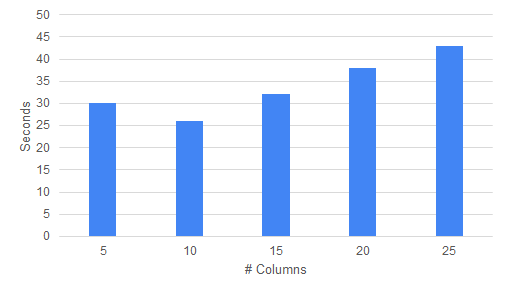
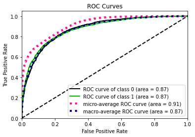
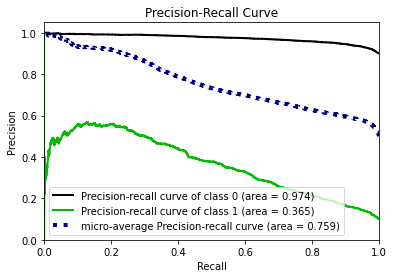

<div style="vertical-align:center">


# Leveraging GANs to Generate Tabular Synthetic Data


</div>


<div style="page-break-after: always; break-after: page;"></div>


#### **Table of Contents**

[TOC]

<div style="page-break-after: always; break-after: page;"></div>

# Executive Summary

##### **Problem context**

Advanced analytics is transforming all industries and is inherently data hungry. In health care data privacy rules detract data sharing for collaboration. Synthetic data, that retains the original characteristics and model compatible, can make data sharing easy and enable analytics for health care data.

##### **Need for change**

Conventionally statistical methods have been used, but with limited success. Current deidentification techniques are not sufficient to mitigate re-identification risks. Emerging technologies in Deep Learning such as GAN are very promising to solve this problem.

##### **Key Question**

How can you certify that the generated data is as similar and as useful as original data for the intended uses?

##### **Proposed Solution**

The Proposed solution by the team involves generating Synthetic Data using Generative Adversarial Networks or GANs and with the help of conventionally available sources such as TGAN and CTGAN. 

The team also wants to build modules which can test the generated synthetic data against the original datasets on following three areas:

- **Statistical Similarity:** Create standardized modules to check if the generated datasets are similar to the original dataset 
- **Privacy Risk:** Create standardized metrics to check if generated synthetic data protects privacy of all data points in the original dataset.
- **Model Compatibility**: Compare performance of Machine Learning techniques on original and synthetic datasets

##### **Results**:

- **Statistical Similarity:** The generated datasets were similar to each other when compared using PCA and Auto-Encoders.
- **Privacy module**: The generated Privacy at Risk (*PaR*) metric and modules helps identify columns which are at risk to expose the privacy of data points from original data. The generated datasets using TGAN and CTGAN had sufficiently high privacy score and protected privacy of original data points.
- **Model Compatibility**: The synthetic data has comparable model performance for both classification and regression problems. 

<div style="page-break-after: always; break-after: page;"></div>

# Introduction

Optum deals with sensitive healthcare data that has Personal identifiable Information (PII) of 100M+ people and it is expanding every day. The healthcare industry is particularly sensitive as Patient Identifiable Information data is strictly regulated by the Health Insurance Portability and Accountability Act (HIPPA) of 1996. Healthcare firms need to keep customer data secure while leveraging it to innovate research and drive growth in the firm. However, current data sharing practices (to ensure de-identification) have resulted in wait times for data access as long as 3 months. This has proved to be a hindrance to fast innovation at Optum. The need of the hour is to reduce the time for data access and enable innovation while protecting the information of patients. The key question to answer here is:

<center> "How can we safely and efficiently share healthcare data that is useful?"</center>

##### **Complication**

The key questions involve the inherent trade-off between safety and efficiency. With the inception of big data, efficiency in the data sharing process is of paramount importance. Availability and accessibility of data ensure rapid prototyping and lay down the path for quick innovation in the healthcare industry. Efficient data sharing also unlocks the full potential of analytics and data sciences through use cases like the diagnosis of cancer, predicting response for drug therapy, vaccine developments, drug discovery through bioinformatics. Apart from medical innovation, efficient data sharing helps to bridge the shortcomings in the healthcare system through salesforce effectiveness, managing supply chain and improve patient engagement. While efficient data sharing is crucial, the safety of patient's data can not be ignored. Existing regulations like HIPPA and recent privacy laws like the California Consumer Privacy Act are focused on maintaining the privacy of sensitive information. More advanced attacks are being organized by hackers and criminals aimed at accessing personal information. As per IBM's report on cost data breaches, the cost per record is ~$150. But the goodwill and trust lost by the companies, cannot be quantified So, the balance between data sharing and privacy is tricky.

# History of the Project

Existing de-identification techniques involve two main techniques 1) Anonymization Techniques 2) Differential Privacy. Almost every firm relies on these techniques to deal with sensitive information in PII data. These techniques have proven to be successful in the past and thus act as low hanging fruit for any organization.

1. **Anonymization techniques:** These techniques try to remove the columns which contain sensitive information. Methods include deleting columns, masking elements, quasi-identifiers, k-anonymity, l-diversity, and t-closeness.

2. **Differential privacy:** This is a perturbation technique which adds noise to columns which introduce randomness to data and thus maintain privacy. It is a mechanism to help to maximize the aggregate utility of databases ensuring high levels of privacy for the participants by striking a balance between utility and privacy.

However, these techniques are not cutting edge when it comes to maintaining privacy and data sharing. Rocher et al have proven that 99.98 percent of Americans (in a sample size of the population of Massachusetts) would be correctly re-identified in any dataset using as few as 15 demographic attributes. They conclude that "even heavily sampled anonymized datasets are unlikely to satisfy the modern standards for anonymization set forth by GDPR and seriously challenge the technical and legal adequacy of the de-identification release-and-forget model.

**Proposition**

Currently, the field of AI which is being given a lot of importance is Deep Learning. It addresses the critical aspect of data science in this age through universality theorem (identifying function form) and representation learning (correct features). Of late, generative modeling has seen a rise in popularity. In particular, a relatively recent model called Generative Adversarial Networks or GANs introduced by Ian Goodfellow et al. shows promise in producing realistic samples. While this is a state-of-the-art deep learning models to generate new synthetic data, there are few challenges which we need to overcome.

| Salient Features                                         | Challenges                                                   |
| -------------------------------------------------------- | ------------------------------------------------------------ |
| Neural Network is cutting edge algorithm in industry     | Trained to solve one specific task, can it fit all use cases? |
| Generate image using CNN architecture                    | Can we generate table from relational databases?             |
| Generate fake images of human faces that looks realistic | Would it balance the trade-off between maintaining utility and privacy of data |
| Requires high computational infrastructure like GPUs     | How to implement GAN for big data?                           |

# Why GANs?

## Introduction

A generative adversarial network (GAN) is a class of machine learning systems invented by **Ian Goodfellow** in 2014. GAN uses algorithmic architectures that use two neural networks, pitting one against the other (thus the “adversarial”) in order to generate new, synthetic instances of data that can pass for real data.


GANs consist of Two neural networks contest with each other in a game. Given a training set, this technique learns to generate new data with the same statistics as the training set. The two Neural Networks are named Generator and a Discriminator.

## GAN Working Overview

**Generator**
The generator is a neural network that models a transform function. It takes as input a simple random variable and must return, once trained, a random variable that follows the targeted distribution. The generator randomly feeds actual image and generated images to the Discriminator. The generator starts with Generating random noise and changes its outputs as per the Discriminator. If the Discriminator is successfully able to identify that generate input is fake, then then its weights are adjusted to reduce the error.

**Discriminator**
The Discriminators job is to determine if the data fed by the generator is real or fake. The discriminator is first trained on real data, so that it can identify it to acceptable accuracy. If the Discriminator is not trained properly, then it in turn will not be accurately able to identify fake images thus poorly training the Generator.

This is continued for multiple iterations till the discriminator can identify the real/fake images purely by chance only.


**Algorithm:**
Now lets see how GANs algorithm works internally.

- The generator randomly feeds real data mixed with generated fake data for the discriminator
- To begin, in first few iterations, the generator produces random noise which the discriminator is very good at detecting that the produced image is fake.
- Every iteration, the discriminator catches a generated image as fake, the generator readjusts its weights to improve itself. much like the Gradient Descent algorithm
- Over time, after multiple iterations, the generator becomes very good at producing images which can now fool the discriminator and pass as real ones.
- Now, its discriminators turn to improve its detection algorithm by adjusting its network weights.
- This game continues till a point where the discriminator is unable to distinguish a real image from fake and can only guess by chance.


## Existing Research in Synthetic Data Generation

### TGAN

This methodology has been created from the work provided in this paper:
[Synthesizing Tabular Data using Generative Adversarial Networks](https://arxiv.org/pdf/1811.11264.pdf)<br><br>
 And also the following python package:
[https://pypi.org/project/tgan/](https://pypi.org/project/tgan/)

Generative adversarial networks (GANs) implicitly learn the probability distribution of a dataset and can draw samples from the distribution. Tabular GAN (TGAN) is a generative adversarial network which can generate tabular data by learning distribution of the existing training datasets and can generate samples which are. Using the power of deep neural networks.

TGAN focuses on generating tabular data with mixed variable types (multinomial/discrete and continuous) and propose TGAN. To achieve this, we use LSTM with attention in order to generate data column by column. To asses, we first statistically evaluate the synthetic data generated by TGAN.

The paper also evaluates Machine learning models performance against traditional methods like modelling a multivariate probability or randomization based models.

#### Data preparation

For a table containing discrete and continuous random variables, They follow some probability distribution. Each row in the table is a sample from this distribution, which is sampled independently and the algorithms learn a generative model such that samples generated from this model can satisfy two conditions:<br>

+ A Machine Learning model using the Synthetic table achieves similar accuracy on the test table
+ Mutual information between an arbitrary pair of variables is similar

**Numerical Variables**<br>
For the model to learn the data effectively, a reversible transformation is applied. The a numerical variables are converted into a scalar in the range (1, 1) and a multinomial distribution, and convert a discrete variable into a multinomial distribution.

Often, numerical variables in tabular datasets follows multimodal distribution. [Gaussian Kernal density estimation](https://jakevdp.github.io/PythonDataScienceHandbook/05.13-kernel-density-estimation.html) is used to estimate these number of noes in the continuous variable. To sample values from these, a [gaussian mixture model](https://scikit-learn.org/stable/modules/mixture.html) is used.

**Categorical Variables** - Improvement needed <br>
categorical variables are directly converted to to one-hot-encoding representation and add noise to binary variables

In TGAN, the the discriminator D tries to distinguish whether the data is from the real distribution, while the generator G generates synthetic data and tries to fool the discriminator. the algorithm uses a Long Short Term Memory(LSTM) as generator and a Multi Layer Perceptron (MLP) as a discriminator.

#### Implementation


```python
import warnings
warnings.filterwarnings('ignore')

import pandas as pd
import tensorflow as tf
from tgan.model import TGANModel
from tgan.data import load_demo_data
```


```python
def tgan_run(data, cont_columns):
    tgan = TGANModel(continuous_columns)
    return tgan.fit(data)

def tgan_samples(model, num_samples):
    return tgan.sample(100000)
```


### CTGAN

CTGAN is a GAN-based method to model tabular data distribution and sample rows from the distribution. CTGAN implements mode-specific normalization to overcome the non-Gaussian and multimodal distribution (Section 4.2). We design a conditional generator and training-by-sampling to deal with the imbalanced discrete columns (Section 4.3). And we use fully-connected networks and several recent techniques to train a high-quality model.

**Several unique properties of tabular data challenge the design of a GAN model.**

+ Mixed data types Real-world tabular data consists of mixed types. To simultaneously generate a mix of discrete and continuous columns, GANs must apply both softmax and tanh on the output.
+ Non-Gaussian distributions: In images, pixels’ values follow a Gaussian-like distribution, which can be normalized to [−1, 1] using a min-max transformation. A tanh function is usually employed in the last layer of a network to output a value in this range. Continuous values in tabular data are usually non-Gaussian where min-max transformation will lead to vanishing gradient problem.
+ Multimodal distributions. We use kernel density estimation to estimate the number of modes in a column. We observe that 57/123 continuous columns in our 8 real-world datasets have multiple modes. Srivastava et al. [21] showed that vanilla GAN couldn’t model all modes on a simple 2D dataset; thus it would also struggle in modeling the multimodal distribution of continuous columns.
+ Learning from sparse one-hot-encoded vectors. When generating synthetic samples, a generative model is trained to generate a probability distribution over all categories using softmax, while the real data is represented in one-hot vector. This is problematic because a trivial discriminator can simply distinguish real and fake data by checking the distribution’s sparseness instead of considering the overall realness of a row.
+ Highly imbalanced categorical columns. In our datasets we noticed that 636/1048 of the categorical columns are highly imbalanced, in which the major category appears in more than 90% of the rows. This creates severe mode collapse. Missing a minor category only causes tiny changes to the data distribution that is hard to be detected by the discriminator. Imbalanced data also leads to insufficient training opportunities for minor classes.

When feeding data to the GAN algorithm, CTGAN samples so that all categories are correctly represented. Specifically, the goal is to resample efficiently in a way that all the categories from discrete attributes are sampled evenly (but not necessary uniformly) during the training process, and to recover the (not-resampled) real data distribution during test

These three things need to be incorporated:

+ Modify the input for conditional vector creation
+ The generated rows should preserve the condition
+ The conditional generator should learn the real data conditional distribution

#### Implementation


```python
import pandas as pd
import tensorflow as tf

from ctgan import load_demo
from ctgan import CTGANSynthesizer
```


```python
data = load_demo()
discrete_columns = ['workclass','education', 'marital-status', 'occupation', 'relationship', 'race', 'sex','native-country', 'income']
ctgan = CTGANSynthesizer()
ctgan.fit(data, discrete_columns)
```


### Differentially Private GAN

Source: [https://arxiv.org/pdf/1802.06739.pdf](https://arxiv.org/pdf/1802.06739.pdf)

One common issue in above proposed methodologies in GANs is that the density of the learned generative distribution could concentrate on the training data points, meaning that they can easily remember training samples due to the high model complexity of deep networks. This becomes a major concern when GANs are applied to private or sensitive data such as patient medical records, and the concentration of distribution may divulge critical patient information. Differentially Private GANs is achieved by adding carefully designed noise to gradients during the learning procedure.

DPGAN focuses on preserving the privacy during the training procedure instead of adding noise on the final parameters directly, which usually suffers from low utility.  Noise is added to the gradient of the Wasserstein distance with respect to the training data.

**Note:**   [Wasserstein distance](https://en.wikipedia.org/wiki/Wasserstein_metric) is a distance function defined between probability distributions on a given metric space

The algorithm guarantees that the parameters of discriminator and generator have differential privacy with respect to the sample training points. The algorithm inputs noise e in the generator parameters which enables this privacy, however one needs to perform a grid search over a large range of noise parameter **e** to get best results.

### PATE-GAN

Source: [https://arxiv.org/pdf/1906.09338.pdf](https://arxiv.org/pdf/1906.09338.pdf)

Generative Adversarial Networks (GAN) provide a powerful method for using real data to generate synthetic data but it does not provide any rigorous privacy guarantees. PATE GAN modifies the existing GAN algorithm in a way that does guarantee privacy

PATE GAN consists of two generator blocks called student block and teacher block on top of the existing generator block. With traditional privacy techniques, it is possible for the Generator to reconstruct the original data even after adding noise. PATE GAN prevents this by breaking down the generator into three stages. After the generator creates the data and adds noise, there is an ensemble block which factors in majority voting to create the input. After this there is a student block which aggregates the inputs from the teacher blocks and generates the final data.

The synthetic data is (differentially) private with respect to the original data DP-GAN: The key idea is that noise is added to the gradient of the discriminator during training to create differential privacy guarantees. Our method is similar in spirit; during training of the discriminator differentially private training data is used, which results in noisy gradients, however, we use the mechanism introduced in A noticeable difference is that the adversarial training is no longer symmetrical: the teachers are now being trained to improve their loss with respect to G but G is being trained to improve its loss with respect to the student S which in turn is being trained to improve its loss with respect to the teachers.


### G-PATE

Theoretically, the generator in GAN has the potential of generating an universal distribution, which is a superset of the real distribution, so it is not necessary for the student discriminator to be trained on real records. However, such a theoretical bound is loose. In practice, if a generator does generate enough samples from the universal distribution, there would be a convergence issue. On the other hand, when the generator does converge, it no longer covers the universal distribution, so the student generator may fail to learn the real distribution without seeing real records.

It is not necessary to ensure differential privacy for the discriminator in order to train a differentially private generator. As long as we ensure differential privacy on the information flow from the discriminator to the generator, it is sufficient to guarantee the privacy property for the generator. Therefore, instead of focusing on ensuring differential privacy for the whole GAN framework, we design a novel framework to guarantee that all information flowed from the discriminator to the generator satisfies differential privacy.

Compared to PATE-GAN, our approach has two advantages. First, we improve the use of privacy budget by applying it to the part of the model that actually needs to be released for data generation. Second, our discriminator can be trained on real data because itself does not need to satisfy differential privacy. The teacher discriminators do not need to be published, so they can be trained with non-private algorithms.

In addition, we design a gradient aggregator to collect information from teacher discriminators and combine them in a differentially private fashion.
Unlike PATE-GAN, G-PATE does not require any student discriminator. The teacher discriminators are directly connected to the student generator. The gradient aggregator sanitizes the information flow from the teacher discriminators to the student generator to ensure differential privacy The privacy property is achieved by sanitizing all information propagated from the discriminators to the generator.


# Methodology

In order to validate the efficacy of GANs to serve our purpose, we propose a methodology for thorough evaluation of synthetic data generated by GANs.


## MIMIC - III Dataset

MIMIC-III stands for Medical Information Mart for Intensive Care Unit. It is an open source database and contains multiple tables which can be combined to prepare various use cases. Data can be accessed on link provided below and in order to access data, few certifications are required which can be obtained by completing trainings on website. Open source dataset developed by the MIT Lab comprising de-identified health data is a comprehensive clinical dataset of 40,000+ patients admitted in ICU.

Source: https://mimic.physionet.org/gettingstarted/overview/

Overview of MIMIC-III data:

- **26 tables**: Comprehensive clinical dataset with different tables like Admissions, Patients, CPT events, Chart events, Diagnosis etc.
- **45,000+ patients**: Data associated with multiple admissions of patients and include details like Gender, Ethnicity, Marital Status
- **65,000+ ICU admissions**: Admitted in ICUs at Beth Israel Deaconess Medical Centre, Boston, from 2001 to 2012
- **PII data**: Includes patient sensitive details like demographics, diagnosis, laboratory tests, medications etc.
- **Use cases**: Can be used for multiple analysis like clinical data (prescriptions), claims data (payer), members data (patient)

For this project, focus is on specific tables from this database and not using all 26 tables. Combining multiple tables from this database, 2 different use cases were created which can be found in section below. These use cases will be used in modules like statistical similarity, model compatibility and privacy risk so initial understanding is crucial to understand the variable names used in further documentation.

##  Use Case 1: Length of Stay

#### Goal

Predicting the length of stay in ICU using 4 out of 26 tables


Use case: Out of variety of possible use cases from MIMIC III dataset we focus on single use case to predict the number of days a patient stays in the ICU to further generate synthetic data. This usecase seemed important to us because its always a benefit for payer to predict the tendency of the length of stay of a patient. It helps in changing the premium charged by the payer according to the comparison of predictions and baseline (the defined no. of days covered by a particular plan of the patient). For this use case the model utilises the total number of diagnosis that occured for different disease category for each patient.

To build this use case we focus on primarily 4 tables.

1. <b> Patients:</b> Every unique patient in the database (defines SUBJECT_ID) 
   <b> Columns like:</b> SUBJECT_ID, GENDER (count of rows: 46520 count of columns: 7)
2. <b> Admissions:</b> Every unique hospitalization for each patient in the database (defines HADM_ID)
   <b> Columns like:</b> SUBJECT_ID, HADM_ID, HOSPITAL_EXPIRE_FLAG, MARITAL_STATUS, ETHNICITY, ADMISSION_TYPE (count of rows: 58976 count of columns: 18 )
3. <b> ICUSTAYS:</b> Every unique ICU stay in the database (defines ICUSTAY_ID)
   <b> Columns like:</b> SUBJECT_ID, HADM_ID, LOS (count of rows: 61532 count of columns: 11 )
4. <b> Diagnosis_ICD:</b> Hospital assigned diagnoses, coded using the International Statistical Classification of Diseases and Related Health Problems (ICD) system
   <b> Columns like:</b> SUBJECT_ID, HADM_ID, NUMDIAGNOSIS (count of rows: 651047 count of columns: 5)

#### Methodology

1. <b> Load csv files:</b> Read the comma separated files downloaded from link (https://mimic.physionet.org/gettingstarted/overview/)
2. <b> Merge tables: </b> Use 'SUBJECT_ID' to merge tables like ADMISSIONS, PATIENTS and ICU_STAYS and finally concatenate 'SUBJECT_ID' and 'HADM_ID' to form 'final_id' as composite key.
3. <b> Prepare diagnosis dataset: </b> DIAGNOSIS_ICD table is used to map the disease category type using the first three code digits if ICD-9 code. The mapping is used to convert the unique 6984 ICD-9 codes into 18 different disease area categories and finally concatenate 'SUBJECT_ID' and 'HADM_ID' to form 'final_id' as composite key..
4. <b> Pivot up diagnosis dataset: </b> After the mapping the disease categories using ICD-9 codes, the dataset is pivoted up at the level of the 18 disease categories and the total count of diagnosis is being populated across 'final_id'
5. <b> Merge pivoted diagnosis datset to the main dataset: </b> Finally, the above generated dataset is then merged to the main dataset using the 'final_id' as the key.

Note: 6984 ICD-9 codes: The diagnosis dataset contains unique International Classification of Disease (ICD-9) codes                                                                            18 primary categories: We consider categories of conditions for the predictive modeling. Finally only the relevant columns required for the analysis are selected and we use the dataset for the synthetic data generation. The final data has 116354 rows and 27 columns.

#### Final Data

- <b> Level of data:</b> Each instance in the final data set is unique admission for each patient and is defined by concatenation of 'SUBJECT_ID' and 'HADM_ID' to form 'final_id'
- <b> Target Variables:</b> 'LOS' (length of stay) is used as target variable
- <b> Predictor variables:</b> 18 columns of different diagnosis category are used as predictor variables.
      These 18 categories are:
      "certain conditions originating in the perinatal period"                      
      "complications of pregnancy, childbirth, and the puerperium",
      "congenital anomalies",                                                
      "diseases of the blood and blood-forming organs",                       
      "diseases of the circulatory system",                                   
      "diseases of the digestive system",                                     
      "diseases of the genitourinary system",                                 
      "diseases of the musculoskeletal system and connective tissue",         
      "diseases of the nervous system",                                       
      "diseases of the respiratory system",                                   
      "diseases of the sense organs",                                         
      "diseases of the skin and subcutaneous tissue",                         
      "endocrine, nutritional and metabolic diseases, and immunity disorders",                     
      "external causes of injury and supplemental classification",            
      "infectious and parasitic diseases",                                    
      "injury and poisoning",                                                 
      "mental disorders",                                                     
      "neoplasms" and                                                            
      "symptoms, signs, and ill-defined conditions".
- <b> Other descriptive variables:</b> "ADMISSION_TYPE", "MARITAL_STATUS","INSURANCE", "ETHNICITY", "HOSPITAL_EXPIRE_FLAG", "GENDER" and "EXPIRE_FLAG"

**Code (data wrangling performed in R)**

1. Import required libraries and read csv files
2. Function for data preparation

**1. Import required libraries and read csv files**


```python
import pandas as pd
import numpy as np
import matplotlib.pyplot as plt
import seaborn as sns
from sklearn.model_selection import train_test_split
from sklearn.metrics import r2_score, mean_squared_error
from sklearn.preprocessing import MinMaxScaler
from sklearn.neighbors import KNeighborsRegressor
from sklearn.linear_model import LinearRegression
from sklearn.svm import SVR
from sklearn.ensemble import RandomForestRegressor
from sklearn.tree import DecisionTreeRegressor
from scipy.stats import pearsonr
from sklearn.ensemble import GradientBoostingRegressor
from sklearn.linear_model import SGDRegressor
import statsmodels.api as sm
from sklearn.model_selection import GridSearchCV
import seaborn as sns
```


```python
# Primary Admissions information
df = pd.read_csv(r"ADMISSIONS.csv")

# Patient specific info such as gender
df_pat = pd.read_csv(r"PATIENTS.csv")

# Diagnosis for each admission to hospital
df_diagcode = pd.read_csv(r"DIAGNOSES_ICD.csv")

# Intensive Care Unit (ICU) for each admission to hospital
df_icu = pd.read_csv(r"ICUSTAYS.csv")
```


#### Patients dataset


```python
print('Dataset has {} number of unique admission events.'.format(df['HADM_ID'].nunique()))
print('Dataset has {} number of unique patients.'.format(df['SUBJECT_ID'].nunique()))
```

    Dataset has 58976 number of unique admission events.
    Dataset has 46520 number of unique patients.


```python
# Convert admission and discharge times to datatime type
df['ADMITTIME'] = pd.to_datetime(df['ADMITTIME'])
df['DISCHTIME'] = pd.to_datetime(df['DISCHTIME'])

# Calculating the Length of Stay variable using the difference between Discharge time and Admit time 
# Convert timedelta type into float 'days'. Note: There are 86400 seconds in a day
df['LOS'] = (df['DISCHTIME'] - df['ADMITTIME']).dt.total_seconds()/86400
```


```python
df['LOS'].describe()
```


    count    58976.000000
    mean        10.133916
    std         12.456682
    min         -0.945139
    25%          3.743750
    50%          6.467014
    75%         11.795139
    max        294.660417
    Name: LOS, dtype: float64


```python
# Drop rows with negative LOS. The negative LOS means that the patient was brought dead to the ICU.
df['LOS'][df['LOS'] > 0].describe()
```


    count    58878.000000
    mean        10.151266
    std         12.459774
    min          0.001389
    25%          3.755556
    50%          6.489583
    75%         11.805556
    max        294.660417
    Name: LOS, dtype: float64


```python
# Plot LOS Distribution
plt.hist(df['LOS'], bins=200, color = '0.75')
plt.xlim(0, 100)
plt.title('Distribution of LOS for all hospital admissions \n incl. deceased')
plt.ylabel('Count')
plt.xlabel('Length-of-Stay (days)')
plt.tick_params(top=False, right=False) 
plt.show();
```


```python
# Drop LOS < 0 
df = df[df['LOS'] > 0]
```


```python
# Dropping the columns that are not needed
df.drop(columns=['DISCHTIME', 'ROW_ID', 
                'EDREGTIME', 'EDOUTTIME', 'HOSPITAL_EXPIRE_FLAG',
                'HAS_CHARTEVENTS_DATA'], inplace=True)
```


```python
# Mapping the dead and alive value of patients who died in hospital as 1 and 0
df['DECEASED'] = df['DEATHTIME'].notnull().map({True:1, False:0})
```


```python
print("{} of {} patients died in the hospital".format(df['DECEASED'].sum(), 
                                                     df['SUBJECT_ID'].nunique()))
```

    5774 of 46445 patients died in the hospital


```python
# Descriptive analysis of patients who died during the stay in ICU
df['LOS'].loc[df['DECEASED'] == 0].describe()
```


    count    53104.000000
    mean        10.138174
    std         12.284461
    min          0.014583
    25%          3.866667
    50%          6.565972
    75%         11.711632
    max        294.660417
    Name: LOS, dtype: float64


```python
# Descriptive analysis of LOS metric (target variable)
mean_los = df['LOS'].mean() 
median_los = df['LOS'].median()
min_los = df['LOS'].min()
max_los = df['LOS'].max()

print("Mean LOS: ",mean_los)
print("Median LOS: ",median_los)
print("Min LOS: ",min_los)
print("Max LOS: ",max_los)
```

    Mean LOS:  10.151266378028323
    Median LOS:  6.489583333333333
    Min LOS:  0.0013888888888888892
    Max LOS:  294.66041666666666


```python
# Club the Ethnicity categories into 5 broad categories
df['ETHNICITY'].replace(regex=r'^ASIAN\D*', value='ASIAN', inplace=True)
df['ETHNICITY'].replace(regex=r'^WHITE\D*', value='WHITE', inplace=True)
df['ETHNICITY'].replace(regex=r'^HISPANIC\D*', value='HISPANIC/LATINO', inplace=True)
df['ETHNICITY'].replace(regex=r'^BLACK\D*', value='BLACK/AFRICAN AMERICAN', inplace=True)
df['ETHNICITY'].replace(['UNABLE TO OBTAIN', 'OTHER', 'PATIENT DECLINED TO ANSWER', 
                         'UNKNOWN/NOT SPECIFIED'], value='OTHER/UNKNOWN', inplace=True)
df['ETHNICITY'].loc[~df['ETHNICITY'].isin(df['ETHNICITY'].value_counts().nlargest(5).index.tolist())] = 'OTHER/UNKNOWN'
df['ETHNICITY'].value_counts()
```

    WHITE                     41268
    OTHER/UNKNOWN              7700
    BLACK/AFRICAN AMERICAN     5779
    HISPANIC/LATINO            2125
    ASIAN                      2006
    Name: ETHNICITY, dtype: int64

##### Function to plot graphs for exploratory analysis


```python
# Bar plot function
def plot_los_groupby(variable, size=(7,4)):
    ''' 
    Plot Median LOS by df categorical series name 
    '''
    results = df[[variable, 'LOS']].groupby(variable).median().reset_index()
    values = list(results['LOS'].values)
    labels = list(results[variable].values)

    fig, ax = plt.subplots(figsize=size)
    ind = range(len(results))
    ax.barh(ind, values, align='center', height=0.6, color = '#55a868', alpha=0.8)
    ax.set_yticks(ind)
    ax.set_yticklabels(labels)
    ax.set_xlabel('Median Length of Stay (days)')
    ax.tick_params(left=False, top=False, right=False) 
    ax.set_title('Comparison of {} labels'.format(variable))
    
    plt.tight_layout()
    plt.show();
    
# Boxplot function
def boxplot_los_groupby(variable, los_range=(-1, 30), size=(8,4)):
    ''' 
    Boxplot of LOS by df categorical series name 
    '''
    results = df[[variable, 'LOS']].groupby(variable).median().reset_index()

    categories = results[variable].values.tolist()

    hist_data = []
    for cat in categories:
        hist_data.append(df['LOS'].loc[df[variable]==cat].values)

    fig, ax = plt.subplots(figsize=size)
    ax.boxplot(hist_data, 0, '', vert=False)
    ax.set_xlim(los_range)
    ax.set_yticklabels(categories)
    ax.set_xlabel('Length of Stay (days)')
    ax.tick_params(left=False, right=False) 
    ax.set_title('Comparison of {} categories'.format(variable))
    plt.tight_layout()
    plt.show();


```


```python
boxplot_los_groupby('ETHNICITY', los_range=(-1, 30))
```


#### Admission Dataset

##### Admission Type


```python
df['ADMISSION_TYPE'].value_counts()
```


    EMERGENCY    41989
    NEWBORN       7854
    ELECTIVE      7702
    URGENT        1333
    Name: ADMISSION_TYPE, dtype: int64


```python
plot_los_groupby('ADMISSION_TYPE')
```


```python
boxplot_los_groupby('ADMISSION_TYPE', los_range=(-5, 35), size=(7, 4))
```


##### Insurance


```python
df['INSURANCE'].value_counts()
```


    Medicare      28174
    Private       22542
    Medicaid       5778
    Government     1781
    Self Pay        603
    Name: INSURANCE, dtype: int64


```python
plot_los_groupby('INSURANCE')
```


```python
boxplot_los_groupby('INSURANCE', los_range=(-5, 30), size=(7, 4))
```


##### Marital Status


```python
df['MARITAL_STATUS'].value_counts(dropna=False)
```


    MARRIED              24199
    SINGLE               13238
    NaN                  10097
    WIDOWED               7204
    DIVORCED              3211
    SEPARATED              571
    UNKNOWN (DEFAULT)      343
    LIFE PARTNER            15
    Name: MARITAL_STATUS, dtype: int64


```python
# Replacing NAs as'UNKNOWN'
df['MARITAL_STATUS'] = df['MARITAL_STATUS'].fillna('UNKNOWN (DEFAULT)')
df['MARITAL_STATUS'].value_counts(dropna=False)
```


    MARRIED              24199
    SINGLE               13238
    UNKNOWN (DEFAULT)    10440
    WIDOWED               7204
    DIVORCED              3211
    SEPARATED              571
    LIFE PARTNER            15
    Name: MARITAL_STATUS, dtype: int64


```python
plot_los_groupby('MARITAL_STATUS')
```


```python
boxplot_los_groupby('MARITAL_STATUS')
```


#### Diagnosis Dataset

Because it's not feasible to have 6985 unique values to use as features for predicting LOS, The diagnosis were reduced into more general categories. After researching the ICD9 coding methodology, the super categories in which the diagnosis codes are arranged are as follows:

- 001–139: infectious and parasitic diseases
- 140–239: neoplasms
- 240–279: endocrine, nutritional and metabolic diseases, and immunity disorders
- 280–289: diseases of the blood and blood-forming organs
- 290–319: mental disorders
- 320–389: diseases of the nervous system and sense organs
- 390–459: diseases of the circulatory system
- 460–519: diseases of the respiratory system
- 520–579: diseases of the digestive system
- 580–629: diseases of the genitourinary system
- 630–679: complications of pregnancy, childbirth, and the puerperium
- 680–709: diseases of the skin and subcutaneous tissue
- 710–739: diseases of the musculoskeletal system and connective tissue
- 740–759: congenital anomalies
- 760–779: certain conditions originating in the perinatal period
- 780–799: symptoms, signs, and ill-defined conditions
- 800–999: injury and poisoning
- E and V codes: external causes of injury and supplemental classification, using 999 as placeholder even though it overlaps with complications of medical care

Source of these categories: https://en.wikipedia.org/wiki/List_of_ICD-9_codes


```python
# Filter out E and V codes since processing will be done on the numeric first 3 values
df_diagcode['recode'] = df_diagcode['ICD9_CODE']
df_diagcode['recode'] = df_diagcode['recode'][~df_diagcode['recode'].str.contains("[a-zA-Z]").fillna(False)]
df_diagcode['recode'].fillna(value='999', inplace=True)
```


```python
df_diagcode['recode'] = df_diagcode['recode'].str.slice(start=0, stop=3, step=1)
df_diagcode['recode'] = df_diagcode['recode'].astype(int)
```


```python
# ICD-9 Main Category ranges
icd9_ranges = [(1, 140), (140, 240), (240, 280), (280, 290), (290, 320), (320, 390), 
               (390, 460), (460, 520), (520, 580), (580, 630), (630, 680), (680, 710),
               (710, 740), (740, 760), (760, 780), (780, 800), (800, 1000), (1000, 2000)]

# Associated category names
diag_dict = {0: 'infectious', 1: 'neoplasms', 2: 'endocrine', 3: 'blood',
             4: 'mental', 5: 'nervous', 6: 'circulatory', 7: 'respiratory',
             8: 'digestive', 9: 'genitourinary', 10: 'pregnancy', 11: 'skin', 
             12: 'muscular', 13: 'congenital', 14: 'prenatal', 15: 'misc',
             16: 'injury', 17: 'misc'}

# Re-code in terms of integer
for num, cat_range in enumerate(icd9_ranges):
    df_diagcode['recode'] = np.where(df_diagcode['recode'].between(cat_range[0],cat_range[1]), 
            num, df_diagcode['recode'])
    
# Convert integer to category name using diag_dict
df_diagcode['recode'] = df_diagcode['recode']
df_diagcode['cat'] = df_diagcode['recode'].replace(diag_dict)
```


```python
# Create list of diagnoses for each admission
hadm_list = df_diagcode.groupby('HADM_ID')['cat'].apply(list).reset_index()
```


```python
# Convert diagnoses list into hospital admission-item matrix
hadm_item = pd.get_dummies(hadm_list['cat'].apply(pd.Series).stack()).sum(level=0)
```


```python
# Join the above created dataset using HADM_ID to the hadm_list
hadm_item = hadm_item.join(hadm_list['HADM_ID'], how="outer")
```


```python
# Finally merging with main admissions df
df = df.merge(hadm_item, how='inner', on='HADM_ID')
```


```python
# Explore median LOS by diagnosis category as defined above
diag_cat_list = ['skin', 'infectious',  'misc', 'genitourinary', 'neoplasms', 'blood', 'respiratory', 
                  'congenital','nervous', 'muscular', 'digestive', 'mental', 'endocrine', 'injury',
                 'circulatory', 'prenatal',  'pregnancy']

results = []
for variable in diag_cat_list:
    results.append(df[[variable, 'LOS']].groupby(variable).median().reset_index().values[1][1])

sns.set(style="whitegrid")

fig, ax = plt.subplots(figsize=(7,5))
ind = range(len(results))
ax.barh(ind, results, align='edge', color = '#55a868', alpha=0.8)
ax.set_yticks(ind)
ax.set_yticklabels(diag_cat_list)
ax.set_xlabel('Median Length of Stay (days)')
ax.tick_params(left=False, right=False, top=False) 
ax.set_title('Comparison of Diagnoses'.format(variable))
plt.show();
```


##### ICU STAYS dataset


```python
df_icu['HADM_ID'].nunique()
```


    57786


```python
# Converting different categories of first care unit into ICU and NICU groups
df_icu['FIRST_CAREUNIT'].replace({'CCU': 'ICU', 'CSRU': 'ICU', 'MICU': 'ICU',
                                  'SICU': 'ICU', 'TSICU': 'ICU'}, inplace=True)
```


```python
df_icu['cat'] = df_icu['FIRST_CAREUNIT']
icu_list = df_icu.groupby('HADM_ID')['cat'].apply(list).reset_index()
```


```python
df_icu['FIRST_CAREUNIT'].value_counts()
```


    ICU     53432
    NICU     8100
    Name: FIRST_CAREUNIT, dtype: int64


```python
# Create admission-ICU matrix
icu_item = pd.get_dummies(icu_list['cat'].apply(pd.Series).stack()).sum(level=0)
icu_item[icu_item >= 1] = 1
icu_item = icu_item.join(icu_list['HADM_ID'], how="outer")
```


```python
# Merge ICU data with main dataFrame
df = df.merge(icu_item, how='outer', on='HADM_ID')
```


```python
# Replace NA with 0
df['ICU'].fillna(value=0, inplace=True)
df['NICU'].fillna(value=0, inplace=True)
```

##### Final preparation of the dataset


```python
# Drop unnecessary columns
df.drop(columns=['ADMISSION_LOCATION','SUBJECT_ID', 'HADM_ID', 'ADMITTIME', 'ADMISSION_LOCATION',
                'DISCHARGE_LOCATION', 'LANGUAGE',
                'DIAGNOSIS', 'DECEASED',  'DEATHTIME'], inplace=True)
 df.drop(columns=['DOB','DOD','DOD_HOSP','DOD_SSN','ROW_ID','RELIGION'], inplace=True)
```


```python
# Filtering only admission with LOS less than 40 days to reduce the skewness of the data.
df = df[df['LOS'] <40]
```


```python
# Randomly splitting the data into test and train with 20% and 80% distribution. Using the train data to generate
# synthetic data and keeping the test data seperate for evaluation purpose

los_use, los_predict = train_test_split(df, test_size=0.2, random_state=25)
```


```python
# Writing the train and test files into csv for further use 
# Note: Train dataset will be used for generating synthetic data using T-GAN and CT-GAN.
# Test dataset will be used for evaluation of models

los_use.to_csv("los_usecase.csv",index = False)
los_predict.to_csv("los_predict.csv",index = False)
```

#### Conclusion

This use case will be used for regression problem in model compatibility and other modules like statistical similarity and privacy risk evaluation.

##  Use Case 2: Mortality Prediction

#### Goal

Another use case using MIMIC-III dataset is for mortality prediction. This use case is inspired by Kaggle kernel (reference below) where one can predict mortality just by the number of interactions between patient and hospital as predictors through count of lab tests, prescriptions, and procedures. It can be used to evaluate privacy risk with the help of PII columns like GENDER, ETHNICITY, MARITAL_STATUS and also serves as classification problem where we have to predict if patient will expire or not for a single hospital admission.

Reference: https://www.kaggle.com/drscarlat/predict-hospital-mortality-mimic3


#### Methodology

Tables used in this use case:

1. **Patients** - Every unique patient in the database (defines SUBJECT_ID). Columns like: SUBJECT_ID, GENDER
2. **Admissions** - Every unique hospitalization for each patient in the database (defines HADM_ID). Columns Like: SUBJECT_ID, HADM_ID, HOSPITAL_EXPIRE_FLAG, MARITAL_STATUS, ETHNICITY, ADMISSION_TYPE
3. **CallOut** - Information regarding when a patient was cleared for ICU discharge and when the patient was actually
   discharged. Columns Like: SUBJECT_ID, HADM_ID, NUMCALLOUT (count of rows)
4. **CPTEvents** - Procedures recorded as Current Procedural Terminology (CPT) codes. Columns Like: SUBJECT_ID, HADM_ID, NUMCPTEVENTS (count of rows)
5. **Diagnosis_ICD** - Hospital assigned diagnoses, coded using the International Statistical Classification of Diseases and Related Health Problems (ICD) system. Columns Like: SUBJECT_ID, HADM_ID, NUMDIAGNOSIS (count of rows)
6. **Inputevents_CV** - Intake for patients monitored using the Philips CareVue system while in the ICU. Columns Like: SUBJECT_ID, HADM_ID, NUMINPUTEVENTS (count of rows)
7. **Labevents** - Laboratory measurements for patients both within the hospital and in out patient clinics. Columns Like: SUBJECT_ID, HADM_ID, NUMLABEVENTS (count of rows)
8. **Noteevents** - Deidentified notes, including nursing and physician notes, ECG reports, imaging reports, and discharge summaries. Columns Like: SUBJECT_ID, HADM_ID, NUMNOTEVENTS (count of rows)
9. **Outputevents** - Output information for patients while in the ICU. Columns Like: SUBJECT_ID, HADM_ID, NUMOUTEVENTS (count of rows)
10. **Prescriptions** - Medications ordered, and not necessarily administered, for a given patient. Columns Like: SUBJECT_ID, HADM_ID, NUMRX (count of rows)
11. **Procedureevents_mv** - Patient procedures for the subset of patients who were monitored in the ICU using the iMDSoft MetaVision system. Columns Like: SUBJECT_ID, HADM_ID, NUMPROCEVENTS (count of rows)
12. **MICROBIOLOGYEVENTS** - Microbiology measurements and sensitivities from the hospital database. Columns Like: SUBJECT_ID, HADM_ID, NUMMICROLABEVENTS (count of rows)
13. **Procedures_icd** - Patient procedures, coded using the International Statistical Classification of Diseases and Related Health Problems (ICD) system. Columns Like: SUBJECT_ID, HADM_ID, NUMPROC (count of rows)
14. **Transfers** - Patient movement from bed to bed within the hospital, including ICU admission and discharge. Columns Like: SUBJECT_ID, HADM_ID, NUMTRANSFERS (count of rows)

Steps to create analytical data set

1. **Load csv files**: Read the comma separated files downloaded from link (https://mimic.physionet.org/gettingstarted/overview/)
2. **Roll up tables**: We need count of various events or interactions between patients and hospital. In order to do this, group
   by or aggregate the tables at 'SUBJECT_ID' and 'HADM_ID' level and take count of number of rows for each. This will
   give total count of events related to single hospital admission.
3. **Merge tables**: Use 'SUBJECT_ID' and 'HADM_ID' as composite key to merge all tables together and create final
   analytical data set.

**Code**

1. Import required libraries and read csv files
2. Function to roll up tables
3. Merge all tables
4. Exploratory Analysis

**Import required libraries and read csv files**


```python
import pandas as pd
import matplotlib.pyplot as plt
from sklearn.model_selection import train_test_split
import warnings
warnings.filterwarnings('ignore')
```


```python
patients = pd.read_csv("data/patients.csv")
admissions = pd.read_csv("data/admissions.csv")
callout = pd.read_csv("data/callout.csv")
cptevents = pd.read_csv("data/cptevents.csv")
diagnosis = pd.read_csv("data/diagnoses_icd.csv")
outputevents = pd.read_csv("data/outputevents.csv")
rx = pd.read_csv("data/prescriptions.csv")
procevents = pd.read_csv("data/procedureevents_mv.csv")
microlabevents = pd.read_csv("data/microbiologyevents.csv")
proc = pd.read_csv("data/procedures_icd.csv")
transfers = pd.read_csv("data/transfers.csv")
inputevents = pd.read_csv("data/inputevents_cv.csv")
labevents = pd.read_csv("data/labevents.csv")
noteevents = pd.read_csv("data/noteevents.csv")
```

**Function to roll up tables**


```python
def rollup_sub_adm(df,col):
    df=df.groupby(['SUBJECT_ID','HADM_ID']).agg({'ROW_ID':'count'})
    df.reset_index(inplace=True)
    df.columns=['SUBJECT_ID','HADM_ID',col]
    print(col,":",df.shape)
    return df
```


```python
callout=rollup_sub_adm(callout,'NUMCALLOUT')
cptevents=rollup_sub_adm(cptevents,'NUMCPTEVENTS')
diagnosis=rollup_sub_adm(diagnosis,'NUMDIAGNOSIS')
outputevents=rollup_sub_adm(outputevents,'NUMOUTEVENTS')
rx=rollup_sub_adm(rx,'NUMRX')
procevents=rollup_sub_adm(procevents,'NUMPROCEVENTS')
microlabevents=rollup_sub_adm(microlabevents,'NUMMICROLABEVENTS')
proc=rollup_sub_adm(proc,'NUMPROC')
transfers=rollup_sub_adm(transfers,'NUMTRANSFERS')
inputevents=rollup_sub_adm(inputevents,'NUMINPUTEVENTS')
labevents=rollup_sub_adm(labevents,'NUMLABEVENTS')
noteevents=rollup_sub_adm(noteevents,'NUMNOTEVENTS')
```

    NUMCALLOUT : (28732, 3)
    NUMCPTEVENTS : (44148, 3)
    NUMDIAGNOSIS : (58976, 3)
    NUMOUTEVENTS : (52008, 3)
    NUMRX : (50216, 3)
    NUMPROCEVENTS : (21894, 3)
    NUMMICROLABEVENTS : (48740, 3)
    NUMPROC : (52243, 3)
    NUMTRANSFERS : (58976, 3)
    NUMINPUTEVENTS : (31970, 3)
    NUMLABEVENTS : (58151, 3)
    NUMNOTEVENTS : (58361, 3)

**Merge all tables**


```python
mortality=admissions[['SUBJECT_ID','HADM_ID','ADMISSION_TYPE','MARITAL_STATUS','ETHNICITY','HOSPITAL_EXPIRE_FLAG']]
mortality.loc[pd.isnull(mortality['MARITAL_STATUS']),'MARITAL_STATUS'] ='UNKNOWN (DEFAULT)'
mortality = mortality.merge(patients[['SUBJECT_ID','GENDER']],how='left',on='SUBJECT_ID')
mortality = mortality.merge(callout,how='left',on=['SUBJECT_ID','HADM_ID'])
mortality = mortality.merge(cptevents,how='left',on=['SUBJECT_ID','HADM_ID'])
mortality = mortality.merge(diagnosis,how='left',on=['SUBJECT_ID','HADM_ID'])
mortality = mortality.merge(outputevents,how='left',on=['SUBJECT_ID','HADM_ID'])
mortality = mortality.merge(rx,how='left',on=['SUBJECT_ID','HADM_ID'])
mortality = mortality.merge(procevents,how='left',on=['SUBJECT_ID','HADM_ID'])
mortality = mortality.merge(microlabevents,how='left',on=['SUBJECT_ID','HADM_ID'])
mortality = mortality.merge(proc,how='left',on=['SUBJECT_ID','HADM_ID'])
mortality = mortality.merge(transfers,how='left',on=['SUBJECT_ID','HADM_ID'])
mortality = mortality.merge(inputevents,how='left',on=['SUBJECT_ID','HADM_ID'])
mortality = mortality.merge(labevents,how='left',on=['SUBJECT_ID','HADM_ID'])
mortality = mortality.merge(noteevents,how='left',on=['SUBJECT_ID','HADM_ID'])
mortality = mortality.fillna(0)
```


```python
#Exporing data
mortality.to_csv('mortality_full_data.csv',index=False)
```

**Exploratory Analysis**


```python
mortality.shape
```


    (58976, 19)


```python
mortality.columns
```


    Index(['SUBJECT_ID', 'HADM_ID', 'ADMISSION_TYPE', 'MARITAL_STATUS',
           'ETHNICITY', 'HOSPITAL_EXPIRE_FLAG', 'GENDER', 'NUMCALLOUT',
           'NUMCPTEVENTS', 'NUMDIAGNOSIS', 'NUMOUTEVENTS', 'NUMRX',
           'NUMPROCEVENTS', 'NUMMICROLABEVENTS', 'NUMPROC', 'NUMTRANSFERS',
           'NUMINPUTEVENTS', 'NUMLABEVENTS', 'NUMNOTEVENTS'],
          dtype='object')


```python
mortality.groupby('HOSPITAL_EXPIRE_FLAG').size().plot.bar()
plt.show()
```


```python
mortality.groupby('GENDER').size().plot.bar()
plt.show()
```


```python
mortality.groupby('MARITAL_STATUS').size().plot.bar()
plt.show()
```


```python
mortality.groupby('ADMISSION_TYPE').size().plot.bar()
plt.show()
```


```python
mortality.groupby('NUMLABEVENTS').size().plot.hist(bins=50)
plt.show()
```


```python
mortality.dtypes
```


    SUBJECT_ID                int64
    HADM_ID                   int64
    ADMISSION_TYPE           object
    MARITAL_STATUS           object
    ETHNICITY                object
    HOSPITAL_EXPIRE_FLAG      int64
    GENDER                   object
    NUMCALLOUT              float64
    NUMCPTEVENTS            float64
    NUMDIAGNOSIS              int64
    NUMOUTEVENTS            float64
    NUMRX                   float64
    NUMPROCEVENTS           float64
    NUMMICROLABEVENTS       float64
    NUMPROC                 float64
    NUMTRANSFERS              int64
    NUMINPUTEVENTS          float64
    NUMLABEVENTS            float64
    NUMNOTEVENTS            float64
    dtype: object

#### Conclusion

This use case will be used for classification problem in model compatibility and other modules like statistical similarity and privacy risk evaluation.


## Synthetic Data Generation

This method is the state of the art in reducing the reidentification risk. As we observed earlier, Data anonymization if effective but reduces the utility, Differential privacy adds small noise but has very bad model compatibility. However, Synthetic data, can be tuned to add privacy without losing either the utility, neither exposing privacy of individual data points.  As the  data doesn't represent any real entity, the disclosure of sensitive private data is eliminated. If the information available in the released synthetic data matches with any real entity participated in the original data then it is purely a co-incidence which gives individuals plausible deniability

A synthetic dataset is a repository of data that is generated programmatically.

- It can be numerical, binary, or categorical (ordinal or non-ordinal),
- The **number of features and length of the dataset** should be arbitrary
- It should preferably be **random** and the user should be able to choose a wide variety of **statistical distribution** to base this data upon i.e.. the underlying **random process can be precisely controlled and tuned**,
- If it is used for classification algorithms, then the **degree of class separation** should be controllable to make the learning problem easy or hard
- Random noise can be interjected in a controllable manner
- For a regression problem, a complex, **non-linear generative process** can be used for sourcing the data


##### Configuring GPU for Tensorflow

To take advantage of GPU for better faster training of Neural networks, the system must be equipped with a CUDA enabled GPU card with a compatibility for CUDA 3.5 or higher. See the list of [CUDA-enabled GPU cards](https://developer.nvidia.com/cuda-gpus)

This is also a guide for the same [https://www.tensorflow.org/install/gpu](https://www.tensorflow.org/install/gpu)

##### Required Python Packages

To install latest version of Tensorflow

```python
pip install tensorflow 
```

For releases 1.15 and older, CPU and GPU packages are separate:

```python
pip install tensorflow==1.15      # CPU
pip install tensorflow-gpu==1.15  # GPU
```


##### Software requirements

The following NVIDIA® software must be installed on your system:

- [NVIDIA® GPU drivers](https://www.nvidia.com/drivers) —CUDA 10.1 requires 418.x or higher.
- [CUDA® Toolkit](https://developer.nvidia.com/cuda-toolkit-archive) —TensorFlow supports CUDA 10.1 (TensorFlow >= 2.1.0)
- [CUPTI](http://docs.nvidia.com/cuda/cupti/) ships with the CUDA Toolkit.
- [cuDNN SDK](https://developer.nvidia.com/cudnn) (>= 7.6)
- *(Optional)* [TensorRT 6.0](https://docs.nvidia.com/deeplearning/sdk/tensorrt-install-guide/index.html) to improve latency and throughput for inference on some models.

finally, Add the CUDA, CUPTI, and cuDNN installation directories to the `%PATH%` environmental variable. For example, if the CUDA Toolkit is installed to `C:\Program Files\NVIDIA GPU Computing Toolkit\CUDA\v10.1` and cuDNN to `C:\tools\cuda`, update your `%PATH%` to match:

```
SET PATH=C:\Program Files\NVIDIA GPU Computing Toolkit\CUDA\v10.1\bin;%PATH%
SET PATH=C:\Program Files\NVIDIA GPU Computing Toolkit\CUDA\v10.1\extras\CUPTI\libx64;%PATH%
SET PATH=C:\Program Files\NVIDIA GPU Computing Toolkit\CUDA\v10.1\include;%PATH%
SET PATH=C:\tools\cuda\bin;%PATH%
```

To Check if Tensorflow is is properly configured with the GPU, the following code can be run in the python console

```python
from tensorflow.python.client import device_lib
print(device_lib.list_local_devices())
```

If properly configured, the command will list out all the devices available for Tensorflow to use

> ```
> Sample Output
> 
> [name: "/cpu:0" device_type: "CPU" memory_limit: 268435456 locality { } incarnation: 4402277519343584096,
> 
> name: "/gpu:0" device_type: "GPU" memory_limit: 6772842168 locality { bus_id: 1 } incarnation: 7471795903849088328 physical_device_desc: "device: 0, name: GeForce GTX 1070, pci bus id: 0000:05:00.0"]
> ```

## Scalability Tests


In this section we check how the execution time increases when the data size increases for the two algorithms TGAN and CTGAN.

When testing both the modules, the most time consuming part of the process seems to be the training time for e TGAN and CTGAN algorithms. This is understandable as GANS are basically two neural networks who are competing against each other to outdo the other. This back and forth, as well as the backpropagation to adjust the weights requires a lot of time and resources and we wanted to understand the exact time taken by these in case we wanted to scale them for future applications.

We approach testing these algorithms in the following way. We have two data types we are working with, mainly Continuous and categorical datasets. We want to record execution times for both of these types of columns. We also want to observe how the training time varies with increasing number of rows and columns.

We take a two datasets both having 100,000 rows and 25 columns. One dataset has all Categorical columns and one of them has only numeric columns. We want to vary the number of rows and columns and time the algorithm to check the execution time for both the algorithms.

#### TGAN

##### **Categorical Data**

​								Increasing Number of Rows    											    Increasing Number of columns

  


##### **Continuous Data**

​								Increasing Number of Rows 										           Increasing Number of columns

 


#### CT-GAN

##### **Categorical Data**

​								Increasing Number of Rows														Increasing Number of columns

 


##### **Numerical Data**

​							 Increasing Number of Rows														Increasing Number of columns

 

#### Conclusion

1. For CTGAN algorithm, we can observe that the training time is affected by both the number of rows and columns in the data. Categorical Data takes much lower time to train than continuous dataset

2. For TGAN algorithm, we can observe that the training time is mainly affected by the the number of columns in the dataset. Increasing the number of rows from 1k to 100k does not lead to increased training time. Categorical Data takes much lower time to train than continuous dataset

3. the CTGAN algorithm takes much lower time to train the  TGAN algorithm

   We can see the training times below

## Statistical Similarity

#### Goal

To calculate the similarity between two tables, our methodology transfers the problem into calculating how different the synthetic data generated by GAN algorithm is from the original data. The smaller the difference between two data sets, the more similar they are with each other. 

In this methodology, the similarity between the synthetic data and original data will be evaluated in two perspectives: 

1. the pair columns. (Column-wise)
2. the relationships across multiple columns in the table. (Table-wise)


The diagram of the metric methodology is shown below.


#### Methodology

##### 1. Column-wise Similarity Evaluation

###### Distribution Metric

*Description and Rationale for **KL-divergence***

*Kullback-Leibler Divergence* (KL-divergence) can be used to measure the distribution similarity between the pair-columns in both original table and synthetic table. KL-divergence quantifies how much information is lost when we compare the synthetic column distribution with original one. More specifically, the KL-divergence is just a slight modification of our formula for entropy and essentially, in our case, is the expectation of the log difference between the probability of data in the original column distribution(p) with the synthetic column distribution(q). The formula is below:

For the probability distribution of continuous variable:

(A **continuous random variable** is defined as one which takes an infinite number of possible values.)


For the probability distribution of discrete variable:

(A **discrete random variable** is defined as one which may take on only a countable number of distinct values and thus can be quantified.)


KL divergence can be used to measure continuous or discrete probability distributions, but in the latter case the integral of the events is calculated in stead of the sum of the probabilities of the discrete events. It requires the input data to have a sum of 1, it would not be a proper probability distribution otherwise. Therefore, transformation step before calculating the KL divergence is required, which converts the original column-wise data to an array of probability values of different events. 


*Why different techniques required for **discrete** and **continuous** data:*

Different from how it is for discrete data, it is impossible to generate a specific and accurate probability value for each data points in the sample of continuous data. In our use case, the 'length of Stay' is the only continuous variable because both day and the time during the day are considered in this variable. We will round the values of length of stay to make it all integers for better calculating the the similarity of probability distribution. The probability values will be ordered based on the number of length stayed, the number of length stayed that does not show up in the rounded data would be assigned 0 as its probability. For example, if there is no patient staying in the ICU around 6 days, the probability of the value "6" will be assigned as 0. 


*Limitation of **KL-divergence**:* 

Even though KL divergence is a good measurement for common cases, it is restricted to be used on two distributions that have the same length of probability distribution. In the case when the generated discrete column has less number of events from the original one, we need to make sure including all events into the probability distribution of the synthetic one by adding 0 as the probability of the omitted event. According to KL-divergence's formula, the probability sequence put in should not contain zero, it would output infinity other wise. 


*Description and Rationale for **Cosine Similarity***

Cosine similarity can solve the issue mentioned above. Cosine similarity is a measure of similarity between two non-zero vectors of an inner product space that measures the cosine of the angle between them. The formula referenced from wiki page is shown below, where A and B in our case is the array of frequency probabilities of each unique value in the synthetic column and original column respectively:


*Limitations:*

For some numerical data such as decimal data that ranges only from 0 to 2,  it is hard to be rounded up or divided by bins, which will create biases in statistical similarity measurement. In this case, we propose to randomly select the same number of observations as the original data contains for calculating the cosine similarity. 

##### 2 Table-wise Similarity Evaluation

###### 2.1 Dimension Reduction Metric

Dimensionality reduction techniques are proposed to compress high-dimensional table in a way that generates a lower dimensional representation of original table, which further enables similarity score calculation and visualization of the relationships among columns in a table. 


2.1.1 Autoencoder 

*Description and Rationale for **Autoencoder***

Autoencoder is considered as a data compression algorithm and has long been thought to be a potential avenue for solving the problem of unsupervised learning, i.e. the learning of useful representations without the need for labels. Stated from [Keras team](https://blog.keras.io/building-autoencoders-in-keras.html) about Autoencoder,  autoencoders are not true unsupervised learning technique (which would imply a different learning process together), they are self-supervised technique, a specific instance of supervised learning where the targets are exactly the input data or generated from the input data. 

In our case, the aim of an autoencoder is to learn a representation (embedding) of the relationships among multiple features in our table by setting the input and target data the same. Because Neural Networks can slowly approximate any function that maps inputs to outputs through an iterative optimization process called training. The embedding space has fewer dimensions (columns) than the feature data in a way that captures some latent structure of the feature data set. 

To get a representation(embedding) of a table from an Autoencoder: 


**Step1:** Train an Autoencoder

Autoencoder can be broken in to 2 parts:

- **Encoder**: this part of the network compresses the input into an assigned number of vectors, which in our case for tabular data is the number of columns. The space represented by these fewer number of vectors is often called the *latent-space* or *bottleneck*. These compressed data that represent the original input are together called an “embedding” of the input.
- **Decoder**: this part of the network tries to reconstruct the input using only the embedding of the input. When the decoder is able to reconstruct the input exactly as it was fed to the encoder, you can say that the encoder is able to produce the best embeddings for the input with which the decoder is able to reconstruct well!


Note: In order to make sure both synthetic table and original table are transformed exactly in the same process, we will train the auto-encoder using the original dataset and then predict on the synthetic dataset using the model built. 


**Step2:** Extracting Embeddings from Autoencoder Network

After training the Autoencoder,  extract the embedding for an example from the network. Extract the embedding by using the feature data as input, and read the outputs of the encoder layer. The embedding should contain information about reproducing the original input data, but stored in a compact way.

For the purpose of generating a similarity score, we would assign the dimension of embedding to be 1 so that we can use Cosine similarity or Euclidean distance to calculate the similarity. However, for visualization, we can choose either using autoencoder to compress both tables separately to a lower dimensional (but more than 2) embedding and then use PCA to further compress the data to 2 dimension or using autoencoder to compress both tables directly to 2 dimensional embeddings. In this document, we will demonstrate later with the former method for the purpose of metric diversity.


*How to quantify the similarity between two embeddings?*

We now have embeddings for the pair of tables. A similarity measure takes these embeddings and returns a number measuring their similarity. Remember that embeddings are simply vectors of numbers. To find the similarity between two vectors A=[a1,a2,...,an] and B=[b1,b2,...,bn], we can use Cosine Similarity that we mentioned before. It is a better measurement than Euclidean distance because it considers the angle of the vectors by putting them on a high dimensional space for comparison. And it outputs a score that ranges from 0 to 1 where 0 means that two vectors are oriented completely differently and 1 means that two vectors are oriented identically. This makes the comparison of the performances between different GAN algorithms easier.


*Limitations:*

1) The challenge applying Autoencoder with tabular data is the fact that each column represents its unique type of distribution. In other words, data types such as categories, ID numbers, ranks, binary values are all smashed into one sample table. 

2) an autoencoder assume that all features (columns) in the table determines the similarity at the same degree, which means that this isn't the optimal choice when certain features could be more important than others in determining similarity. 

3) Different settings of bins for calculating the frequency probabilities would result in different cosine similarity scores. The metric for this is not robust enough for an accurate and stable result.


2.1.2 PCA and t-SNE

For visualization, PCA and t-SNE are both commonly used dimensionality reduction metrics and can be used in our case to generate a lower dimensional data and then visualize the structures of different tables to compare.

*Description and Rationale for **PCA***

Principal Component Analysis (PCA) is a linear feature extraction technique. It performs a linear mapping of the data to a lower-dimensional space in such a way that the variance of the data in the low-dimensional representation is maximized. It does so by calculating the eigenvectors from the covariance matrix. The eigenvectors that correspond to the largest eigenvalues (the principal components) are used to reconstruct a significant fraction of the variance of the original data.

*Description and Rationale for **t-SNE***

t-Distributed Stochastic Neighbor Embedding (t-SNE) is a tool to visualize high-dimensional data. It converts similarities between data points to joint probabilities and tries to minimize the Kullback-Leibler divergence between the joint probabilities of the low-dimensional embedding and the high-dimensional data. 

*Why **PCA** over **t-SNE**?*

- According to this [blog](https://towardsdatascience.com/visualising-high-dimensional-datasets-using-pca-and-t-sne-in-python-8ef87e7915b) trying out both PCA and t-SNE techniques, t-SNE is computational heavy with the probabilistic method it does. Since t-SNE scales quadratically in the number of objects N, its applicability is limited to data sets with only a few thousand input objects; beyond that, learning becomes too slow to be practical (and the memory requirements become too large).
- t-SNE in Scikit learn has a cost function that is not convex according to Scikit learn [documentation](https://scikit-learn.org/stable/modules/generated/sklearn.manifold.TSNE.html), which makes two visualizations of two tables generated by the same transformation function not comparable. Because they use different initializations for the transformation, we would get different results. Below is an example of t-SNE plots using the same transformation on two different data, from which we can see that they are too different to compare because of different initializations.


Therefore, in this document, we would use PCA as techniques for visualization comparison. t-SNE is still a great technique recommended for visualizing high-dimensional data because it is a probabilistic technique compared to PCA that is a  mathematical one. Linear dimensionality reduction algorithms, like PCA, concentrate on placing dissimilar data points far apart in a lower dimension representation. But in order to represent high dimension data on low dimension, non-linear manifold, it is essential that similar data points must be represented close together, which is something t-SNE does not PCA.

*Why **Autoencoder + PCA** over **PCA**?*

If a dataset has a lot of noisy data, it is risky that too much variation is created in a way that affects the judgement of choosing the best principal components. So applying data compression process would help capturing the major structure of data to avoid this issue.


###### 2.2 Clustering Metric 

The combination of Autoencoder and dimensionality reduction techniques such as PCA is one way to measure the statistical similarity between two tables. They are done in a self-supervised manner by training the same data as input and output of a special neural network so that it could extract an representation of the input data in a desired dimensional structure. But how are the synthetic data performing in an unsupervised algorithm compared to the original data? Here we will use a unsupervised technique that is classical but widely-used in real business -Clustering - to evaluate the statistical similarity in another perspective.


*Description and Rationale for **Clustering***

The basic idea of clustering is to organize data objects (which in our case is patients) into homogeneous groups called clusters. The desired properties of clustering result are high intra-similarity (data objects within each cluster) and low inter-similarity (clusters with each other). 


We would use the most common approach k-means clustering algorithm for clustering evaluation. Here is k-means idea:

1. Choose k data points (objects) at random (They will represent cluster centers, namely means)
2. Assign the remaining points to the cluster to which they are most similar (Based on the distance from the cluster mean value)
3. Update the means based on newly formed clusters
4. Repeat from Step 2 until converges.


**Step1:** Data Transformation 

We use the most popular and widely used distance metric for numeric data, Euclidean Distance, to calculate the distance between data objects. Therefore, we  need to convert string values into numerical values using one-hot encoding transformation. Even though one-hot encoding would make it harder to interpret the cluster results because it would keep increasing the space of features, we can use it because we do not need to worry about the interpretation in this case.

**Step 2:** Define the number of Clusters (Elbow Curve) and clustering modeling

The k-means clustering algorithm requires the number of clusters (k) to be assigned manually. The elbow method is the most common method to validate the number of clusters. The idea of the elbow method is to run k-means clustering on the dataset for a range of values of k, and for each value of k calculate the sum of squared errors (SSE). Then plot a line chart of the SSE for each value of k. If the line chart looks like an arm, then the "elbow" on the arm is the value of k that is the best. The idea is that we want a small SSE, but that the SSE tends to decrease toward 0 as we increase k. So our goal is to choose a small value of k that still has a low SSE, and the elbow usually represents where we start to have diminishing returns by increasing k.

**Step 3:** Evaluating Clustering result 

We will evaluate the similarity of the table by comparing the visualization of the elbow curve and centers of clusters. By comparing the number of clusters indicated by elbow curves and how different centers of different clusters are between the original table and synthetic table, we can get a sense of how similar the features are between data in the original table and the synthetic one.


#### Implementation


##### 1. Distribution Metric (column-wise)

For discrete columns:

**Step 1:** Convert original data to probability values

**Step 2:** Calculate the Cosine Similarity and KL divergence (if applicable)


For continuous columns:

**Step 1: **Transform numerical data into values of bins

**Step 2:** Convert original data to probability values

**Step 3:** Calculate the Cosine Similarity 


```python
# p and q have to be probability distributions, which means they should be sum of 1.
def kl_divergence(p, q):
    return np.sum(np.where(p != 0, p * np.log(p / q), 0))

from scipy.spatial import distance
def cos_similarity(p,q):
    return 1 - distance.cosine(p, q)
```

For discrete data:

```python
def discret_probs(column):
    counts = column.value_counts()
    freqs ={counts.index[i]: counts.values[i] for i in range(len(counts.index))} 
    probs = []
    for k,v in freqs.items():
        probs.append(v/len(column))
    return np.array(probs)


def cat_plot(colname, realdata, syndata):
    real_p = discret_probs(realdata[colname])
    syn_p = discret_probs(syndata[colname])
    real_plt = pd.DataFrame({colname:realdata[colname], 'table': 'real'})
    syn_plt = pd.DataFrame({colname:realdata[colname], 'table': 'synthetic'})
    df_plt = pd.concat([real_plt, syn_plt], axis=0, sort=False)
    kl = kl_divergence(np.array(real_p), np.array(syn_p))
    cos_sim = cos_similarity(real_p,syn_p)

    plt.figure(figsize = [16, 6])
    plt.title('KL-divergence = %1.3f , Cosine Similarity = %1.3f'% (kl, cos_sim),
              fontsize = 16)
    sns.countplot(x=colname, hue="table", data=df_plt)
    plt.suptitle('Frequency Distribution Comparison (Column: {})'.format(colname),
                 fontsize = 20)
    plt.xlabel('Categories of Column: {}'.format(colname),fontsize = 14)
    plt.ylabel("Frequency",fontsize = 14)
    
cat_plot('insurance', real_data, syn_data)
```

For continuous data:

```python
# identify bin range
max_numlen = max(max(real_data['NUMLABEVENTS']), max(syn_data['NUMLABEVENTS']))
min_numlen = min(min(real_data['NUMLABEVENTS']), min(syn_data['NUMLABEVENTS']))
print('max: ',max_numlen)
print('min: ',min_numlen)
```

```python
### Decide the bins by yourself:
# The upper bound should be 2 more steps more than the maximum value of both vectors

bins = np.arange(-50,13800,10)

real_inds = pd.DataFrame(np.digitize(real_data['NUMLABEVENTS'], bins), columns = ['inds'])
syn_inds = pd.DataFrame(np.digitize(syn_data['NUMLABEVENTS'], bins), columns = ['inds'])

from scipy.spatial import distance

def identify_probs(table,column):
    counts = table[column].value_counts()
    freqs = {counts.index[i]: counts.values[i] for i in range(len(counts.index))}
    for i in range(1, len(bins)+1):
        if i not in freqs.keys():
            freqs[i] = 0
    sorted_freqs = {}
    for k in sorted(freqs.keys()):
        sorted_freqs[k] = freqs[k]
    probs = []
    for k,v in sorted_freqs.items():
        probs.append(v/len(table[column]))
    return sorted_freqs, np.array(probs)


real_p = identify_probs(real_inds,'inds')[1]
syn_p = identify_probs(syn_inds,'inds')[1]

def cos_similarity(p,q):
    return 1 - distance.cosine(p, q)

cos_sim = cos_similarity(real_p,syn_p)

def num_plot(colname, realdata, syndata):
    plt.figure(figsize = [16, 6])
    plt.suptitle('Frequency Distribution Comparison (Cosine Similarity: %1.3f )'%  cos_sim, fontsize = 18)
    plt.subplot(121)
    plt.title('Synthetic Data', fontsize = 16)
    sns.distplot(syndata[colname], color = 'b', kde = False)
    plt.xlabel('Column: {}'.format(colname),fontsize = 14)
    plt.ylabel("Frequency",fontsize = 14)
    plt.xlim(min(bins), max(bins))
    plt.subplot(122)
    plt.title('Original Data', fontsize = 16)
    sns.distplot(realdata[colname], color = 'r', kde = False)
    plt.xlabel('Column: {}'.format(colname) ,fontsize = 14)
    plt.ylabel("Frequency",fontsize = 14)
    plt.xlim(min(bins), max(bins))
    plt.show()
        
num_plot('NUMLABEVENTS', real_data, syn_data)
```


Result demo:

1. **Discrete** column demo


KL divergence and frequency distribution of pair-columns on **Use case 1 dataset** generated by **tGAN**:


KL divergence and frequency distribution of  pair-columns on **Use case 1 dataset** generated by **ctGAN**:


2. **Continuous** column demo 

KL divergence and frequency distribution of pair-columns on **Use case 1 dataset** generated by **tGAN**:

(Note: Some missing values are treated as 0 )


KL divergence and frequency distribution of pair-columns on **Use case 1 dataset** generated by **ctGAN**:


KL divergence and frequency distribution of "insurance" pair-columns on **Use case 2 dataset** generated by **tGAN**:


KL divergence and frequency distribution of "insurance" pair-columns on **Use case 2 dataset** generated by **ctGAN**:


##### 2. Data Reduction Metric


###### Autoencoder

**Step1:** Train an Autoencoder

**Step2:** Extracting Embeddings from Autoencoder Network


```python
x_train = np.array(x_train)
x_test = np.array(x_test)
# Flatten the data into vectors
x_train = x_train.reshape((len(x_train), np.prod(x_train.shape[1:])))
x_test = x_test.reshape((len(x_test), np.prod(x_test.shape[1:])))
print(x_train.shape)
print(x_test.shape)
```

```python
from keras.layers import Input, Dense
from keras.models import Model
def modeling_autoencoder(latent_dim, x_train):
    original_dim= x_train.shape[1]

    # this is our input placeholder
    input_data = Input(shape=(original_dim,))
    # "encoded" is the encoded representation of the input
    encoded = Dense(latent_dim, activation='relu')(input_data)
    # "decoded" is the lossy reconstruction of the input
    decoded = Dense(original_dim, activation='sigmoid')(encoded)

    # this model maps an input to its reconstruction (Define a model that would turn input_data into decoded output)
    autoencoder = Model(input_data, decoded)
    
    #### Create a separate encoder model ####
    # this model maps an input to its encoded representation
    encoder = Model(input_data, encoded)
    
    #### as well as the decoder model ####
    # create a placeholder for an encoded (assigned # of dimensions) input
    encoded_input = Input(shape=(latent_dim,))
    # retrieve the last layer of the autoencoder model
    decoder_layer = autoencoder.layers[-1]
    # create the decoder model
    decoder = Model(encoded_input, decoder_layer(encoded_input)) 
    
    #### Autoencoder model training ####
    autoencoder.compile(optimizer='adadelta', loss='binary_crossentropy')
    
    autoencoder.fit(x_train, x_train,
                epochs=50,
                batch_size=256,
                shuffle=True,
                validation_split = 0.2)
    
    return encoder, decoder


 
```


###### Calculate Similarity Score

**Step 1: **Extract 1-dimensional embedding from the model trained for the datasets respectively

**Step 2:** Transform embedding data to probability values (distribution vector)

**Step 3:** Calculate the Cosine Similarity between two distribution vectors


```python
trained_encoder = modeling_autoencoder(1, x_train)[0]
encoded_testdata = trained_encoder.predict(x_test)
encoded_traindata = trained_encoder.predict(x_train)   
```


```python
### Decide the bins by yourself:
# The upper bound should be 2 more steps more than the maximum value of both vectors

bins = np.arange(0,2100,20)

real_inds = pd.DataFrame(np.digitize(encoded_traindata, bins), columns = ['inds'])
syn_inds = pd.DataFrame(np.digitize(encoded_testdata, bins), columns = ['inds'])

def identify_probs(table,column):
    counts = table[column].value_counts()
    freqs = {counts.index[i]: counts.values[i] for i in range(len(counts.index))}
    for i in range(1, len(bins)+1):
        if i not in freqs.keys():
            freqs[i] = 0
    sorted_freqs = {}
    for k in sorted(freqs.keys()):
        sorted_freqs[k] = freqs[k]
    probs = []
    for k,v in sorted_freqs.items():
        probs.append(v/len(table[column]))
    return sorted_freqs, np.array(probs)

from scipy.spatial import distance

real_p = identify_probs(real_inds,'inds')[1]
syn_p = identify_probs(syn_inds,'inds')[1]
def cos_similarity(p,q):
    return 1 - distance.cosine(p, q)
cos_similarity(real_p,syn_p)
```


Result demo:


###### Visualization

**Step 1:** Train autoencoder for a 5-dim embedding using original table, and then predict on synthetic table.

**Step 2:** Extract the embeddings of original table and synthetic table respectively

**Step 3:** Train a PCA/t-SNE transformation using the original embedding for reducing the dimension to 2, and use the same transformation for the synthetic embedding.

**Step 4:** Visualize the results of PCA/t-SNE with two scatter plots 

```python
trained_encoder = modeling_autoencoder(5, x_train)[0]
encoded_testdata = trained_encoder.predict(x_test)
encoded_traindata = trained_encoder.predict(x_train)
```

PCA:

```python
import matplotlib.pyplot as plt
from sklearn.decomposition import PCA

# T-sne visualization
pca = PCA(n_components=2, random_state = 0)
pca_train = pca.fit_transform(encoded_traindata)
pca_test = pca.fit_transform(encoded_testdata)
pca_train_df = pd.DataFrame(data = pca_train, columns = ('Dim_1','Dim_2'))
pca_test_df = pd.DataFrame(data = pca_test, columns = ('Dim_1','Dim_2'))

plt.figure(figsize = [14, 5])
plt.subplot(121)
plt.title('Original dataset')
plt.scatter(pca_train_df['Dim_1'],pca_train_df['Dim_2'], marker = 'o')
plt.xlabel('Dimension 1',fontsize=14)
plt.ylabel('Dimension 2',fontsize=14)
# plt.axis([-1.0, 2.0, -0.5, 1.5]) 

plt.subplot(122)
plt.title('Synthetic dataset')
plt.scatter(pca_test_df['Dim_1'],pca_test_df['Dim_2'], marker = 'o')
plt.xlabel('Dimension 1',fontsize=14)
plt.ylabel('Dimension 2',fontsize=14)
# plt.axis([-1.0, 2.0, -0.5, 1.5])

plt.show()
```

t-SNE:

```python
import matplotlib.pyplot as plt
from sklearn.manifold import TSNE

# T-sne visualization
tsne = TSNE(n_components = 2, random_state = 0)
tsne_train = tsne.fit_transform(encoded_traindata)
tsne_test = tsne.fit_transform(encoded_testdata)
tsne_train_df = pd.DataFrame(data = tsne_train, columns = ('Dim_1','Dim_2'))
tsne_test_df = pd.DataFrame(data = tsne_test, columns = ('Dim_1','Dim_2'))

plt.figure(figsize = [14, 5])
plt.subplot(121)
plt.title('Original dataset')
plt.scatter(tsne_train_df['Dim_1'],tsne_train_df['Dim_2'], marker = 'o')
plt.xlabel('Dimension 1',fontsize=14)
plt.ylabel('Dimension 2',fontsize=14)
# plt.axis([-30, 40, -40, 40])

plt.subplot(122)
plt.title('Synthetic dataset')
plt.scatter(tsne_test_df['Dim_1'],tsne_test_df['Dim_2'], marker = 'o')
plt.xlabel('Dimension 1',fontsize=14)
plt.ylabel('Dimension 2',fontsize=14)
# plt.axis([-30, 40, -40, 40])

plt.show()
```


Result demo: 

1. **Use Case 1 dataset**


2. **Use Case 2 dataset**


##### 3. Clustering Metric

**Step1:** Data Transformation 

**Step 2:** Define the number of Clusters (Elbow Curve) and clustering modeling

**Step 3:** Evaluating Clustering result 


For Use case 1:

```python
import numpy as np
import pandas as pd
from scipy import stats
from sklearn.cluster import KMeans
import matplotlib.pyplot as plt
import seaborn as sns
from sklearn.preprocessing import StandardScaler

train_tgan=train_tgan.round(0)
train_tgan[train_tgan < 0] = 0

train_ctgan=train_ctgan.round(0)
train_ctgan[train_ctgan < 0] = 0

original=train.iloc[:,1:19]
tgan=train_tgan.iloc[:,1:19]
ctgan=train_ctgan.iloc[:,1:19]

scaler_1 = StandardScaler()
scaler_1.fit(original)
original_scaled=scaler_1.transform(original)

scaler_2 = StandardScaler()
scaler_2.fit(tgan)
tgan_scaled=scaler_2.transform(tgan)

scaler_3 = StandardScaler()
scaler_3.fit(ctgan)
ctgan_scaled=scaler_3.transform(ctgan)

# Original
wcss_original = []
for i in range(1, 20):
    kmeans = KMeans(n_clusters=i, init='k-means++', max_iter=300, n_init=10, random_state=0)
    kmeans.fit(original_scaled)
    wcss_original.append(kmeans.inertia_)
    
# TGAN
wcss_tgan = []
for i in range(1, 20):
    kmeans = KMeans(n_clusters=i, init='k-means++', max_iter=300, n_init=10, random_state=0)
    kmeans.fit(tgan_scaled)
    wcss_tgan.append(kmeans.inertia_)

# CTGAN
wcss_ctgan = []
for i in range(1, 20):
    kmeans = KMeans(n_clusters=i, init='k-means++', max_iter=300, n_init=10, random_state=0)
    kmeans.fit(ctgan_scaled)
    wcss_ctgan.append(kmeans.inertia_)

# For elbow plots
plt.figure(figsize = [14, 6])
plt.style.use('seaborn')
# Plot 1
plt.subplot(131)
plt.plot(range(1, 20), wcss_original)
plt.title('Elbow Plot (Original Dataset)')
plt.xticks(np.arange(0,20,2))
plt.xlabel('Number of clusters')
plt.ylabel('WCSS')
# Plot 2
plt.subplot(132)
plt.plot(range(1, 20), wcss_tgan)
plt.title('Elbow Plot (TGAN Dataset)')
plt.xticks(np.arange(0,20,2))
plt.xlabel('Number of clusters')
plt.ylabel('WCSS')
# Plot 3
plt.subplot(133)
plt.plot(range(1, 20), wcss_ctgan)
plt.title('Elbow Plot (CTGAN Dataset)')
plt.xticks(np.arange(0,20,2))
plt.xlabel('Number of clusters')
plt.ylabel('WCSS')
# Layout of plots
plt.tight_layout()
plt.show()
```

Result demo:

1) Elbow Curves for **Use case 1:  Length of Stay Prediction**


2) Elbow Curves for **Use case 2: Mortality Prediction**


Create clusters

```python
kmeans = KMeans(n_clusters=3, init='k-means++', max_iter=300, n_init=10, random_state=0)
kmeans.fit(original_scaled)
original['clusters'] = kmeans.labels_

kmeans = KMeans(n_clusters=3, init='k-means++', max_iter=300, n_init=10, random_state=0)
kmeans.fit(tgan_scaled)
tgan['clusters'] = kmeans.labels_

kmeans = KMeans(n_clusters=3, init='k-means++', max_iter=300, n_init=10, random_state=0)
kmeans.fit(ctgan_scaled)
ctgan['clusters'] = kmeans.labels_

original_means=original.groupby(['clusters']).mean()
tgan_means=tgan.groupby(['clusters']).mean()
ctgan_means=ctgan.groupby(['clusters']).mean()

plt.figure(figsize = [14, 5])
plt.style.use('seaborn')
# Plot 1
plt.subplot(131)
plt.title('Original Data')
plt.scatter(original_means['NUMPROC'],
            original_means['NUMDIAGNOSIS'],
            s=80)
plt.xlim(0,18)
plt.ylim(0,25)
plt.xlabel('NUMPROC')
plt.ylabel('NUMDIAGNOSIS')
# Plot 2
plt.subplot(132)
plt.title('TGAN Data')
plt.scatter(tgan_means['NUMPROC'],
            tgan_means['NUMDIAGNOSIS'],
            s=80)
plt.xlim(0,18)
plt.ylim(0,25)
plt.xlabel('NUMPROC')
plt.ylabel('NUMDIAGNOSIS')
# Plot 3
plt.subplot(133)
plt.title('CTGAN Data')
plt.scatter(ctgan_means['NUMPROC'],
            ctgan_means['NUMDIAGNOSIS'],
            s=80)
plt.xlim(0,18)
plt.ylim(0,25)
plt.xlabel('NUMPROC')
plt.ylabel('NUMDIAGNOSIS')

plt.tight_layout()
plt.show()
```

Result demo:

1) Centers of clustering for **Use case 1:  Length of Stay Prediction**


2) Centers of clustering results for **Use case 2: Mortality Prediction**


#### Conclusion

Result summary of **Distribution Metric**:

For **discrete** columns: 

- highly similar and consistently for all columns
- similarity scores are all higher than 0.95

For **continuous** columns:

- similarity varies from different columns

- similarity scores ranges from 0.452 to 0.933

- **CT-GAN** result is generally better than T-GAN

*Further Improvement:* 

The variation can be resulted in the bins set for calculating frequency distribution. We can set penalty for a bin setup that is too dense and too loose.


Result summary of **Data Reduction Metric**:

From visualization result:

- Synthetic data can capture the major shape and ranges but not the noise in original data.
- **CT-GAN** captures more similar shapes than T-GAN.

From similarity score result:

- Both T-GAN and CT-GAN are able to maintain the relationships well across columns. 
- **CT-GAN** performs slightly better than T-GAN.

*Further Improvement:* 

Cosine Similarity can overestimate the performance if data has a lot of noise. We can underweight this similarity score or combine with other metrics.


Result summary of **Clustering Metric**:

From elbow plots:

- highly consistent across different GAN algorithms in terms of how many clusters they indicate respectively.

From the centers of clusters:

- **CT-GAN** results in relatively closer center values overall to the original ones.

*Further Improvement:*

The distribution of the clustering labels can be used to calculate the similarity score for this metric.


**Final Conclusion:**

The synthetic tabular data generated by CT-GAN is statistically and structurally more similar as the original data than T-GAN. 


## Privacy Risk Module

Data breaches have been on the rise, and healthcare firms such as Optum/United Healthcare are particularly vulnerable as they possess extensive Personal Identifiable Information of patients. This significantly hampers the productivity of analysts who need access to datasets, because of long wait times for data access and authorization. Synthetic Data can potentially solve the problem, but there is still a need to compare the privacy risks of synthetic data vs alternatives for businesses to understand the risk involved.


#### Goal

Privacy Risk is the most important problem that has led to productivity issues, because of delays in data authorization and access. Addressing this problem, we need to understand why we need to quantitatively measure privacy risk. A walkthrough on existing and new techniques to minimize privacy risk, all confront the problem that measuring privacy risk is tricky.


##### Existing and New Techniques to reduce Privacy Risk

1. **Reduce the number of columns by removing identifier columns:**

Risks: Very common columns like SSN or Patient ID which are unique to a record need to be removed and these definitely reduce the Privacy Risk dramatically as they can be used to join with external tables and mine information. But in practice, these identifier information are not very useful in the use cases for Optum’s research initiatives. The question then becomes - what other columns do we need to drop in order to reduce our Privacy Risk? There is no way to measure which columns make a dataset sensitive.


2. **Reduce the number of rows:** 

Risks: We still do not have a quantifiable metric to say how much of Privacy Risk was reduced. The larger risk here is that we arbitrarily remove a fraction of the dataset, this might lead to the dataset becoming less useful. We need to remove rows in a way that retains the usefulness of data, while reducing the risk. Note that every single datapoint that is retained is 100% exposed and can be used by bad actors to mine information (by joining with external tables)


3. **Synthesize new data that resembles original data**

   Risks: There is a potential that our synthetic data generation tool presents data that is still relatively close or 100% similar to our original data points if we try to maximize the utility of the dataset too much. We need a metric to still quantify the risk that we accept in these scenarios.
   
   


##### The need to measure privacy

The solution to generate synthetic data has been gaining great traction, but it is still at a nascent stage in terms of research and deployment. A common problem is the idea of coming up with metrics that define the level of privacy achieved in a synthetic dataset, that are easily explainable.

We are predominantly concerned about bad actors being able to join our datasets with the synthetic dataset with outside information to gain access to our PII information. Hence, if there is an opportunity to confuse the bad actor in a way they cannot link a synthetic data point to an original data point, that is the ideal scenario for us.

**Goal of our methodology document is to define how Optum can define the Privacy Risk in a synthetically created medical dataset.** We would like to walk through the progressive evolution of a new metric/method we developed - **‘Privacy At Risk (PaR)’**, how it can be used to define risk in multiple situations, and how PaR values can be used to effectively assess situations and enable quicker data-sharing practices within Optum.


#### Methodology

Our goal is to define how Optum can assess the privacy risk inherent in the synthetic data generated for distribution purposes. Our methodology revolves around the evolution of a measurement technique, starting from a naive approach to a more sophisticated approach based on the need for the level of privacy in a use case, and the level of sophistication we expect from bad actors.


##### Roadmap of Privacy Risk Measurement


```python
from IPython.display import Image
Image('roadmap.png')
```


As we go from 1 to 5: We become more and more conservative ie. caculate risk as if we're preparing for the worst outcome. To put in different words, they're ordered in the level of sophistication the bad actors might have.

Part 5 is Differential Privacy which we've not had the bandwidth to explore within this project. But it's a promising direction to take the project towards, because of the mathematical guarantees on Privacy that it has to offer. In this module, we focused on more explainable metrics that can quickly be used to understand the privacy of dataset and iterate.


##### 1. Privacy Risk - Exact Matches

So we have generated synthetic data. We cannot by default assume that since it's artificial data, it cannot be the same as the original data. In scenarios of overtraining models, we might get exact CLONES in Synthetic Data. This is counterproductive, because we end up exposing those individuals/records anyway. So for every original person/record - we scan the dataset to see if we find an exact match ie. clone


##### 2. Privacy Risk - Closest Matches

But there is a problem with the Exact Matches Approach - our bad actors can get more sophisticated. They get to know we keep changing few values in the dataset to confuse them - and hence they would start looking at who's the closest match and use those records to re-identify people. The simple game of 'Spot the Differences' on the right explains this concept. This is what our Synthetic Data could be doing - adding more differences to the original datapoints. The more differences, we add the more we are able to protect the original information


```python
Image('spotdiff.png')
```


##### 3. Privacy Risk using PaR (Privacy at Risk metric)

##### 3.1 Issue with Previous Approach

A key issue with the previous approach is that one cannot know whether 9 differing columns is ideal or poor. The answer is always depends on the context of the problem, and the level of privacy it demands. Hence, setting thresholds becomes necessary, but can be arbitrary.

##### 3.2 Privacy at Risk methodology

The Privacy At Risk Metric was developed to solve this issue. **The PaR Metric works** by leveraging the idea of confusion with respect to data records. How many datapoints in our set can be confused for with other people/other records? The higher the confusion, the lesser the chance of a person being re-identified. The focus is primarily on whether including a certain record increases the chance of exposing a person/record and the degree of the exposure.

**Pseudo Code:**

    for each person in original_dataset:
        synthetic = number of columns that differ with closest match in Synthetic Dataset
        within = number of columns that differ with closest match in Original Dataset
        atRisk = True (if within > synthetic) / False (if synthetic > within)
        lift = within/synthetic
        
        privacy_at_risk = Number of atRisk Rows x 100 / Total Number of Rows

**3.2.1 Low-Risk Situation**


```python
Image('lowrisk.png')
```


Let's take a look at the Low Risk Scenario above. We first assess Person A and try to find the closest match in the Synthetic Dataset. That turns out to be Record #2 - and they match on 8 columns. Now let's do one thing additionally, we look within the original dataset to find who else is similar to us - we can see that Person D is the most - matching on all the 10 columns. 

**External Similarity** is when we look at the closest (most similar) record within Synthetic Dataset and **Internal Similarity** is when we look at th closest (most similar) record within the Original Dataset

Hence, when Internal Similarity > External Similarity = Low-Risk Situation

**3.2.2 High Risk Situation**


Let's take a look at the High Risk Scenario above. We first assess Person A and try to find the closest match in the Synthetic Dataset. That turns out to be Record #2 - and they match on 9 columns now! We now look within the original dataset to find who else is similar to us - we can see that Person D is the most - matching on only 5 out of 10 columns.

Hence if a bad actor got access to synthetic dataset and hence Record #2, the bad actor would be able to connect it with Person A and not D (because D and A are not that similar). This is risky because using a synthetic record, we can trace it back to A.

Hence when External Similarity > Internal Similarity = High-Risk

**3.3 Plausible Deniability**

What does this mean for the privacy of Person A? If a bad actor were to get access to Synthetic Data and Record #2 - the bad actor could trace it back to Person A or they could trace it back to Person D cuz they're both lookalike. There's always a plausible deniability that Person A could say my record was pointing to Person D - thus their sensitive information is protected. 

**3.4 Measuring Internal Similarity in different types of datasets**

1. **Personal Information Datasets**: This follows the same approach detailed in 3.2.1 and 3.2.2

2. **Multiple Rows per Person Datasets**:This case will be dealt with differently with respect to Internal Similarity.

   In this scenario, when we compare a single record with every other record in the same Original Dataset - we are not really answering the question of whether there is another person who really resembles this person/record. The problem here is each person might have multiple records. Hence when we compute Internal Similarity, we may end up finding 'similar people' always when those are all records belonging to the same person.

   Hence the solution is to only look at records belonging to other users / patients in our use case. We use the Patient ID information to determine which records belong to which user. Hence:

   ***Internal Similarity is the distance of a given datapoint to every other datapoint belonging to a different user.***

*Summarizing,*

* Internal Similarity > External Similarity : Ideal Data Point for us; Bad actors cannot attribute a data point to a single person/original record.

* External Similarity > Internal Similarity: Risky Data Point for us; The record in synthetic dataset is so unique that the synthetic data record can only point to one user record and hence increases the privacy risk of that data point. 

* Hence **Privacy Risk = Number of Risky Points / (Number of Datapoints Total)**


Advantage: The biggest problem we solve is the need to set thresholds, because it is completely relative to the dataset.

**3.5 Interpreting PaR Analysis Results**

The table below is a sample result from a PaR analysis. The results dataframe is as the same length as the original dataset. This is because we flag original datapoints and mention if they have been put at risk because of the synthetic dataset. Hence PaR is a metric that looks at the synthetic dataset and answers the question of the degree of harm that can happen if the synthetic data was exposed. Using the original datapoints that are at Risk - we can do further analysis to see what synthetic datapoints should be addressed to 

The most important columns to look at are the 'synthetic', 'within', 'risky' and the 'lift' features.

1. Synthetic - Number of Columns that differ with the Closest Match **in synthetic dataset** for that row
2. Within - Number of Columns that differ with the Closest Match **within the original dataset** for that row
3. Risky - A boolean flag that denotes whether our PaR Analysis has flagged this point as 'At Risk' or not.
4. Risk Lift - The lift/marginal increase in Risk for that datapoint/row


```python
Image('par_results.png')
```


**3.6 Lift - An option to tailor Risk Measurement**

Lift = Number of Differing Columns w/ Original Dataset / Number of Differing Columns w/ Synthetic Dataset

Business use cases might not always be compatible with risk measurement where a Risky Situation is only flagged when External Similarity is simply greater than Internal Similarity. Some situations might need a metric that is proportional to the high risk involved, and hence flagging all points with Lift above 1 alone as 'Risky' may not be appropriate. 

In these case, the Lift chart can be very useful about customizing the threshold to the use case. A lower Lift Threshold would mean we catch more Risky Situations and a higher Lift Threshold (red line moves right) would mean we relax the way we measure Risk.


```python
Image('liftchart.png'
```


##### 4. Privacy Risk -  PaR using Distance Metrics

###### **4.1 Issue with Previous Approach

A key issue with the previous approach with estimating PaR using the number of column matches (previous approach) is that column matches are a more naive approach to measure privacy. What if our Synthetic Data adds a little bit of noise to every single column, and all the values are close enough to be re-identified, but they differ by a slight amount (say 0.001). Our previous approach would note that all columns differ and hence flag it as low-risk, but in reality a sophisticated bad actor might be able to note that it's not very different.

The Synthetic Data Generation process by itself brings in noise into the data, in a way that maximizes utility while also minimizing the chances of data looking closer to the original data (hence increasing the confusion aspect). Hence we need to be able to catch such situations well.


Now we can see the closest resemblance to A inside the Original Dataset is D again, but they are only 10% similar. So that means Person A is already a stand-out unique record. On top of this, our Synthetic Dataset Record 2 is now 80% similar. So when a bad actor gets access to Record 2, there is a high chance they can connect it with Person A and nobody else without any confusion. We need to avoid these scenarios.

*Summarizing,*

* Internal Similarity > External Similarity : Ideal Data Point for us; Bad actors cannot attribute a data point to a single person/original record.

* External Similarity > Internal Similarity: Risky Data Point for us; The record in synthetic dataset is so unique that the synthetic data record can only point to one user record and hence increases the privacy risk of that data point. 

* Hence Privacy Risk = Number of Risky Points / (Number of Ideal Points + Number of Risky Points)

###### **4.2 Conservatism of the PaR metric**

A Privacy at Risk value of 6% does not mean 6% of the records are exposed to bad actors. It only means that there is a higher potential of a bad actor trying to interpret the synthetic information to a real record/person with 6% of the records. The inherent assumption here is that all the records in the original dataset are potentially vulnerable.

###### **4.3 Distance / Similarity Metrics** 

**4.3.1 Issue with Column Matches as Similarity Metric**

This can be used as an extremely conservative metric where we only look for exact matches between columns of Synthetic Data and Original Data. This can help us spot exact matches between Original Data and Synthetic Data more efficiently. It can be used in situations where the use case mandates we only worry about privacy risk in situations that are an exact match and can hence be traced back.

**4.3.2 Choice of Distance Metrics**

There are a number of Distance Metrics to choose from - Euclidean, Manhattan, Gower Distance and so on. Mahattan Distance can be useful for scenarios where we have high dimensionality (high number of columns. Gower Distance is ideal for cases where we have mixed features (categorical and continuous).

But for this analysis, we prefer to use the simple Euclidean distance after one-hot encoding the data. 

A lower value of Euclidean Distance means a higher degree of similarity and vice versa.


We go about computing the distance between every single datapoint in the Original Dataset with every other point in the Synthetic Dataset. 


These are all the **External Distances** we obtain as a matrix of size: Length of Original Dataset x Length of Synthetic Dataset

We also need to compute the Internal Distances so that we can compare the External Distance vs Internal Distance for every real Person in the dataset.

**Internal Distances** matrix of size: Length of Original Dataset x Length of Original Dataset

**4.3.2.1 One-Hot Encoding and Normalization**

One-Hot Encoding is necessary if the metric of choice is Euclidean. Categorical Features have to be reduced down to boolean variables so that the distance can be computed. Another important step before running PaR estimates is to normalize the data. This is to ensure that when variables have different scales/magnitudes, there wouldn't be any bias propagated in the distance calculations because of that. 


**4.4 Number of Closest Neighbors**

We only wish to look at the closest/most similar records given a real person in the Original Dataset. The way bad actors can obtain information about this real person is by leveraging a very similar looking record and connect it to a real person's information outside. 

But defining 'close' is subjective. A simple approach would be to use n=1 ie. only look at the closest person in the synthetic dataset (External Similarity), and the closest other person in the original dataset (Internal Similarity)

There's always an option to extend this into a radius of close people. By setting n=5, we can always look at the closest 5 people in Original and Synthetic datasets to achieve an idea of how close are records on average.


**4.5 Feature Sensitivity - Weighted Distance Metrics**

Distance metrics, by default, may not account for domain knowledge about what defines similarity. Hence, a weighted distance metric might yield bette results for a defined problem, given domain knowledge.

In our scenario, we are dealing with Mortality information of Patients in ICU Wards. We know that information like Gender, Ethnicity and Age can often be used to join with External Datasets and mine patient's personally identifiable information.

Hence, we might modify the Euclidean Distance to add a lower weight for features of Gender, Age and Ethnicity. When we add lower weights for highly sensitive fields, we report higher similarity and we will be better able to catch risky situations often.


### Versatility of the PaR Module

The PaR module is more driven on a broad concept and hence can be extremely tailored and used for different situations.

1. **Column Subset Analysis** - Often bad actors may have access to only 3 or 4 fields about a certain person whose information they wish to mine. The way they would go about re-identifying these individuals is by querying for these attributes and finding the closest match. More broadly, the business could only be concerned about a few columns that are highly sensitive to the business. We can filter for only these columns and estimate Privacy at Risk values.

2. **Choice of distance metric** is driven by the level of privacy needed for the use case. The way we compute similarity can be simply changed by the choice of function - be it Euclidean, Gower Distance or Cosine Similarity or Exact Matching

3. **Feature Weighting** In cases we know the sensitivity of features, we can specify the way we measure similarity by assigning weights to the features we pass into the Privacy Risk Estimator. This allows for a more tailored estimate of the risk associated with the synthetic dataset.

4. **Ability to handle different types of datasets** With the module, we can handle both Personal Information scenarios, eg: Member Data and Journey scenarios eg: Claims data. The idea of individuals within the Privacy Risk calculations can be extended to entities as well - the question becomes 'Will an entity be exposed given the synthetic data?'

##### Applications of PaR Module

##### 1. Privacy Risk Removal

Using PaR analysis, we are able to flag each row of the original dataset as Risky or Not Risky. Using this information, we can look up each Risky Datapoint, understand which rows in the synthetic dataset have contributed to this, and **remove those synthetic datapoints**. We can remove anywhere between 0-100% of the Risky Datapoints, or remove datapoints ordered by Lift (how risky they are). But a key issue to note is as the Privacy at Risk value reduces, so will the Utility of the dataset. Hence careful iterations have to be made, to observe and find the ideal balance between the two

##### 2. Measuring Sensitivity of Columns

PaR analysis can also be used to understand how sensitive each column is. The approach is to pick each column, compare the PaR values including and excluding the column to come up with a Sensitivity Lift for the column. The Sensitivty Lift indicates the percentage increase in PaR values if the synthetic dataset included the column.

This can be very useful in cold-start scenarios when not much information is available about a new dataset. Data Governance team can make quantitative decisions on whether certain columns should be shared or not, based on the tradeoff between how sensitive the feature is and how necessary it is for analysts.


#### Implementation


```python
#Import all libraries
import pandas as pd
import numpy as np
from sklearn import preprocessing
from scipy.spatial import distance, distance_matrix
from sklearn.metrics import pairwise_distances
from datetime import datetime
import matplotlib.pyplot as plt
```


```python
#Load up datasets
original = pd.read_csv('./mortality_full_10k.csv')
tgan = pd.read_csv('./mortality_full_10k_tgan_v1.csv')
ctgan = pd.read_csv('./mortality_full_10k_ctgan_v1.csv')
```

##### Use Case - Patient Mortality in ICUs

This use case is inspired by Kaggle kernel (reference below) where one can predict mortality just by the number of interactions betweeen patient and hospital as predictors through count of lab tests, prescriptions, and procedures. It can be used to evaluate privacy risk with the help of Pll columns like GENDER, ETHNICITY, MARITAL_STATUS and also serves as classification problem where we have to predict if patient will expire or not for a single hospital admission. 

##### Understanding the Dataset


```python
#Round all numerical columns in TGAN dataset
tgan = tgan.apply(lambda x: round(x) if x.name in ['NUMCALLOUT', 'NUMCPTEVENTS', 'NUMDIAGNOSIS', 'NUMOUTEVENTS', 'NUMRX',
       'NUMPROCEVENTS', 'NUMMICROLABEVENTS', 'NUMPROC', 'NUMTRANSFERS',
       'NUMINPUTEVENTS', 'NUMLABEVENTS', 'NUMNOTEVENTS'] else x)
tgan.head()
```


```python
#Filtering for only columns needed 

#Storing the Subject ID ie. Patient ID for use in computing Internal Similarity
original_uid = original['SUBJECT_ID'].values

original = original[['ADMISSION_TYPE', 'MARITAL_STATUS',
       'ETHNICITY', 'HOSPITAL_EXPIRE_FLAG', 'GENDER', 'NUMCALLOUT',
       'NUMCPTEVENTS', 'NUMDIAGNOSIS', 'NUMOUTEVENTS', 'NUMRX',
       'NUMPROCEVENTS', 'NUMMICROLABEVENTS', 'NUMPROC', 'NUMTRANSFERS',
       'NUMINPUTEVENTS', 'NUMLABEVENTS', 'NUMNOTEVENTS']]


tgan = tgan[['ADMISSION_TYPE',
       'MARITAL_STATUS', 'ETHNICITY', 'HOSPITAL_EXPIRE_FLAG', 'GENDER',
       'NUMCALLOUT', 'NUMCPTEVENTS', 'NUMDIAGNOSIS', 'NUMOUTEVENTS', 'NUMRX',
       'NUMPROCEVENTS', 'NUMMICROLABEVENTS', 'NUMPROC', 'NUMTRANSFERS',
       'NUMINPUTEVENTS', 'NUMLABEVENTS', 'NUMNOTEVENTS']]

original.head()

```

##### Exact Matches Approach

##### Data Preparation - One Hot Encoding, Normalization, Categorical Column Level Mapping


```python
#Prepares data for use in the Privacy Risk Calculations
#Parameters: Original Dataset, Synthetic Data, List of Columns to use
#Returns processed Original Dataset, Synthetic Dataset, Column-Levels Mapping
def prepData(original, tgan, col_list=None):
    
    
    #Select Columns from Original and Synthetic Dataset
    if col_list is not None:
        tgan = tgan[col_list]
        original = original[col_list]
    
    #One-Hot Encode and Normalize the Original Dataset    
    x = pd.get_dummies(original).values #returns a numpy array
    min_max_scaler = preprocessing.MinMaxScaler()
    x_scaled = min_max_scaler.fit_transform(x)
    original_df = pd.DataFrame(x_scaled)
    original_df.columns = pd.get_dummies(original).columns
    
    #One-Hot Encode and Normalize the Synthetic Dataset 
    x = pd.get_dummies(tgan).values #returns a numpy array
    min_max_scaler = preprocessing.MinMaxScaler()
    x_scaled = min_max_scaler.fit_transform(x)
    synth_df = pd.DataFrame(x_scaled)
    synth_df.columns = pd.get_dummies(tgan).columns

    #Number of Categorical Feature Levels that were dropped because Synthetic Dataset did not report them    
    print("{0} columns levels were dropped because they were not observed in synthetic data ".format(str(len(original_df.columns) - len(synth_df.columns))))
    
    #Adding column names back
    synth_df.columns = pd.get_dummies(synth_df).columns
    original_df = original_df[synth_df.columns]
     
        
    #Feature - Feature Level Mapping (Useful to map One-Hot Encoded feature levels and associate it to a certain feature)    
    col_mapping = {}
    
    if col_list is None:
        for col in original.columns:

            col_mapping[col] = [x for x in original_df.columns if x.startswith(col)]
    else:
        for col in col_list:
            col_mapping[col] = [x for x in original_df.columns if x.startswith(col)]  
          
          
    return original_df, synth_df, col_mapping
    
    
```


```python
#Round all numerical columns in TGAN dataset
tgan = tgan.apply(lambda x: round(x) if x.name in ['NUMCALLOUT', 'NUMCPTEVENTS', 'NUMDIAGNOSIS', 'NUMOUTEVENTS', 'NUMRX',
       'NUMPROCEVENTS', 'NUMMICROLABEVENTS', 'NUMPROC', 'NUMTRANSFERS',
       'NUMINPUTEVENTS', 'NUMLABEVENTS', 'NUMNOTEVENTS'] else x)
tgan.head()

ctgan = ctgan.apply(lambda x: round(x) if x.name in ['NUMCALLOUT', 'NUMCPTEVENTS', 'NUMDIAGNOSIS', 'NUMOUTEVENTS', 'NUMRX',
       'NUMPROCEVENTS', 'NUMMICROLABEVENTS', 'NUMPROC', 'NUMTRANSFERS',
       'NUMINPUTEVENTS', 'NUMLABEVENTS', 'NUMNOTEVENTS'] else x)
ctgan.head()

#Filtering for only columns needed 

original = original[['ADMISSION_TYPE', 'MARITAL_STATUS',
       'ETHNICITY', 'HOSPITAL_EXPIRE_FLAG', 'GENDER', 'NUMCALLOUT',
       'NUMCPTEVENTS', 'NUMDIAGNOSIS', 'NUMOUTEVENTS', 'NUMRX',
       'NUMPROCEVENTS', 'NUMMICROLABEVENTS', 'NUMPROC', 'NUMTRANSFERS',
       'NUMINPUTEVENTS', 'NUMLABEVENTS', 'NUMNOTEVENTS']]


ctgan = ctgan[['ADMISSION_TYPE',
       'MARITAL_STATUS', 'ETHNICITY', 'HOSPITAL_EXPIRE_FLAG', 'GENDER',
       'NUMCALLOUT', 'NUMCPTEVENTS', 'NUMDIAGNOSIS', 'NUMOUTEVENTS', 'NUMRX',
       'NUMPROCEVENTS', 'NUMMICROLABEVENTS', 'NUMPROC', 'NUMTRANSFERS',
       'NUMINPUTEVENTS', 'NUMLABEVENTS', 'NUMNOTEVENTS']]
tgan = tgan[['ADMISSION_TYPE',
       'MARITAL_STATUS', 'ETHNICITY', 'HOSPITAL_EXPIRE_FLAG', 'GENDER',
       'NUMCALLOUT', 'NUMCPTEVENTS', 'NUMDIAGNOSIS', 'NUMOUTEVENTS', 'NUMRX',
       'NUMPROCEVENTS', 'NUMMICROLABEVENTS', 'NUMPROC', 'NUMTRANSFERS',
       'NUMINPUTEVENTS', 'NUMLABEVENTS', 'NUMNOTEVENTS']]

original.head()

#Prepare Data for PaR estimation
original_df_tgan, synth_df_tgan, col_mapping = prepData(original, tgan, col_list = None)

#Dispose the raw data to clear memory
del tgan

#Prepare Data for PaR estimation
original_df_ctgan, synth_df_ctgan, col_mapping = prepData(original, ctgan, col_list = None)

#Dispose the raw data to clear memory
del original, ctgan

```

    18 columns levels were dropped because they were not observed in synthetic data 
    1 columns levels were dropped because they were not observed in synthetic data 


```python
#Parameters: Original Dataset, Synthetic Dataset, Number of Closest Points to Analyze, Original IDs/Indexes, Verbose Flag

def findMatches(x, y):
    return len(x) - np.sum(x == y)


def estimatePARExactMatch(original_df, synth_df, top_n, original_uid = None, verbose=0 ):
    
    #Timer
    now = datetime.now()
    
    #Compute External Distances
    externals = pairwise_distances(np.asarray(original_df), np.asarray(synth_df), metric = findMatches, n_jobs=-1)
    del synth_df
    externalDistance = [np.sort(externals[i])[:top_n].mean() for i in range(0, len(original_df))]
    del externals
    now3 = datetime.now()
    if verbose == 1:
        print('External Similarities Completed: Time: {0}'.format(str(now3-now)))
    
    #Compute Internal Distances
    withins = pairwise_distances(np.asarray(original_df), np.asarray(original_df), metric=findMatches, n_jobs=-1)
    
    #Handling the Patient Journey vs Patient Info type of datasets wrt Internal Similarity
    if original_uid is not None:
        #Track uids
        original_uidf = pd.DataFrame({'uid':original_uid, 'index':original_df.index})
        uidDict = []
        for id in original_uidf.uid.unique():
            uidDict.append(original_uidf[original_uidf.uid==id]['index'].values)
            
        del original_uidf
        
        #Track all records associated with this patient, remove and compare only to others.
        withinDistance = [np.sort(np.delete(withins[i], [v for v in uidDict if i in v][0]))[:top_n].mean() for i in range(0, len(original_df))]
        del withins
        
    else:
        withinDistance = [np.sort(np.delete(withins[i], i))[:top_n].mean() for i in range(0, len(original_df))]
        del withins
        
    now2 = datetime.now()
    if verbose == 1:
        print('Internal Similarities Completed: Time: {0}'.format(str(now2-now)))
    
    #Add all info into a results dataset
    df_d = pd.DataFrame()
    df_d['synthetic'] = externalDistance #d_synthetics
    df_d['within'] = withinDistance #d_withins
    
    # 'Closer' variable tells whether Within Similarity is lower than External Similarity ie. Internal Distance greater than
    # External - Closer being 1 means this is a risky datapoint.
    df_d['closer'] = df_d.within >= df_d.synthetic
    
    #Lift measures the increase in Risk as a ratio of Internal Distance / External Distance. A Lift < 1 means not Risky. 
    #Higher values of Lift mean those datapoints in Original Dataset are at a risk of being re-identified
    df_d['lift'] = df_d.within / df_d.synthetic
    
    #Report all the At Risk IDs in Original Dataset
    atRiskIds = df_d[df_d['closer']==True].sort_values(by="lift", ascending=False).index
    
    now4 = datetime.now()
    if verbose == 1:
        print("Total Time:{0}".format(str(now4-now)))
    
    #Compute the Privacy At Risk Value
    par = df_d['closer'].mean()*100
    print("Privacy At Risk: {0}% ".format(par))
    
    return df_d, atRiskIds, par, now4-now

```


```python
#TGAN Analysis
results_t, atrisk_t, par_t, time_t = estimatePARExactMatch(original_df_tgan, synth_df_tgan, 1, original_uid=original_uid, verbose=1)
```

    External Similarities Completed: Time: 0:11:26.324615
    Internal Similarities Completed: Time: 0:26:41.341530
    Total Time:0:26:41.372776
    Privacy At Risk: 1.02% 


```python
#CT-GAN Analysis
results_ct, atrisk_ct, par_ct, time_ct = estimatePARExactMatch(original_df_tgan, synth_df_ctgan[synth_df_tgan.columns], 1, original_uid=original_uid, verbose=1)
```

    External Similarities Completed: Time: 0:11:48.733858
    Internal Similarities Completed: Time: 0:26:58.294220
    Total Time:0:26:58.309845
    Privacy At Risk: 0.62% 


Exact Match Checks


```python
#Show all datapoints that have an exact match in Synthetic Dataset
results_t[results_t.synthetic==0]
```


```python
results_ct[results_ct.synthetic==0]
```


We can observe both T-GAN and CT-GAN Synthetic Data had 0% Exact Matches. The synthetic data generating processes perform good on this front.


##### Closest Matches Approach

The 'synthetic' column shows the closest synthetic record for the original data point and how many columns differed. We know that in no case we have an exact match i.e. differing columns = 0. The higher the number of differing columns, more the privacy for our original data

Hence we would want to look at the average number of differing columns


```python
results_t[['synthetic']].mean()
```


    synthetic    9.6103
    dtype: float64


```python
results_ct[['synthetic']].mean()
```


    synthetic    9.9574
    dtype: float64


On average, every datapoint in T-GAN and CT-GAN had 9 different values/columns compared to the original datapoint. This is re-assuring because, the **closest** datapoint in the synthetic dataset varied on 9 columns on average, hence our synthetic data is quite different while retaining statistical utility.


#### Privacy at Risk (Column Matches)

Now that we've looked at the Average Number of Differing Columns for T-GAN and CT-GAN, there is no way for us to determine if 9 differing columns out of 37 is good or bad. Setting thresholds can be difficult. This is a problem the Privacy at Risk metric can fix.


```python
#PaR for T-GAN
results_t.closer.mean()*100
```


    1.02


```python
#PaR for T-GAN
results_ct.closer.mean()*100
```


    0.62


Our PaR values for T-GAN turned to be 1.02% and 0.62% for CT-GAN. CT-GAN provides marginally better privacy in the synthetic data compared to T-GAN

**Interpretation** For T-GAN: Given the T-GAN Synthetic Data reaches a bad actor, 1.02% of the original dataset/patients could be re-identified/exposed.

**Lift Charts**

We can see very few points lie above a lift of 1. The highest prominence of Lift is around 0.7 ie. We have higher Similarity internally compared to the Synthetic dataset. CT-GAN results are similar.


```python
results_t.lift.hist(bins=50)
plt.xlabel('Lift')
plt.title('T-GAN: Lift Analysis')
```


    Text(0.5, 1.0, 'T-GAN: Lift Analysis')


```python
results_ct.lift.hist(bins=50)
plt.xlabel('Lift')
plt.title('CT-GAN: Lift Analysis')
```


    Text(0.5, 1.0, 'CT-GAN: Lift Analysis')


##### Privacy At Risk (Distance Metrics)


```python
#Prepare Data for PaR estimation
original_df, synth_df, col_mapping = prepData(original, tgan, col_list = None)

#Dispose the raw data to clear memory
del original, tgan
```

    34 columns levels were dropped because they were not observed in synthetic data 


```python
#Check if all columns are the same in both datasets
original_df.columns == synth_df.columns
```


    array([ True,  True,  True,  True,  True,  True,  True,  True,  True,
            True,  True,  True,  True,  True,  True,  True,  True,  True,
            True,  True,  True,  True,  True,  True,  True,  True,  True,
            True,  True,  True,  True,  True,  True])


```python
#Parameters: Original Dataset, Synthetic Dataset, Number of Closest Points to Analyze, Original IDs/Indexes, Verbose Flag

def findMatches(x, y):
    return np.sum(x == y)


def estimatePAR(original_df, synth_df, top_n, original_uid = None, verbose=0 ):
    
    #Timer
    now = datetime.now()
    
    #Compute External Distances
    externals = pairwise_distances(np.asarray(original_df), np.asarray(synth_df), n_jobs=-1)
    del synth_df
    externalDistance = [np.sort(externals[i])[:top_n].mean() for i in range(0, len(original_df))]
    del externals
    now3 = datetime.now()
    if verbose == 1:
        print('External Similarities Completed: Time: {0}'.format(str(now3-now)))
    
    #Compute Internal Distances
    withins = pairwise_distances(np.asarray(original_df), np.asarray(original_df) )
    
    #Handling the Patient Journey vs Patient Info type of datasets wrt Internal Similarity
    if original_uid is not None:
        #Track uids
        original_uidf = pd.DataFrame({'uid':original_uid, 'index':original_df.index})
        uidDict = []
        for id in original_uidf.uid.unique():
            uidDict.append(original_uidf[original_uidf.uid==id]['index'].values)
            
        del original_uidf
        
        #Track all records associated with this patient, remove and compare only to others.
        withinDistance = [np.sort(np.delete(withins[i], [v for v in uidDict if i in v][0]))[:top_n].mean() for i in range(0, len(original_df))]
        del withins
        
    else:
        withinDistance = [np.sort(np.delete(withins[i], i))[:top_n].mean() for i in range(0, len(original_df))]
        del withins
        
    now2 = datetime.now()
    if verbose == 1:
        print('Internal Similarities Completed: Time: {0}'.format(str(now2-now)))
    
    #Add all info into a results dataset
    df_d = pd.DataFrame()
    df_d['synthetic'] = externalDistance #d_synthetics
    df_d['within'] = withinDistance #d_withins
    
    # 'Closer' variable tells whether Within Similarity is lower than External Similarity ie. Internal Distance greater than
    # External - Closer being 1 means this is a risky datapoint.
    df_d['closer'] = df_d.within >= df_d.synthetic
    
    #Lift measures the increase in Risk as a ratio of Internal Distance / External Distance. A Lift < 1 means not Risky. 
    #Higher values of Lift mean those datapoints in Original Dataset are at a risk of being re-identified
    df_d['lift'] = df_d.within / df_d.synthetic
    
    #Report all the At Risk IDs in Original Dataset
    atRiskIds = df_d[df_d['closer']==True].sort_values(by="lift", ascending=False).index
    
    now4 = datetime.now()
    if verbose == 1:
        print("Total Time:{0}".format(str(now4-now)))
    
    #Compute the Privacy At Risk Value
    par = df_d['closer'].mean()*100
    print("Privacy At Risk: {0}% ".format(par))
    
    return df_d, atRiskIds, par, now4-now

```


```python
results2, atrisk2, par2, time2 = estimatePAR(original_df, synth_df, 1, original_uid=None, verbose=1)
```

    External Similarities Completed: Time: 0:06:45.516049
    Internal Similarities Completed: Time: 0:12:36.220353
    Total Time:0:12:36.282866
    Privacy At Risk: 6.143176885512751% 


```python
results2.to_csv('results-tgan.csv')
pd.DataFrame({'atrisk':atrisk2}).to_csv('results-tgan-atrisk.csv')
del results2, atrisk2
```

Here we can see the results. The Privacy At Risk value for the synthetic data generation turns out to be 6.2%. This means that conservatively, 6.2% of the people/records in Original Dataset can potentially be re-identified back to the original information using our synthetic dataset. Hence, the objective always would be to reduce the Privacy At Risk value while maximizing utility.

We can also observe the AtRisk variable. This gives us the list of Original Datapoints/People that can be potentially exposed based on the PaR calculation. We leverage this later to reduce the PaR for the process.

#### Distance Density Plots for Risky Scenarios vs Safe Scenarios


```python
results = pd.read_csv('results-tgan.csv').sort_values(by='lift', ascending=False)
risky = results[results.closer==1]
safe = results[results.closer==0]

fig, (ax1, ax2) = plt.subplots(1, 2, figsize=(18,7))
ax1.hist(risky.synthetic, 100, alpha=0.6, label='Risky - External Distance')
ax1.hist(risky.within, 100, alpha=0.6, label="Risky - Internal Distance")
ax1.set_xlabel('Distance')
ax1.legend()
ax2.hist(safe.synthetic, 100, alpha=0.6, label="Safe - External Distance")
ax2.hist(safe.within, 100, alpha=0.6, label="Safe - Internal Distance")
ax2.set_xlabel('Distance')
ax2.legend()

```


    <matplotlib.legend.Legend at 0x1ed8045a888>


We can observe that there is signficant overlap between the External and Internal Distances, meaning they're too close to call. Using a Synthetic Dataset point, one would be able to infer the original person's information in these cases

Whereas for the Safe Datapoints, we can observe that the Externa Distances are much higher compared to the Internal Distances. This means that there are more similar 'real'/original people or records, than there are similar people in the Synthetic Dataset. This means a higher degree of privacy for us

#### The Riskiest Data point

In our datasets, the Riskiest Datapoint is described below; with a significant lift of 12 ie. where the External Distance is considerable larger than the Internal Distance, by 12 times. Intuitively this should make the original datapoint considerably prone to risk, as it is extremely unique in nature. But the data tell us a slightly different story.


```python
pairwise = pairwise_distances(original_df.iloc[[28626],:], synth_df)
key = np.where(pairwise[0] == np.amin(pairwise[0]))[0][0]
synth_df.iloc[[key], :]
```


```python
original_df.iloc[[28626],:]
```


For the most Risky Datapoint in our analysis, we can compare what the closest synthetic datapoint and the ground truth is. We can still observe there is some amount of difference between the two and it may not be obvious to a bad actor to inference who the real person might be using the synthetic datapoint. 

Hence, the PaR metric is very conservative and prepares for the worst case scenario, where a bad actor might be technically competent to mine the closest person using a set of parameters. Our synthetic data performs a good job even in this scenario.

#### Safe Data point Scenario


```python
results[results.lift>0].sort_values(by="lift").head(1)
```


<div>
<style scoped>
    .dataframe tbody tr th:only-of-type {
        vertical-align: middle;
    }


    .dataframe tbody tr th {
        vertical-align: top;
    }
    
    .dataframe thead th {
        text-align: right;
    }

</style>

<table border="1" class="dataframe">
  <thead>
    <tr style="text-align: right;">
      <th></th>
      <th>Unnamed: 0</th>
      <th>synthetic</th>
      <th>within</th>
      <th>closer</th>
      <th>lift</th>
    </tr>
  </thead>
  <tbody>
    <tr>
      <td>23035</td>
      <td>23035</td>
      <td>1.00313</td>
      <td>0.000025</td>
      <td>False</td>
      <td>0.000025</td>
    </tr>
  </tbody>
</table>

</div>


This is what the ground truth information from the original dataset looks like for this record


```python
original_df.iloc[[23035],:]
```

This is the **closest** datapoint in the synthetic data that we could find. There is still observable difference between the ground truth and the synthetic data, meaning the privacy is protected


```python
pairwise = pairwise_distances(original_df.iloc[[23035],:], synth_df)
key = np.where(pairwise[0] == np.amin(pairwise[0]))[0][0]
synth_df.iloc[[key], :]
```

This is the closest point within the original dataset that we could find. If you compare this point to the datapoint we're using to compare. We can see they are much more similar. Meaning if a bad actor were to use the synthetic data, they could record at Index 23035 with Record at Index 28799. This means, the privacy of the records/individuals is protected to a higher degree


```python
pairwise = pairwise_distances(original_df.iloc[[23035],:], original_df.drop([23035]))
key = np.where(pairwise[0] == np.amin(pairwise[0]))[0][0]
original_df.iloc[[key], :]
```


#### Lift Scores : An option to leverage thresholds

We compute Lift as the ratio of Internal Distance over External Distance. How much bigger is the Internal Distance compared to the External Distance? If the external distance is much smaller than the internal distance, the synthetic datapoint can easily be used to identify the original datapoint. In PaR calculations, we use a binary flag to only check if the Internal Distance is lesser than the External Distance. But we can also look at how big is the gap to arrive at a more tailored understanding of the privacy.


```python
results[['closer', 'lift']].head()
```


<div>
<style scoped>
    .dataframe tbody tr th:only-of-type {
        vertical-align: middle;
    }


    .dataframe tbody tr th {
        vertical-align: top;
    }
    
    .dataframe thead th {
        text-align: right;
    }

</style>

<table border="1" class="dataframe">
  <thead>
    <tr style="text-align: right;">
      <th></th>
      <th>closer</th>
      <th>lift</th>
    </tr>
  </thead>
  <tbody>
    <tr>
      <td>28626</td>
      <td>True</td>
      <td>12.509684</td>
    </tr>
    <tr>
      <td>23278</td>
      <td>True</td>
      <td>9.406859</td>
    </tr>
    <tr>
      <td>9981</td>
      <td>True</td>
      <td>8.807608</td>
    </tr>
    <tr>
      <td>31047</td>
      <td>True</td>
      <td>8.444272</td>
    </tr>
    <tr>
      <td>23283</td>
      <td>True</td>
      <td>8.393637</td>
    </tr>
  </tbody>
</table>

</div>


```python
plt.figure(figsize=(10,6))
plt.hist(results.lift, 200)
plt.axvline(1, color='red', linestyle='--', label="Lift=1")
plt.xlabel('Lift (Risk)')
plt.legend()
```


    <matplotlib.legend.Legend at 0x1edfda59688>


We need to care about the points on the Right Tail (beyond Lift=1). We can set up custom thresholds to flag off risk vs non-risk situations to customize to a certain situation. A highly confidential dataset might need a much lower Lift threshold (ie close to 1) whereas in a low-risk dataset, we can flag Risky Scenarios to be datapoints with Lift > 2.

##### CTGAN Comparison


```python
#Load up datasets
original = pd.read_csv('./mortality_full_10k.csv')
ctgan = pd.read_csv('./mortality_full_10k_ctgan_v1.csv')
tgan = pd.read_csv('./mortality_full_10k_tgan_v1.csv')

#Round all numerical columns in TGAN dataset
tgan = tgan.apply(lambda x: round(x) if x.name in ['NUMCALLOUT', 'NUMCPTEVENTS', 'NUMDIAGNOSIS', 'NUMOUTEVENTS', 'NUMRX',
       'NUMPROCEVENTS', 'NUMMICROLABEVENTS', 'NUMPROC', 'NUMTRANSFERS',
       'NUMINPUTEVENTS', 'NUMLABEVENTS', 'NUMNOTEVENTS'] else x)
tgan.head()

ctgan = ctgan.apply(lambda x: round(x) if x.name in ['NUMCALLOUT', 'NUMCPTEVENTS', 'NUMDIAGNOSIS', 'NUMOUTEVENTS', 'NUMRX',
       'NUMPROCEVENTS', 'NUMMICROLABEVENTS', 'NUMPROC', 'NUMTRANSFERS',
       'NUMINPUTEVENTS', 'NUMLABEVENTS', 'NUMNOTEVENTS'] else x)
ctgan.head()

#Filtering for only columns needed 

#Storing the Subject ID ie. Patient ID for use in computing Internal Similarity
original_uid = original['SUBJECT_ID'].values

original = original[['ADMISSION_TYPE', 'MARITAL_STATUS',
       'ETHNICITY', 'HOSPITAL_EXPIRE_FLAG', 'GENDER', 'NUMCALLOUT',
       'NUMCPTEVENTS', 'NUMDIAGNOSIS', 'NUMOUTEVENTS', 'NUMRX',
       'NUMPROCEVENTS', 'NUMMICROLABEVENTS', 'NUMPROC', 'NUMTRANSFERS',
       'NUMINPUTEVENTS', 'NUMLABEVENTS', 'NUMNOTEVENTS']]


ctgan = ctgan[['ADMISSION_TYPE',
       'MARITAL_STATUS', 'ETHNICITY', 'HOSPITAL_EXPIRE_FLAG', 'GENDER',
       'NUMCALLOUT', 'NUMCPTEVENTS', 'NUMDIAGNOSIS', 'NUMOUTEVENTS', 'NUMRX',
       'NUMPROCEVENTS', 'NUMMICROLABEVENTS', 'NUMPROC', 'NUMTRANSFERS',
       'NUMINPUTEVENTS', 'NUMLABEVENTS', 'NUMNOTEVENTS']]
tgan = tgan[['ADMISSION_TYPE',
       'MARITAL_STATUS', 'ETHNICITY', 'HOSPITAL_EXPIRE_FLAG', 'GENDER',
       'NUMCALLOUT', 'NUMCPTEVENTS', 'NUMDIAGNOSIS', 'NUMOUTEVENTS', 'NUMRX',
       'NUMPROCEVENTS', 'NUMMICROLABEVENTS', 'NUMPROC', 'NUMTRANSFERS',
       'NUMINPUTEVENTS', 'NUMLABEVENTS', 'NUMNOTEVENTS']]

original.head()

#Prepare Data for PaR estimation
original_df_tgan, synth_df_tgan, col_mapping = prepData(original, tgan, col_list = None)

#Dispose the raw data to clear memory
del tgan

#Prepare Data for PaR estimation
original_df_ctgan, synth_df_ctgan, col_mapping = prepData(original, ctgan, col_list = None)

#Dispose the raw data to clear memory
del original, ctgan

```

    18 columns levels were dropped because they were not observed in synthetic data 
    1 columns levels were dropped because they were not observed in synthetic data 


```python
results_ct, atrisk_ct, par_ct, time_ct = estimatePAR(original_df_ctgan, synth_df_ctgan, 1, original_uid=None, verbose=1)
```

    External Similarities Completed: Time: 0:00:09.343777
    Internal Similarities Completed: Time: 0:00:17.645556
    Total Time:0:00:17.655331
    Privacy At Risk: 8.05% 


We can observe that PaR with Distance Metrics tells a different story here. T-GAN PaR was 6.14% whereas CT-GAN PaR was 8.05%, considerably higher than the former.

##### TGAN protects privacy better than CTGAN

We can note that TGAN performs much better than CTGAN on the Privacy Risk side. TGAN Synthetic Data had a PaR value of 5.85% compared to 8.05% for the CTGAN generated Synthetic Data.


```python
# risky_ct = results_ct[results_ct.closer==1]
# safe_ct = results_ct[results_ct.closer==0]

fig, (ax1, ax2) = plt.subplots(1, 2, figsize=(18,7))
ax1.hist(results_ct.synthetic, 100, alpha=0.6, label='CTGAN - External Distance')
ax1.hist(results_ct.within, 100, alpha=0.6, label="CTGAN - Internal Distance")
ax1.set_xlabel('Distance')
ax1.legend()
ax2.hist(results_t.synthetic, 100, alpha=0.6, label="TGAN - External Distance")
ax2.hist(results_t.within, 100, alpha=0.6, label="TGAN - Internal Distance")
ax2.set_xlabel('Distance')
ax2.legend()

```


    <matplotlib.legend.Legend at 0x2b580711e88>


In this visualization, we can also observe the seperation between the Internal and External Distances is much wider in the TGAN data compared to the CTGAN, which has considerable overlap between Internal and External Distances. The wider the Internal Distance and External Distances are seperated, the higher the amount of privacy as bad actors cannot find ground truth information based on similarity.


##### Finding the Sensitive Columns

Users of a dataset often have an understanding of which columns are vulnerable to attacks. For example, Gender, Age and Zipcode are often potential sources used to join with other databases in order to mine information. But in a new dataset, there might always be other fields that we might not expect to be sensitive, but turn out to be sensitive in the way they make a person/record unique

So in our analysis, we compare the privacy at risk value before and after we drop a column (all levels if it's a categorical column). If the PaR increases after we drop the column, the decrease (lift) is attributed to the column that was dropped - meaning dropping a column decreases the Privacy At Risk by say 10%


```python
results2, atrisk2, par2, time2 = estimatePAR(original_df, synth_df, 1, original_uid=None, verbose=1)
```

    External Similarities Completed: Time: 0:06:13.676850
    Internal Similarities Completed: Time: 0:11:46.179716
    Total Time:0:11:46.246984
    Privacy At Risk: 6.143176885512751% 


```python
def runSensitivityAnalysis(original_df, synth_df, original_uid, col_mapping, initialPAR):
    sensitivityDf = pd.DataFrame()
    sensitivityDf['column'] = col_mapping.keys()

    newPARs = []
    for x in col_mapping.keys():

        newColumns = []
        newCols = col_mapping.keys() - [x]
        for col in newCols:
            newColumns += col_mapping[col]

        x,y, par, time = estimatePAR(original_df[newColumns], synth_df[newColumns], 1, original_uid=None)
        newPARs.append(par)
        del x,y, par

    sensitivityDf['new_PAR'] = newPARs
    sensitivityDf['sensitivity_lift'] = (initialPAR - sensitivityDf['new_PAR'])*100/initialPAR
    
    return sensitivityDf
    
sens_df = runSensitivityAnalysis(original_df, synth_df, original_uid, col_mapping, 6.14317)   
```


```python
sens_df['sensitivity_lift'] = (6.143 - sens_df['new_PAR'] )*100/6.143
sens_df.sort_values(by="sensitivity_lift", ascending=False)
```


<div>
<style scoped>
    .dataframe tbody tr th:only-of-type {
        vertical-align: middle;
    }


    .dataframe tbody tr th {
        vertical-align: top;
    }
    
    .dataframe thead th {
        text-align: right;
    }

</style>

<table border="1" class="dataframe">
  <thead>
    <tr style="text-align: right;">
      <th></th>
      <th>column</th>
      <th>new_PAR</th>
      <th>sensitivity_lift</th>
    </tr>
  </thead>
  <tbody>
    <tr>
      <td>1</td>
      <td>MARITAL_STATUS</td>
      <td>4.167797</td>
      <td>30.070519</td>
    </tr>
    <tr>
      <td>2</td>
      <td>ETHNICITY</td>
      <td>4.567960</td>
      <td>23.356378</td>
    </tr>
    <tr>
      <td>7</td>
      <td>NUMDIAGNOSIS</td>
      <td>4.801953</td>
      <td>19.430313</td>
    </tr>
    <tr>
      <td>4</td>
      <td>GENDER</td>
      <td>5.022382</td>
      <td>15.731846</td>
    </tr>
    <tr>
      <td>12</td>
      <td>NUMPROC</td>
      <td>5.057990</td>
      <td>15.134401</td>
    </tr>
    <tr>
      <td>13</td>
      <td>NUMTRANSFERS</td>
      <td>5.149552</td>
      <td>13.598115</td>
    </tr>
    <tr>
      <td>0</td>
      <td>ADMISSION_TYPE</td>
      <td>5.347938</td>
      <td>10.269494</td>
    </tr>
    <tr>
      <td>3</td>
      <td>HOSPITAL_EXPIRE_FLAG</td>
      <td>5.751492</td>
      <td>3.498454</td>
    </tr>
    <tr>
      <td>5</td>
      <td>NUMCALLOUT</td>
      <td>5.949878</td>
      <td>0.169834</td>
    </tr>
    <tr>
      <td>10</td>
      <td>NUMPROCEVENTS</td>
      <td>5.961747</td>
      <td>-0.029315</td>
    </tr>
    <tr>
      <td>9</td>
      <td>NUMRX</td>
      <td>5.985486</td>
      <td>-0.427611</td>
    </tr>
    <tr>
      <td>11</td>
      <td>NUMMICROLABEVENTS</td>
      <td>6.031267</td>
      <td>-1.195754</td>
    </tr>
    <tr>
      <td>6</td>
      <td>NUMCPTEVENTS</td>
      <td>6.112656</td>
      <td>-2.561342</td>
    </tr>
    <tr>
      <td>8</td>
      <td>NUMOUTEVENTS</td>
      <td>6.156742</td>
      <td>-3.301036</td>
    </tr>
    <tr>
      <td>15</td>
      <td>NUMLABEVENTS</td>
      <td>6.275434</td>
      <td>-5.292518</td>
    </tr>
    <tr>
      <td>16</td>
      <td>NUMNOTEVENTS</td>
      <td>6.399213</td>
      <td>-7.369350</td>
    </tr>
    <tr>
      <td>14</td>
      <td>NUMINPUTEVENTS</td>
      <td>11.380901</td>
      <td>-90.954710</td>
    </tr>
  </tbody>
</table>

</div>


##### Interpreting the Sensitivity Lift Scores

We can see that Marital Status, Ethnicity and Number of Diagnoses have the highest Sensitivity Lift. A score of 30% means that including a column increases the Privacy At Risk Score by 30% ie. Including the MARITAL_STATUS field will increase the Privacy At Risk Score by 30%

We can also observe NUMINPUTEVENTS has a Sensitivity Lift of -90%. This means including the column reduces the Privacy Risky by 90%. This could be because Number of Input Events tracks every recorded event within the ICU and hence might be a random value not pertaining to a certain user thus increasing the confusion aspect.

**A useful tool in ascertaining necessity of certain features during data distribution**

Given that we know including fields such as Gender, Marital Status, Number of Diagnoses, we can use this information to take a quantitative decision on whether these information needs to be distributed. The stakeholders need to weigh the increase in PaR of 30% for including the Marital Status field versus the need for the Marital Status field to be consumed by Analysts.


##### Removing At Risk points

Once we have understood which original data points are at risk, we can act on it by removing the synthetic data records that can potentially expose these points. We have access to the At Risk data points from the 'estimatePAR' function.

**Edge Case: One original person/record can have multiple synthetic data points very close to it**
We deal with this scenario by looking at all the synthetic data points that are closer to the original data point that the closest Within Distance for that data point (ie. Distance of Closest Other Original Record). We then remove all data points associated with the Risky Data points.


```python
results = pd.read_csv('results-tgan.csv')
results.head()
```


<div>
<style scoped>
    .dataframe tbody tr th:only-of-type {
        vertical-align: middle;
    }


    .dataframe tbody tr th {
        vertical-align: top;
    }
    
    .dataframe thead th {
        text-align: right;
    }

</style>

<table border="1" class="dataframe">
  <thead>
    <tr style="text-align: right;">
      <th></th>
      <th>Unnamed: 0</th>
      <th>synthetic</th>
      <th>within</th>
      <th>closer</th>
      <th>lift</th>
    </tr>
  </thead>
  <tbody>
    <tr>
      <td>0</td>
      <td>0</td>
      <td>0.070816</td>
      <td>0.013465</td>
      <td>False</td>
      <td>0.190141</td>
    </tr>
    <tr>
      <td>1</td>
      <td>1</td>
      <td>0.065207</td>
      <td>0.026632</td>
      <td>False</td>
      <td>0.408424</td>
    </tr>
    <tr>
      <td>2</td>
      <td>2</td>
      <td>0.069628</td>
      <td>0.006089</td>
      <td>False</td>
      <td>0.087455</td>
    </tr>
    <tr>
      <td>3</td>
      <td>3</td>
      <td>0.064984</td>
      <td>0.027990</td>
      <td>False</td>
      <td>0.430718</td>
    </tr>
    <tr>
      <td>4</td>
      <td>4</td>
      <td>0.064515</td>
      <td>0.033358</td>
      <td>False</td>
      <td>0.517061</td>
    </tr>
  </tbody>
</table>

</div>


```python
atrisk = pd.read_csv('results-tgan-atrisk.csv')['atrisk'].values
atrisk
```


    array([28626, 23278,  9981, ..., 30788,  1644, 22787], dtype=int64)


```python
withinDistances = results.iloc[pd.read_csv('results-tgan-atrisk.csv')['atrisk'].values, 2:3]['within'].values
withinDistances
```


    array([1.00158487, 1.01350409, 1.41741934, ..., 0.09605177, 0.08350501,
           0.11007349])


```python
def removeRisk(original_df, synth_df, atrisk, top_remove, multipleCloseFlag=False, withins=None):
    
    #Set up a percentile for how many points you wanna remove : Eg: 10%
    n = round(len(atrisk)*top_remove/100)
    atrisk = atrisk[:n]
    
    riskyPoints = original_df.iloc[atrisk, :]
    
    synth_risks = []
    
    distances = pairwise_distances(np.asarray(riskyPoints), np.asarray(synth_df))     
    
    if multipleCloseFlag == False:
        for i in range(0, len(atrisk)):
            synth_risks += list(np.where(distances[i] == np.amin(distances))[0])
    else:
        for i in range(0, len(atrisk)):
            synth_risks += list(np.where(distances[i] < withins[i])[0])
        
    estimatePAR(original_df, synth_df.drop(synth_risks), 1, None, verbose=1)
    
    return synth_df.drop(synth_risks)
```


```python
newsynth = removeRisk(original_df, synth_df, atrisk, 100, True, withinDistances)
```

    External Similarities Completed: Time: 0:05:30.299798
    Internal Similarities Completed: Time: 0:11:14.052077
    Total Time:0:11:14.485657
    Privacy At Risk: 0.0% 


```python
newsynth.to_csv('new_synthetic_tgan.csv')
```

We can see that PaR has now decreased to 0%! This is because we set the top_remove percent to be 100% ie. Remove all synthetic datapoints associated with the original records put at risk. But zero Privacy Risk might not always mean good for us. 


#### Conclusions

We have come up with a clear framework on how Optum can go about measuring the risks associated with Synthetic Datasets, and few tools to assess and reduce the risks involved with T-GAN/CT-GAN generated Synthetic Data

##### Exact Matches Risk Measurement

Synthetic Data, from both T-GAN and CT-GAN reported 0% exact matches. Both models performed well on this front.

##### Closest Matches

On average, every original datapoint's closest neighbor in T-GAN dataset/CT-GAN dataset had 9 (out of 37) columns different. This is reassuring as even the closest neighbor in synthetic dataset was significantly different, but setting thresholds is difficult.

##### PaR 

In the PaR (with column matches) approach, T-GAN reported a PaR of 1.02% and CT-GAN 0.62%.

In the PaR (with distance metrics) approach, T-GAN reported a PaR of 6.14% whereas CT-GAN was 8.05%

##### PaR is a very conservative metric

Significant differences still exists in the synthetic data, even though PaR may indicate a much higher privacy risk / number of records that could potentially be exposed. PaR should be recommended as a conservative metric, that prepares for the worst case scenario with respect to exposure.

##### T-GAN vs CT-GAN

T-GAN and CT-GAN were comparable in the Exact Matches, Closest Matches and PaR (with column matches) approaches. T-GAN outperformed CT-GAN data in the PaR with Distance Metrics scenario, with T-GAN PaR 2% lower.

##### Complexity of Risk Measurement based on Scenario

The Risk Measurement should be tailored to the scenario after assessing the sophistication of bad actors, and the level of privacy the use case requires.

1. Choose approach (Exact Matches to PaR with Distance Metrics) on the Roadmap chart based on parameters
2. Use Lift Charts to tailor the way PaR is measured based on situation. Setting a lower Lift threshold would result in larger number of Risky points, and is hence more conservative.

##### Risk Removal

The Risk Removal module can be used to lower the number of Risky Synthetic Datapoints. T-GAN PaR was brough down to 0% using the module, but Utility suffered

##### Column Sensitivity Analysis

PaR module can be used to understand the sensitivity of columns in a dataset, without much background information. The sensitivity values reflected common intuition, with features like Gender, Ethnicity having a strong Sensitivity Lift ie. including such columns increased the PaR


#### Miscellaneous Notes on Privacy Risk Module

##### Tradeoff between Utility and Privacy

There is always a tradeoff whenever we remove datapoints from the synthetic datapoints. At the cost of improving the Privacy, we will sacrifice some utility with respect to the dataset. We can experiment with the top_remove parameter, which decides what % of the Risky Datapoints will be dealt with - We can observe the new PaR values on de-exposing 10% of Risky Datapoints, 50% of Risky Datapoints and so on.

An understanding of what is the accepted level of Privacy and Utility is required to make decisions here on which synthetic data generation process works best for the situation.

##### Using Lift values to remove data points

Another useful metric to base the decision of removing synthetic datapoints can be based on the sensitivity_lift parameter. This is a ratio of the Within Distance and the External Distance. A higher ratio means a higher risk of a certain datapoint being exposed. This requires intervention from the stakeholders as to what should be the right threshold ie. De-expose original datapoints having a Sensitivity Lift value above 2

##### Scalability of the Module

The Privacy Risk module at this stage is computationally expensive. Multiple Cross-Joins are required between the Original and Synthetic Datasets through the PaR Estimation, Sensitivity Analysis and the Privacy Risk Removal parts.

1. ##### **Privacy At Risk Estimation**

The PaR Estimation (estimatePAR) function performs two cross joins and hence is a function of the dataset size. In Big-O notation, the Order of the Function would be:  O(2 x n<sup>2</sup>). 

With a dataset size of 58,000 rows, the PaR module ran for 10:53 minutes on the AWS setup without handling for Patient Journey Edge Cases (multiple records per patient). Handling for the Patient Journey case, the PaR module took ~4 hours.

2. ##### **Feature Sensitivity Analysis**

This is the most time-consuming module. The Order of the runSensitivityAnalysis is of the magnitude O(K x n<sup>2</sup>) in Big-O notation; K being the number of columns (33 here). It's in additinally proportional to the number of columns to test, apart from the square of the dataset size, in terms of time complexity.

Without handling for the Patient Journey use case, the Feature Sensitivity Analysis will on average run for about 6 hours. While handling the edge case, the time to run quickly jumps up to 5.5 days.

3. ##### **Removal of Risky Datapoints**

This is comparable to the Privacy At Risk Estimation, as we have one simple cross-join on a subset of the data and a Privacy At Risk Estimation at the end to assess the improvement. Time to run the module is comparable to PaR Estimation.


##### Future Steps

1. **Improving the Scalability of the Privacy Risk Module**

The module is currently highly time and resource intensive. More parallelization of the functions can result in significant reduction of the time complexity.

2. **Connect the Privacy Risk and Utility Modules to automate decisions on trade-off**

By connecting the two modules, we will be able to run multiple iterations to understand what is the best balance between Privacy Risk and Utility that can be achieved through the Synthetic Data Generation Process. A requirement for this would be to reduce the time complexity of the module, so that we can perform multiple iterations at scale.

3. **Integration of Differential Privacy Metrics**

Integrating Differential Privacy into both the Synthetic Data Generation process and the metric for evaluation can be a promising path for the project. Differential Privacy provides mathematical guarantees on the privacy of a dataset and the potential for re-identifying individuals within a dataset. DP-GAN is still in a nascent stage and is not compatible with Tabular Data as of now. Further exploration could be in this direction.

## Model Compatibility

#### Goal

The synthetic data generated by GAN algorithms can be shared with internal business, academic researchers and third parties to tackle business problems. These stakeholders can then use machine learning algorithms on synthetic data to perform future predictions and create strategies as per their needs. In order to serve these needs, the synthetic data generated should have the same utility as the original data and provide fairly similar prediction if not exactly same. Thus, it's crucial to evaluate if models generated using synthetic data are compatible with original data? In this module, we will build different machine learning algorithms on 2 different use cases; a) Length of Stay b) Mortality prediction. The description of use cases can be found under <b> Use cases</b> section. These use cases are selected to evaluate both regression and classification models.

#### Methodology

1. <b>One hot encoding (optional): </b> In case there are any categorical variables required for prediction, we first need to perform one hot encoding. This is done to make sure we don't miss out any categories in test dataset after splitting data into train and test. Example, in case of ethnicity column, there are multiple types like White, Hispanic, Asian, African etc. If we split data into train and test before performing one hot encoding, then there are chances that no Hispanic is present in test data and only present in train data. This can lead to problems while evaluating accuracy of models.
2. <b> Split data into train and test: </b> The analytical data set generated as per the use cases is first split into 2 parts i.e.. train and test in the ratio of 80:20. While splitting data set, stratified sampling is performed using the dependent / target variable, duration of stay in use case 1 (length of stay) and expiry flag in use case 2 (mortality prediction).
3. <b> Generate Synthetic Data: </b> Train dataset is used as an input to GAN algorithms to generate synthetic data of same name of rows. We generated synthetic data using TGAN and CTGAN which was then used to build models.
4. <b> Standarize variables (optional): </b> Numerical variables are present on different scales and some variables can influence the prediction results more than others. Example, Age and Salary are both numeric variables however, range of salary is much bigger than range of age and thus can impact the prediction results. In order to account for this, we standardized all variables with mean 0 and standard deviation 1. This is same as z-score formula.
5. <b> Model building: </b> Using original train data and synthetic train data (generated by GAN algorithm). For use case 1 (Length of Stay), we used regression algorithms like Regression Tree, Random Forest, XGBoost, Support Vector Machine and K-Nearest Neighbor. For use case 2 (Mortality Prediction), we used classification algorithms like Logistic Regression, XGBoost and Neural Network. Variety in use cases allows us to evaluate performance of synthetic data on various machine learning algorithms. In classification, due to imbalanced class of target variable, we used parameters within algorithms to assign appropriate weightage to each class.
6. <b> Hyperparameter tuning: </b> 5-fold cross validation is performed along with grid search to perform hyperparameter tuning and selected best combination to improve the models. The metrics to evaluate can be different for different use case example, for mortality prediction, focus is on recall because we want to make sure we predict the patients who are going to die and take actions to save lives.
7. <b> Prediction: </b> Finally, test data is used for prediction based on models generated and range of metrics were reported to compare performance. For classification, metrics like accuracy, precision, recall, f1-score and AUC-ROC. For regression, metrics like Mean Squared Error, Root Mean Squared Error, Mean Absolute Error, Mean Absolute Percentage Error.


Above image gives us a better idea of the overall process we are going to follow here.

- With the existing data Sources, the team will formulate analytical datasets common use cases with the data such as
  - Predicting length of stay in the ICU
  - Predicting Hospitality Mortality Rate
- These datasets will be run through various machine learning algorithms ranging from simple, ensemble to Neural networks to evaluate their performance on holdout data to compare their usefulness in real world usage

### Use Case 1 - Length of Stay

#### Implementation

1. Importing required libraries and csv data for use case 2 (mortality prediction): There are 6 main libraries required to run this module. It includes pandas, sklearn, keras (Neural Network), scikitplot, matplotlib, and xgboost. We are using data set created under <b> Use case </b> section for Use case 1 - Length of stay prediction.
2. Data prep and one hot encoding: The predictor variable in this use case is Length of Stay. This is a left skewed continuous field. So to make it a normal distribution a logarithmic transformation is done on LOS field. Also, we have categorical columns like ETHNICITY, ADMISSION_TYPE, INSURANCE and MARITAL_STATUS which are one hot encoded.
3. Split the data into test and train: The original dataset is split into test and train with 20:80 ratio. The train dataset is used as an input to generate synthetic data and finally the train datasets from original, TGAN and CTGAN are tested on the initially created test dataset. An important thing to note is the test dataset was not considered for synthetic data generation and was kept as it is for comparison purposes.
4. Scaling on test and train dataset: Scaling on predictor variables of test and train is done to normalize the dataset. This step is important for regularization.
5. Generate synthetic data: Post splitting dataset into train and test, we need to generate synthetic data using original train data. This task will be performed using TGAN and CTGAN in separate script. We will simply read the synthetic data generated by GAN algorithms in this script.
6. Data correction: The data generated by GAN algorithm treat numeric columns as continuous columns rather than only integer values. As it try to replicate the distribution of data, it generate decimal values like 2.45 and also negative values like -2 for these numeric columns. In our use case, we can have only integer values and thus we need to correct data before building models.
7. Model fit function: Function created to train the model and predict using test data
8. Standardize and Hyperparameter tuning: Before implementing machine learning algorithms, we need to standardize data to bring different predictor variables to same scale. This is done to reduce bias caused by variables with high range as compared to other variables. Post which we implemented Random Forest, XGBoost, KNN Regression and Neural Network, along with hyperparameter tuning using 5-fold cross validation to select best hyperparameters for model.
9. Compare metrics: There are number of metrics which can be used to compare the performance of regression models. We are reporting Mean Absolute Error (MAE), Mean Squared Error (MSE), Root Mean Squared Error (RMSE), Explained variance Score and Coefficient of Determination (R-Squared). However, in case of Length of stay prediction, we want to predict the LOS and minimize the RMSE, because RMSE takes care of outlier situations of LOS as well while calculating the model performance.

<b> 1. Importing required libraries and csv data for use case 1 (Length of Stay Prediction) </b>
      
Need to first install and then import libraries. There are 6 main libraries required to run this module. It includes pandas, sklearn, keras (Neural Network), scikitplot, matplotlib, and xgboost. We are using data-set created under Use case section for Use case 1 - Length of Stay prediction.


```python
#Importing necessary libraries required for modeling - linear regression, k-NN, regression tree, SVM regression
# & Neural Network
from sklearn import tree
from sklearn import neighbors
from sklearn import linear_model
from sklearn.preprocessing import StandardScaler
from sklearn.model_selection import train_test_split, GridSearchCV, cross_val_score, KFold,RandomizedSearchCV, GridSearchCV, cross_val_predict
from sklearn import svm
from sklearn import preprocessing
from sklearn.preprocessing import StandardScaler
from scipy import interp
from sklearn.model_selection import StratifiedKFold
from sklearn import datasets
from sklearn import linear_model
import seaborn as seabornInstance
from sklearn.linear_model import LinearRegression
from sklearn import metrics
from sklearn.model_selection import cross_val_predict
from sklearn import utils
%matplotlib inline
from keras.models import Sequential
from keras.layers import Dense
from keras.layers import Dropout
from keras import regularizers
from keras.utils.generic_utils import get_custom_objects
from keras.layers import Activation
from keras.backend import sigmoid
from sklearn.ensemble import AdaBoostRegressor
import xgboost as xgb1
import math
import matplotlib.pyplot as plt
from matplotlib.colors import ListedColormap
import numpy as np
import pandas as pd
import math
import warnings
warnings.filterwarnings('ignore')
```

##### Data Import


```python
#Loading data into dataframes
# the command below helps to import the dataset into the Jupyter notebook
los_use = pd.read_csv(r"C:\Users\poona\Desktop\ELP\data_used\los_usecase.csv")
los_predict = pd.read_csv(r"C:\Users\poona\Desktop\ELP\data_used\los_predict.csv")
los_tgan = pd.read_csv(r"C:\Users\poona\Desktop\ELP\data_used\los_usecase_tgan.csv")
los_ctgan = pd.read_csv(r"C:\Users\poona\Desktop\ELP\data_used\los_usecase_ctgan.csv")
```

##### Data Preparation

The predictor variable in this use case is Length of Stay. This is a left skewed continuous field. So to make it a normal distribution a logarithmic transformation is done on LOS field


```python
los_use['LOS']=np.log(los_use['LOS']+1)
los_predict['LOS']=np.log(los_predict['LOS']+1)
los_tgan['LOS']=np.log(los_tgan['LOS']+1)
los_ctgan['LOS']=np.log(los_ctgan['LOS']+1)
```


```python
los_use.groupby('MARITAL_STATUS').size().plot.bar()
plt.show()
```


```python
los_predict.groupby('MARITAL_STATUS').size().plot.bar()
plt.show()
```


The above two plots clearly show that the split of test and train dataset is perfect and there is no bias in either of the datasets.

##### One Hot Encoding

We have categorical columns like ETHNICITY, ADMISSION_TYPE, INSURANCE and MARITAL_STATUS which are converted into dummy variables using one hot encoding


```python
# Create dummy columns for categorical variables
prefix_cols = ['ADM', 'INS', 'ETH', 'MAR']
dummy_cols = ['ADMISSION_TYPE', 'INSURANCE',
             'ETHNICITY', 'MARITAL_STATUS']
los_use = pd.get_dummies(los_use, prefix=prefix_cols, columns=dummy_cols)
```


```python
# Create dummy columns for categorical variables
prefix_cols = ['ADM', 'INS', 'ETH', 'MAR']
dummy_cols = ['ADMISSION_TYPE', 'INSURANCE',
             'ETHNICITY', 'MARITAL_STATUS']
los_predict = pd.get_dummies(los_predict, prefix=prefix_cols, columns=dummy_cols)
```


```python
los_use.shape
```


    (45736, 43)


```python
los_predict.shape
```


    (11435, 43)


##### Selection of Features for the predictive model and the target variable (i.e. Length of Stay)


```python
#Selecting the required columns - features and target variable.
X_train = los_use.iloc[:,1:43]
y_train = los_use.iloc[:,0]
```


```python
#Selecting the required columns - features and target variable.
X_test = los_predict.iloc[:,1:43]
y_test = los_predict.iloc[:,0]
```

##### Scaling

Scaling on test and train dataset: Scaling on predictor variables of test and train is done to normalize the dataset. This step is important for regularization


```python
scaler = StandardScaler()
scaler.fit(X_train)
x_train_scaled=scaler.transform(X_train)
x_test_scaled=scaler.transform(X_test)
```

##### Data Exploration

The split of test and split is made sure to be similar for the predictor Variable "LOS" so that there is no bias in the split


```python
plt.hist(y_train, bins=200, color = '0.75')
plt.xlim(0, 5)
plt.title('Distribution of LOS for hospital admissions')
plt.ylabel('Count')
plt.xlabel('Log of Length-of-Stay (days)')
plt.tick_params(top=False, right=False) 
plt.show();
```


```python
# Plot LOS Distribution
plt.hist(y_test, bins=200, color = '0.75')
plt.xlim(0, 5)
plt.title('Distribution of LOS for all hospital admissions in Train data')
plt.ylabel('Count')
plt.xlabel('Log of Length-of-Stay (days)')
plt.tick_params(top=False, right=False) 
plt.show();
```


### Model 1 - Random Forest

#### Random Forest for Original Dataset


```python
# importing required libraries
import pandas as pd
from sklearn.ensemble import RandomForestRegressor
rf = RandomForestRegressor(n_jobs=-1,
                           random_state=123,
                            min_samples_split=1000,
                            min_samples_leaf=500,
                            criterion="mse")

params = {'n_estimators':[310,320,330],
          'max_depth':list(range(12,16,2)),
          'max_features':list(range(20,30,3))}

model = GridSearchCV(rf, params,
                     scoring='neg_mean_squared_error',
                     iid=True,n_jobs=-1, cv=5)
model.fit(x_train_scaled,y_train)
print("Best Score:",model.best_score_)
print("Best parameters:",model.best_params_)
```

    Best Score: -0.39919683129382644
    Best parameters: {'max_depth': 12, 'max_features': 26, 'n_estimators': 310}


```python
# Model with best parameter
rf = RandomForestRegressor(n_jobs=-1,random_state=123,
                n_estimators=310,
                max_depth=12,
                max_features = 26,
                min_samples_split= 1000,
                min_samples_leaf=500,
                criterion="mse")
rf.fit(x_train_scaled,y_train)
```


    RandomForestRegressor(bootstrap=True, criterion='mse', max_depth=12,
                          max_features=26, max_leaf_nodes=None,
                          min_impurity_decrease=0.0, min_impurity_split=None,
                          min_samples_leaf=500, min_samples_split=1000,
                          min_weight_fraction_leaf=0.0, n_estimators=310, n_jobs=-1,
                          oob_score=False, random_state=123, verbose=0,
                          warm_start=False)


```python
#predicting on the test set
y_pred = rf.predict(x_test_scaled)
```

##### Results of Original Dataset


```python
print('Mean Absolute Error:', metrics.mean_absolute_error(y_test, y_pred))
print('Mean Squared Error:', metrics.mean_squared_error(y_test, y_pred))
print('Root Mean Squared Error:', np.sqrt(metrics.mean_squared_error(y_test, y_pred)))
print('Explained Variance Score:', metrics.explained_variance_score(y_test,y_pred))
print('Coefficient of Determination:', metrics.r2_score(y_test,y_pred))
```

    Mean Absolute Error: 0.49474381261999767
    Mean Squared Error: 0.40216756951715943
    Root Mean Squared Error: 0.6341668309815324
    Explained Variance Score: 0.23204382169282
    Coefficient of Determination: 0.23199701065424982


```python
feature_imp = pd.DataFrame(rf.best_estimator_.feature_importances_,
                                   index = x_train_scaled.columns,
                                   columns=['importance']).sort_values('importance', ascending=False)

feature_imp.head(20)

# Plot feature importance
fig, ax = plt.subplots(figsize=(7, 5))
ind = range(0,10)
ax.barh(ind, feature_imp['importance'].values[0:10], 
        align='center', color='#c44e52', alpha=0.9)
ax.set_yticks(ind)
ax.set_yticklabels(feature_imp.index[0:10].tolist())
ax.tick_params(left=False, top=False, right=False) 
ax.set_title("Top 10 features for predicting LOS")
ax.set_xlabel('Feature Importance Coefficient \n(Random Forest Regressor)')
plt.gca().invert_yaxis()

```


#### Random forest for TGAN generated Data

##### Converting float to integers


```python
los_tgan.head(5).describe()
```


```python
los_tgan.iloc[:,5:23] = los_tgan.iloc[:,5:23].astype(int)
```

##### One-Hot encoding for TGAN generated dataset


```python
# Create dummy columns for categorical variables
prefix_cols = ['ADM', 'INS', 'ETH', 'MAR']
dummy_cols = ['ADMISSION_TYPE', 'INSURANCE',
             'ETHNICITY', 'MARITAL_STATUS']
los_tgan = pd.get_dummies(los_tgan, prefix=prefix_cols, columns=dummy_cols)
```

##### Selection of Features for the predictive model and the target variable (i.e.. Length of Stay)


```python
#Selecting the required columns - features and target variable. The model doesnot include the patient demographic details
X_train_tgan = los_tgan.iloc[:,1:43]
y_train_tgan = los_tgan.iloc[:,0]
```

##### Scaling


```python
scaler = StandardScaler()
scaler.fit(X_train_tgan)
x_train_tgan_scaled=scaler.transform(X_train_tgan)
```


```python
# importing required libraries
import pandas as pd
from sklearn.ensemble import RandomForestRegressor
rf = RandomForestRegressor(n_jobs=-1,
                           random_state=123,
                            min_samples_split=1000,
                            min_samples_leaf=500,
                            criterion="mse")

params = {'n_estimators':[310,320,330],
          'max_depth':list(range(12,16,2)),
          'max_features':list(range(20,30,3))}

model = GridSearchCV(rf, params,
                     scoring='neg_mean_squared_error',
                     iid=True,n_jobs=-1, cv=5)
model.fit(x_train_tgan_scaled,y_train_tgan)
print("Best Score:",model.best_score_)
print("Best parameters:",model.best_params_)
```

    Best Score: -0.3372495810953033
    Best parameters: {'max_depth': 12, 'max_features': 23, 'n_estimators': 330}


```python
# Model with best parameter
rf = RandomForestRegressor(n_jobs=-1,random_state=123,
                n_estimators=330,
                max_depth=12,
                max_features = 23,
                min_samples_split= 1000,
                min_samples_leaf=500,
                criterion="mse")
rf.fit(x_train_tgan_scaled,y_train_tgan)
```


    RandomForestRegressor(bootstrap=True, criterion='mse', max_depth=12,
                          max_features=23, max_leaf_nodes=None,
                          min_impurity_decrease=0.0, min_impurity_split=None,
                          min_samples_leaf=500, min_samples_split=1000,
                          min_weight_fraction_leaf=0.0, n_estimators=330, n_jobs=-1,
                          oob_score=False, random_state=123, verbose=0,
                          warm_start=False)


```python
#predicting on the test set
y_pred_tgan = rf.predict(x_test_scaled)
```

##### Results of TGAN generated Dataset


```python
print('Mean Absolute Error:', metrics.mean_absolute_error(y_test, y_pred_tgan))
print('Mean Squared Error:', metrics.mean_squared_error(y_test, y_pred_tgan))
print('Root Mean Squared Error:', np.sqrt(metrics.mean_squared_error(y_test, y_pred_tgan)))
print('Explained Variance Score:', metrics.explained_variance_score(y_test,y_pred_tgan))
print('Coefficient of Determination:', metrics.r2_score(y_test,y_pred_tgan))
```

    Mean Absolute Error: 0.7279566282671975
    Mean Squared Error: 0.778884563966444
    Root Mean Squared Error: 0.8825443694038527
    Explained Variance Score: -0.04340910078625271
    Coefficient of Determination: -0.4874040544832323


##### Random forest for CTGAN generated Data


```python
#Viewing top 5 rows to get a sense of the data
los_ctgan.head(5)
```

##### Converting float to integers


```python
los_ctgan.iloc[:,5:23] = los_ctgan.iloc[:,5:23].astype(int)
```

##### One-Hot encoding for CTGAN generated dataset


```python
# Create dummy columns for categorical variables
prefix_cols = ['ADM', 'INS', 'ETH', 'MAR']
dummy_cols = ['ADMISSION_TYPE', 'INSURANCE',
             'ETHNICITY', 'MARITAL_STATUS']
los_ctgan = pd.get_dummies(los_ctgan, prefix=prefix_cols, columns=dummy_cols)
```

##### Selection of Features for the predictive model and the target variable (i.e. Length of Stay)


```python
#Selecting the required columns - features and target variable. The model doesnot include the patient demographic details
X_train_ctgan = los_ctgan.iloc[:,1:43]
y_train_ctgan = los_ctgan.iloc[:,0]
```

##### Scaling


```python
scaler = StandardScaler()
scaler.fit(X_train_tgan)
x_train_ctgan_scaled=scaler.transform(X_train_ctgan)
```


```python
# importing required libraries
import pandas as pd
from sklearn.ensemble import RandomForestRegressor
rf = RandomForestRegressor(n_jobs=-1,
                           random_state=123,
                            min_samples_split=1000,
                            min_samples_leaf=500,
                            criterion="mse")

params = {'n_estimators':[310,320,330],
          'max_depth':list(range(12,16,2)),
          'max_features':list(range(20,30,3))}

model = GridSearchCV(rf, params,
                     scoring='neg_mean_squared_error',
                     iid=True,n_jobs=-1, cv=5)
model.fit(x_train_ctgan_scaled,y_train_ctgan)
print("Best Score:",model.best_score_)
print("Best parameters:",model.best_params_)
```

    Best Score: -0.4815609066792369
    Best parameters: {'max_depth': 12, 'max_features': 20, 'n_estimators': 330}


```python
# Model with best parameter
rf = RandomForestRegressor(n_jobs=-1,random_state=123,
                n_estimators=330,
                max_depth=12,
                max_features = 20,
                min_samples_split= 1000,
                min_samples_leaf=500,
                criterion="mse")
rf.fit(x_train_ctgan_scaled,y_train)
```


    RandomForestRegressor(bootstrap=True, criterion='mse', max_depth=12,
                          max_features=20, max_leaf_nodes=None,
                          min_impurity_decrease=0.0, min_impurity_split=None,
                          min_samples_leaf=500, min_samples_split=1000,
                          min_weight_fraction_leaf=0.0, n_estimators=330, n_jobs=-1,
                          oob_score=False, random_state=123, verbose=0,
                          warm_start=False)


```python
#predicting on the test set
y_pred_ctgan = rf.predict(x_test_scaled)
```

##### Results of CTGAN generated Dataset


```python
print('Mean Absolute Error:', metrics.mean_absolute_error(y_test, y_pred_ctgan))
print('Mean Squared Error:', metrics.mean_squared_error(y_test, y_pred_ctgan))
print('Root Mean Squared Error:', np.sqrt(metrics.mean_squared_error(y_test, y_pred_ctgan)))
print('Explained Variance Score:', metrics.explained_variance_score(y_test,y_pred_ctgan))
print('Coefficient of Determination:', metrics.r2_score(y_test,y_pred_ctgan))
```

    Mean Absolute Error: 0.5804768997622798
    Mean Squared Error: 0.5224514901898464
    Root Mean Squared Error: 0.7228080590238645
    Explained Variance Score: 0.002452833230047413
    Coefficient of Determination: 0.0022957178380246246


#### Model 2 - XG Boost

##### XGBoost for Original Dataset


```python
import warnings
warnings.filterwarnings('ignore')
params = {'min_child_weight':[4,5], 'gamma':[i/10.0 for i in range(3,6)],  'subsample':[i/10.0 for i in range(6,11)],
'colsample_bytree':[i/10.0 for i in range(6,11)], 'max_depth': [2,3,4]}
xgb = xgb1.XGBRegressor(nthread=-1,objective='reg:squarederror') 

grid = GridSearchCV(xgb, params)
grid.fit(x_train_scaled, y_train)
grid.best_params_
```


    {'colsample_bytree': 1.0,
     'gamma': 0.5,
     'max_depth': 4,
     'min_child_weight': 5,
     'subsample': 0.8}


```python
xg = xgb1.XGBRegressor(nthread=-1,colsample_bytree= 1.0,gamma= 0.5, max_depth= 4,min_child_weight= 5,subsample= 0.8)
xg.fit(x_train_scaled,y_train)
```

    [04:01:28] WARNING: src/objective/regression_obj.cu:152: reg:linear is now deprecated in favor of reg:squarederror.


    XGBRegressor(base_score=0.5, booster='gbtree', colsample_bylevel=1,
                 colsample_bynode=1, colsample_bytree=1.0, gamma=0.5,
                 importance_type='gain', learning_rate=0.1, max_delta_step=0,
                 max_depth=4, min_child_weight=5, missing=None, n_estimators=100,
                 n_jobs=1, nthread=-1, objective='reg:linear', random_state=0,
                 reg_alpha=0, reg_lambda=1, scale_pos_weight=1, seed=None,
                 silent=None, subsample=0.8, verbosity=1)


##### Results of original dataset


```python
#predicting on the test set
y_pred = xg.predict(x_test_scaled)
```


```python
print('Mean Absolute Error:', metrics.mean_absolute_error(y_test, y_pred))
print('Mean Squared Error:', metrics.mean_squared_error(y_test, y_pred))
print('Root Mean Squared Error:', np.sqrt(metrics.mean_squared_error(y_test, y_pred)))
print('Explained Variance Score:', metrics.explained_variance_score(y_test,y_pred))
print('Coefficient of Determination:', metrics.r2_score(y_test,y_pred))
```

    Mean Absolute Error: 0.47559520787158843
    Mean Squared Error: 0.37467830476969993
    Root Mean Squared Error: 0.6121097162843439
    Explained Variance Score: 0.28456272924877657
    Coefficient of Determination: 0.2844921373157866


##### XGBoost for TGAN generated Data


```python
import warnings
warnings.filterwarnings('ignore')
params = {'min_child_weight':[4,5], 'gamma':[i/10.0 for i in range(3,6)],  'subsample':[i/10.0 for i in range(6,11)],
'colsample_bytree':[i/10.0 for i in range(6,11)], 'max_depth': [2,3,4]}
xgb = xgb1.XGBRegressor(nthread=-1,objective='reg:squarederror') 

grid = GridSearchCV(xgb, params)
grid.fit(x_train_tgan_scaled, y_train_tgan)
grid.best_params_
```


    {'colsample_bytree': 0.7,
     'gamma': 0.4,
     'max_depth': 4,
     'min_child_weight': 5,
     'subsample': 0.9}


```python
xg = xgb1.XGBRegressor(nthread=-1,colsample_bytree= 0.7,gamma= 0.4, max_depth= 4,min_child_weight= 5,subsample= 0.9)
xg.fit(x_train_tgan_scaled,y_train_tgan)
```

    [04:23:52] WARNING: src/objective/regression_obj.cu:152: reg:linear is now deprecated in favor of reg:squarederror.


    XGBRegressor(base_score=0.5, booster='gbtree', colsample_bylevel=1,
                 colsample_bynode=1, colsample_bytree=0.7, gamma=0.4,
                 importance_type='gain', learning_rate=0.1, max_delta_step=0,
                 max_depth=4, min_child_weight=5, missing=None, n_estimators=100,
                 n_jobs=1, nthread=-1, objective='reg:linear', random_state=0,
                 reg_alpha=0, reg_lambda=1, scale_pos_weight=1, seed=None,
                 silent=None, subsample=0.9, verbosity=1)


```python
#predicting on the test set
y_pred_tgan = xg.predict(x_test_scaled)
```

##### Results of TGAN generated dataset


```python
print('Mean Absolute Error:', metrics.mean_absolute_error(y_test, y_pred_tgan))
print('Mean Squared Error:', metrics.mean_squared_error(y_test, y_pred_tgan))
print('Root Mean Squared Error:', np.sqrt(metrics.mean_squared_error(y_test, y_pred_tgan)))
print('Explained Variance Score:', metrics.explained_variance_score(y_test,y_pred_tgan))
print('Coefficient of Determination:', metrics.r2_score(y_test,y_pred_tgan))
```

    Mean Absolute Error: 0.737410158105928
    Mean Squared Error: 0.797439337832042
    Root Mean Squared Error: 0.892994590035148
    Explained Variance Score: -0.07522053317108623
    Coefficient of Determination: -0.5228373486509403


##### Comparing Result of XG Boost with CTGAN generated Data


```python
import warnings
warnings.filterwarnings('ignore')
params = {'min_child_weight':[4,5], 'gamma':[i/10.0 for i in range(3,6)],  'subsample':[i/10.0 for i in range(6,11)],
'colsample_bytree':[i/10.0 for i in range(6,11)], 'max_depth': [2,3,4]}
xgb = xgb1.XGBRegressor(nthread=-1,objective='reg:squarederror') 

grid = GridSearchCV(xgb, params)
grid.fit(x_train_ctgan_scaled, y_train_ctgan)
grid.best_params_
```


    {'colsample_bytree': 0.7,
     'gamma': 0.3,
     'max_depth': 2,
     'min_child_weight': 5,
     'subsample': 0.8}


```python
xg = xgb1.XGBRegressor(nthread=-1,colsample_bytree= 0.7,gamma= 0.3, max_depth= 2,min_child_weight= 5,subsample= 0.8)
xg.fit(x_train_ctgan_scaled,y_train_ctgan)
```

    [04:46:16] WARNING: src/objective/regression_obj.cu:152: reg:linear is now deprecated in favor of reg:squarederror.
    
    XGBRegressor(base_score=0.5, booster='gbtree', colsample_bylevel=1,
                 colsample_bynode=1, colsample_bytree=0.7, gamma=0.3,
                 importance_type='gain', learning_rate=0.1, max_delta_step=0,
                 max_depth=2, min_child_weight=5, missing=None, n_estimators=100,
                 n_jobs=1, nthread=-1, objective='reg:linear', random_state=0,
                 reg_alpha=0, reg_lambda=1, scale_pos_weight=1, seed=None,
                 silent=None, subsample=0.8, verbosity=1)


```python
#predicting on the test set
y_pred_ctgan = xg.predict(x_test_scaled)
```

##### Results of CTGAN generated dataset


```python
print('Mean Absolute Error:', metrics.mean_absolute_error(y_test, y_pred_ctgan))
print('Mean Squared Error:', metrics.mean_squared_error(y_test, y_pred_ctgan))
print('Root Mean Squared Error:', np.sqrt(metrics.mean_squared_error(y_test, y_pred_ctgan)))
print('Explained Variance Score:', metrics.explained_variance_score(y_test,y_pred_ctgan))
print('Coefficient of Determination:', metrics.r2_score(y_test,y_pred_ctgan))
```

    Mean Absolute Error: 0.543835273908177
    Mean Squared Error: 0.4735598462798842
    Root Mean Squared Error: 0.6881568471503311
    Explained Variance Score: 0.09667335736798843
    Coefficient of Determination: 0.09566209425161754


#### Model 3 - Neural Network

###### Importing Necessary libraries


```python
from tensorflow.keras.models import Sequential
from tensorflow.keras.layers import Conv2D
from tensorflow.keras.layers import MaxPool2D
from tensorflow.keras.layers import Flatten
from tensorflow.keras.layers import Dense
from tensorflow.keras.layers import Dropout
from tensorflow.keras import regularizers
from tensorflow.keras.wrappers.scikit_learn import KerasRegressor
from sklearn.model_selection import cross_val_score
from sklearn.model_selection import KFold
from sklearn.preprocessing import StandardScaler
from sklearn.pipeline import Pipeline
```

##### Neural Network for Original Dataset


```python
model = Sequential()
# Adding the input layer and first hidden layer
model.add(Dense(100, activation = 'relu', input_dim = 42))
# Adding the second hidden layer
model.add(Dense(units = 50, activation = 'relu'))
# Adding other hidden layers
model.add(Dense(units = 50, activation = 'relu'))
model.add(Dense(units = 50, activation = 'relu'))
#Finally, adding the output layer
model.add(Dense(units = 1))
```


```python
model.compile(optimizer = 'adam', loss = 'mean_squared_error', metrics = ['mae','mse'])
model.summary()
```

    Model: "sequential_4"
    _________________________________________________________________
    Layer (type)                 Output Shape              Param #   
    =================================================================
    dense_20 (Dense)             (None, 100)               4300      
    _________________________________________________________________
    dense_21 (Dense)             (None, 50)                5050      
    _________________________________________________________________
    dense_22 (Dense)             (None, 50)                2550      
    _________________________________________________________________
    dense_23 (Dense)             (None, 50)                2550      
    _________________________________________________________________
    dense_24 (Dense)             (None, 1)                 51        
    =================================================================
    Total params: 14,501
    Trainable params: 14,501
    Non-trainable params: 0
    _________________________________________________________________


```python
neur_net_model = model.fit(x_train_scaled, y_train, batch_size=50, epochs = 100, verbose = 0, validation_split = 0.2)
```


```python
neur_net_predict = model.predict(x_test_scaled)
```

##### Results of original dataset


```python
rms_nn = math.sqrt(metrics.mean_squared_error(y_test, neur_net_predict))
print('RMSE = {}'.format(rms_nn))
```

    RMSE = 0.7080099344946935


```python
ms_nn = metrics.mean_squared_error(y_test, neur_net_predict)
print('MSE = {}'.format(ms_nn))
```

    MSE = 0.5012780673431801


```python
mae_nn = metrics.mean_absolute_error(y_test, neur_net_predict)
print('MAE = {}'.format(mae_nn))
```

    MAE = 0.5451481714502014


##### Neural Network for TGAN generated Dataset


```python
model = Sequential()
# Adding the input layer and first hidden layer
model.add(Dense(100, activation = 'relu', input_dim = 42))
# Adding the second hidden layer
model.add(Dense(units = 50, activation = 'relu'))
# Adding other hidden layers
model.add(Dense(units = 50, activation = 'relu'))
model.add(Dense(units = 50, activation = 'relu'))
#Finally, adding the output layer
model.add(Dense(units = 1))
model.compile(optimizer = 'adam', loss = 'mean_squared_error', metrics = ['mae','mse'])
model.summary()
```

    Model: "sequential_2"
    _________________________________________________________________
    Layer (type)                 Output Shape              Param #   
    =================================================================
    dense_10 (Dense)             (None, 100)               4300      
    _________________________________________________________________
    dense_11 (Dense)             (None, 50)                5050      
    _________________________________________________________________
    dense_12 (Dense)             (None, 50)                2550      
    _________________________________________________________________
    dense_13 (Dense)             (None, 50)                2550      
    _________________________________________________________________
    dense_14 (Dense)             (None, 1)                 51        
    =================================================================
    Total params: 14,501
    Trainable params: 14,501
    Non-trainable params: 0
    _________________________________________________________________


```python
neur_net_model = model.fit(x_train_tgan_scaled, y_train_tgan, batch_size=50, epochs = 100, verbose = 0, validation_split = 0.2)
```


```python
neur_net_predict = model.predict(x_test_scaled)
```

##### Results of TGAN generated dataset


```python
rms_nn = math.sqrt(metrics.mean_squared_error(y_test, neur_net_predict))
print('RMSE = {}'.format(rms_nn))
```

    RMSE = 0.9420184756122622


```python
ms_nn = metrics.mean_squared_error(y_test, neur_net_predict)
print('MSE = {}'.format(ms_nn))
```

    MSE = 0.8873988083948501


```python
mae_nn = metrics.mean_absolute_error(y_test, neur_net_predict)
print('MAE = {}'.format(mae_nn))
```

    MAE = 0.7748605521755945


##### Neural Network for CTGAN generated Dataset


```python
model = Sequential()
# Adding the input layer and first hidden layer
model.add(Dense(100, activation = 'relu', input_dim = 42))
# Adding the second hidden layer
model.add(Dense(units = 50, activation = 'relu'))
# Adding other hidden layers
model.add(Dense(units = 50, activation = 'relu'))
model.add(Dense(units = 50, activation = 'relu'))
#Finally, adding the output layer
model.add(Dense(units = 1))
model.compile(optimizer = 'adam', loss = 'mean_squared_error', metrics = ['mae','mse'])
model.summary()
```

    Model: "sequential_3"
    _________________________________________________________________
    Layer (type)                 Output Shape              Param #   
    =================================================================
    dense_15 (Dense)             (None, 100)               4300      
    _________________________________________________________________
    dense_16 (Dense)             (None, 50)                5050      
    _________________________________________________________________
    dense_17 (Dense)             (None, 50)                2550      
    _________________________________________________________________
    dense_18 (Dense)             (None, 50)                2550      
    _________________________________________________________________
    dense_19 (Dense)             (None, 1)                 51        
    =================================================================
    Total params: 14,501
    Trainable params: 14,501
    Non-trainable params: 0
    _________________________________________________________________


```python
neur_net_model = model.fit(x_train_ctgan_scaled, y_train_ctgan, batch_size=50, epochs = 100, verbose = 0, validation_split = 0.2)
```


```python
neur_net_predict_ctgan = model.predict(x_test_scaled)
```

##### Results of CTGAN generated dataset


```python
rms_nn = math.sqrt(metrics.mean_squared_error(y_test, neur_net_predict_ctgan))
print('RMSE = {}'.format(rms_nn))
```

    RMSE = 0.8886563821270672


```python
ms_nn = metrics.mean_squared_error(y_test, neur_net_predict_ctgan)
print('MSE = {}'.format(ms_nn))
```

    MSE = 0.7897101654951681


```python
mae_nn = metrics.mean_absolute_error(y_test, neur_net_predict_ctgan)
print('MAE = {}'.format(mae_nn))
```

    MAE = 0.6866950184854483


##### Model 4-  KNN Regressor

##### KNN Regressor for original Dataset


```python
from sklearn.neighbors import KNeighborsRegressor
knn = KNeighborsRegressor()
param={'n_neighbors':[2,4,6,8,10]}
regressor = GridSearchCV(knn, param, scoring="neg_mean_squared_error",cv=5)
regressor.fit(x_train_scaled,y_train)
regressor.best_params_
```


    {'n_neighbors': 10}


```python
knn = KNeighborsRegressor(10)
knn.fit(x_train_scaled,y_train)
```


```python
KNeighborsRegressor(algorithm='auto', leaf_size=30, metric='minkowski',
                    metric_params=None, n_jobs=None, n_neighbors=10, p=2,
                    weights='uniform')
```


```python
#predicting on the test set
y_pred = knn.predict(x_test_scaled)
```

##### Results of original dataset


```python
print('Mean Absolute Error:', metrics.mean_absolute_error(y_test, y_pred))
print('Mean Squared Error:', metrics.mean_squared_error(y_test, y_pred))
print('Root Mean Squared Error:', np.sqrt(metrics.mean_squared_error(y_test, y_pred)))
print('Explained Variance Score:', metrics.explained_variance_score(y_test,y_pred))
print('Coefficient of Determination:', metrics.r2_score(y_test,y_pred))
```

    Mean Absolute Error: 0.5100689976896554
    Mean Squared Error: 0.42647409905508615
    Root Mean Squared Error: 0.6530498442347921
    Explained Variance Score: 0.20245437147192247
    Coefficient of Determination: 0.1855798234898035


##### KNN Regressor for TGAN generated Dataset


```python
from sklearn.neighbors import KNeighborsRegressor
knn = KNeighborsRegressor()
param={'n_neighbors':[2,4,6,8,10]}
regressor = GridSearchCV(knn, param, scoring="neg_mean_squared_error",cv=5)
regressor.fit(x_train_tgan_scaled,y_train_tgan)
regressor.best_params_
```


    {'n_neighbors': 10}


```python
knn = KNeighborsRegressor(10)
knn.fit(x_train_tgan_scaled,y_train_tgan)
```


    KNeighborsRegressor(algorithm='auto', leaf_size=30, metric='minkowski',
                        metric_params=None, n_jobs=None, n_neighbors=10, p=2,
                        weights='uniform')


```python
#predicting on the test set
y_pred_tgan = knn.predict(x_test_scaled)
```

##### Results of TGAN generated dataset


```python
print('Mean Absolute Error:', metrics.mean_absolute_error(y_test, y_pred_tgan))
print('Mean Squared Error:', metrics.mean_squared_error(y_test, y_pred_tgan))
print('Root Mean Squared Error:', np.sqrt(metrics.mean_squared_error(y_test, y_pred_tgan)))
print('Explained Variance Score:', metrics.explained_variance_score(y_test,y_pred_tgan))
print('Coefficient of Determination:', metrics.r2_score(y_test,y_pred_tgan))
```

    Mean Absolute Error: 0.7684822689157088
    Mean Squared Error: 0.8697140558405797
    Root Mean Squared Error: 0.932584610553155
    Explained Variance Score: -0.1254402197801261
    Coefficient of Determination: -0.6608574270757614


##### KNN Regressor for TGAN generated Dataset


```python
from sklearn.neighbors import KNeighborsRegressor
knn = KNeighborsRegressor()
param={'n_neighbors':[2,4,6,8,10]}
regressor = GridSearchCV(knn, param, scoring="neg_mean_squared_error",cv=5)
regressor.fit(x_train_ctgan_scaled,y_train_ctgan)
regressor.best_params_
```


    {'n_neighbors': 10}


```python
knn = KNeighborsRegressor(10)
knn.fit(x_train_ctgan_scaled,y_train_ctgan)
```


    KNeighborsRegressor(algorithm='auto', leaf_size=30, metric='minkowski',
                        metric_params=None, n_jobs=None, n_neighbors=10, p=2,
                        weights='uniform')


```python
#predicting on the test set
y_pred_ctgan = knn.predict(x_test_scaled)
```


```python
### Results of CTGAN generated dataset
```


```python
print('Mean Absolute Error:', metrics.mean_absolute_error(y_test, y_pred_ctgan))
print('Mean Squared Error:', metrics.mean_squared_error(y_test, y_pred_ctgan))
print('Root Mean Squared Error:', np.sqrt(metrics.mean_squared_error(y_test, y_pred_ctgan)))
print('Explained Variance Score:', metrics.explained_variance_score(y_test,y_pred_ctgan))
print('Coefficient of Determination:', metrics.r2_score(y_test,y_pred_ctgan))
```

#### Final Results


#### Use Case 2 - Mortality Prediction

#### Code

1. Importing required libraries and csv data for use case 2 (mortality prediction): There are 6 main libraries required to run this module. It includes pandas, sklearn, keras (Neural Network), scikitplot, matplotlib, and xgboost. We are using data set created under <b> Use case </b> section for Use case 2 - Mortality prediction.
2. Filter data and one hot encoding: Data contains fields like SUBJECT_ID and HADM_ID which are unique to each rows and doesn't contribute towards predicting the mortality. Also, we have columns like ETHNICITY and MARITAL_STATUS which are also not good predictors and thus can be removed. After filtering these columns, we need to one hot encod remaining ctaegorical columns like ADMISSION_TYPE and GENDER.
3. Startified sampling for train test split: HOSPITAL_EXPIRE_FLAG is our target variable and is not balanced. The imbalance ratio is 10:1 i.e. there are 10 non expired patients corresponding to each expired patient in dataset. In order to account for this imabalnce and make sure this ratio is maintained in train and test, we used stratified sampling
4. Generate synthetic data: Post splitting dataset into train and test, we need to generate synthetic data using original train data. This task will be perfomed using TGAN and CTGAN in separate script. We will simply read the synthetic data generated by GAN algorithms in this script.
5. Data correction: The data generated by GAN algorithm treat numeric columns as continous columns rather than only integer values. As it try to replicate the distribution of data, it generate decimal values like 2.45 and also negative values like -2 for these numeric columns. In our use case, we can have only integer values and thud we need to corret data before building models.
6. Model fit function: Function created to train the model and predict using test data
7. Standardize and Hyperparameter tuning: Before implementing machine learning algorithms, we need to standardize data to bring different predictor variables to same scale. This is done to reduce bias caused by variables with high range as compared to other variables. Post which we implemneted Logistic Regression, XGBoost and Neural Network (Multi Layer Perceptron), along with hyperparamter tuning using 5-fold cross validation to select best hyperparamters for model. Also, algorithms are tuned in a way to account for imbalanced data using paramters within function. For detailed understanding , refer to official sklearn documentation. Example Logistic Regression function under sklearn contain parameter for 'class_weight' which can be used to specify imbalanced data.
   - Original data
   - TGAN synthetic data
   - CTGAN synthetic data
8. Compare metrics: There are number of metrics which can be used to compare the performance of classification models. We are reporting testing accuracy, precision, recall, f1-score and AUC-ROC. However, in case of mortality prediction, we want to make sure we predict patients who are going to die and save lives. So recall for binary class 1 (indicating death) is of utmost importance here. The hyperparameters are also tuned to increase the recall of models.

#### 1. Importing required libraries and csv data for use case 2 (mortality prediction)

Need to first install and then import libraries. There are 6 main libraries required to run this module. It includes pandas, sklearn, keras (Neural Network), scikitplot, matplotlib, and xgboost. We are using data set created under <b> Use case </b> section for Use case 2 - Mortality prediction.


```python
from sklearn import tree, neighbors, datasets, linear_model, svm, naive_bayes
from sklearn.model_selection import cross_val_score, train_test_split
from sklearn.model_selection import cross_validate,GridSearchCV
from sklearn import metrics, linear_model
from sklearn.preprocessing import StandardScaler
from sklearn.feature_extraction import DictVectorizer
from sklearn.utils.multiclass import unique_labels
import scikitplot as skplt
import matplotlib.pyplot as plt
from matplotlib.colors import ListedColormap
from mpl_toolkits.mplot3d import Axes3D
import xgboost as xgb
import numpy as np
import pandas as pd
import warnings
from keras import models, regularizers, layers, optimizers, losses
from keras.wrappers.scikit_learn import KerasClassifier
import tensorflow as tf
warnings.filterwarnings('ignore')
```


```python
mortality= pd.read_csv("mortality_full_data.csv")
```

#### 2. One hot encoding

We don't need SUBJECT_ID and HADM_ID as they define the level of data and are unique for each row. We can remove them and other columns which cannot impact the mortality of patient. Example ETHNICITY and MAIRTAL_STATUS have no influence on mortality and can be removed.


```python
#One Hot encoding
mortality_pred=mortality.drop(columns=['SUBJECT_ID','HADM_ID','ETHNICITY','MARITAL_STATUS'])
mortality_pred=pd.get_dummies(mortality_pred,prefix=['ADMISSION_TYPE','GENDER'])
```

#### 3. Stratified sampling for train test split

HOSPITAL_EXPIRE_FLAG is our target variable and is not balanced. The imbalance ratio is 10:1 i.e. there are 10 non expired patients corresponding to each expired patient in dataset. In order to account for this imabalnce and make sure this ratio is maintained in train and test, we used stratified sampling


```python
mortality_pred.groupby('HOSPITAL_EXPIRE_FLAG').size().plot.bar()
plt.show()
```


```python
# Split data using target variable
train, test = train_test_split(mortality_pred, test_size=0.20, random_state=42,stratify=mortality_pred['HOSPITAL_EXPIRE_FLAG'])
```


```python
train.groupby('HOSPITAL_EXPIRE_FLAG').size().plot.bar()
plt.show()
```


```python
test.groupby('HOSPITAL_EXPIRE_FLAG').size().plot.bar()
plt.show()
```


```python
# Writing csv files to disk
train.to_csv('mortality_train.csv',index=False)
test.to_csv('mortality_test.csv',index=False)
```

#### 4. Generate synthetic data

After splitting data set into train and test, we need to generate synthetic data using train data set. We used TGAN and CTGAN for generating synthetic data and will use them in following code to build models.


```python
# Reading data files
train = pd.read_csv("mortality_train.csv")
test = pd.read_csv("mortality_test.csv")
train_tgan=pd.read_csv("mortality_train_tgan.csv")
train_ctgan=pd.read_csv("mortality_train_ctgan.csv")
```

#### 5. Data Correction

The columns like NUMDIAGNOSIS, NUMRX, etc. consist of number of interactions and are present as integer values. There is no possibility of these values being continous or decimal like 2.45. At the same time there is no possibilty of negative values as number of prescriptions cannot be negative for any patients. However, the data generated by GAN algorithm treat these columns as continous columns rather than only integer values. As it try to replicate the distribution of data, it generate decimal values like 2.45 and also negative values like -2 for number of prescriptions. In order to maintain consistency between original data and synthetic data, we round the decimal places to nearest integer and also change all negative number to 0.


```python
train_tgan=train_tgan.round(0)
train_tgan[train_tgan < 0] = 0
train_tgan.head()
```


```python
train_ctgan=train_ctgan.round(0)
train_ctgan[train_ctgan < 0] = 0
train_ctgan.head()
```


#### 6. Model fit function

Function created to predict using various machine learning algorithms for classification problems. It takes following inputs:

1. Algorithm (alg)
2. Predictors in train data (x_train)
3. Predictors in test data(x_test)
4. Target variable in train data (y_train)
5. Target variables in test data (y_test)

This function will generate following outputs:

1. Trainig accuracy
2. Testing accuracy
3. Classification report: Contains precision, recall and f1-score for both classes
4. Confusion matrix
5. AUC-ROC: Area under the curve for receiver operating characteristic curve
6. ROC plot
7. Precision-Recall Curve
8. Lift Chart
9. Cumulative Gain chart


```python
# Calculate important metrics like testing accuracy, roc-auc, f1-measure
def model_fit(alg,x_train,x_test,y_train,y_test):
    #fit model
    alg.fit(x_train,y_train)
    #predict using model
    train_predictions=alg.predict(x_train)
    #print report
    print("Training Accuracy: ",round(metrics.accuracy_score(
                y_train.values,train_predictions),2))
    # Predict using testing dataset
    y_test_predict=alg.predict(x_test)
    y_test_predict_prob=alg.predict_proba(x_test)[:,1]
    y_test_predict_prob_both=alg.predict_proba(x_test)
    # Calculate accuracy score on predicted values
    print("Testing Accuracy: ", round(metrics.accuracy_score(
                y_test,y_test_predict),2)," \n")
    print("Classification Report:")
    print(metrics.classification_report(y_test.values,
                y_test_predict))
    print("Confusion Matrix: ")
    print("Actual Predicted")
    labels = list(unique_labels(y_test.values, y_test_predict))
    print(pd.DataFrame(metrics.confusion_matrix(y_test.values,
                    y_test_predict),columns=labels,index=labels))
    print("ROC-AUC: ", round(metrics.roc_auc_score(
                y_test.values,y_test_predict_prob),2))
    # ROC plot
    skplt.metrics.plot_roc(y_test.values, y_test_predict_prob_both)
    plt.show()
    # Precision recall curve
    skplt.metrics.plot_precision_recall(y_test, y_test_predict_prob_both)
    plt.show()
    # Plot Lift chart
    #skplt.metrics.plot_lift_curve(y_test, y_test_predict_prob_both)
    #plt.show()
    # Cumulative gain chart
    #skplt.metrics.plot_cumulative_gain(y_test, y_test_predict_prob_both)
    #plt.show()
```

#### 7.1 Building Models -  Original data


```python
features=['NUMCALLOUT', 'NUMCPTEVENTS', 'NUMDIAGNOSIS',
       'NUMOUTEVENTS', 'NUMRX', 'NUMPROCEVENTS', 'NUMMICROLABEVENTS',
       'NUMPROC', 'NUMTRANSFERS', 'NUMINPUTEVENTS', 'NUMLABEVENTS',
       'NUMNOTEVENTS', 'ADMISSION_TYPE_ELECTIVE', 'ADMISSION_TYPE_EMERGENCY',
       'ADMISSION_TYPE_NEWBORN', 'ADMISSION_TYPE_URGENT', 'GENDER_F',
       'GENDER_M']
x_train = train[features]
y_train = train['HOSPITAL_EXPIRE_FLAG']
x_test = test[features]
y_test = test['HOSPITAL_EXPIRE_FLAG']
```

#### Standardize variables


```python
scaler = StandardScaler()
scaler.fit(x_train)
x_train_scaled=scaler.transform(x_train)
x_test_scaled=scaler.transform(x_test)
```

#### Logistic Regression

When it comes to explainability and basics of classifications, Logistic Regression is famous algorithm used by data scientists around the world. We are using sklearn package to implement this algorithm and to account for imbalanced class, we used class_weight ='balanced' parameter. In order to identify best hyperparameters, we are performing 5-fold cross validation along with grid search. Cross validation gives best combination of hyperparameters while maximizing the area under the ROC curve. Best combination from grid search is then used as final hyperparameters for the model.


Reference: https://scikit-learn.org/stable/modules/generated/sklearn.linear_model.LogisticRegression.html


```python
param_test ={'C':[0.001, 0.01, 0.1, 1, 10, 100],
             'penalty':('l1','l2')}
lr=linear_model.LogisticRegression(random_state=10,multi_class='ovr', class_weight='balanced')
gsearch=GridSearchCV(estimator=lr,
                        param_grid=param_test,
                        scoring='roc_auc',
                        n_jobs=-1,
                        iid=True,
                        cv=5)
gsearch.fit(x_train_scaled,y_train)
print("Best Score:",gsearch.best_score_)
print("Best parameters:",gsearch.best_params_)
```

    Best Score: 0.8268811058211591
    Best parameters: {'C': 100, 'penalty': 'l1'}


```python
# Model with best parameter
logistic_regression = linear_model.LogisticRegression(C=100,penalty='l1',
                                                      multi_class='ovr',
                                                      class_weight='balanced')
print('Logistic regression model \n')
model_fit(logistic_regression,x_train_scaled,x_test_scaled,y_train,y_test)
```

    Logistic regression model
    
    Training Accuracy:  0.73
    Testing Accuracy:  0.73
    
    Classification Report:
                  precision    recall  f1-score   support
    
               0       0.97      0.72      0.83     10625
               1       0.24      0.80      0.37      1171
    
        accuracy                           0.73     11796
       macro avg       0.61      0.76      0.60     11796
    weighted avg       0.90      0.73      0.78     11796
    
    Confusion Matrix:
    Actual Predicted
          0     1
    0  7628  2997
    1   229   942
    ROC-AUC:  0.83


 


#### XGBoost

XGBoost is a decision tree based algorithm which leverages the concept of boosting and regularization to improve the accuracy of model. XGBoost is not present in sklearn package, however it has sklearn based API which can be easily used in python. To account for imbalanced class, we used scale_pos_weight =12 parameter to assign more weight to class with less data because the ratio in which classes are present is 1:12. In order to identify best hyperparameters, we are performing 5-fold cross validation along with grid search. Cross validation gives best combination of hyperparameters while maximizing the area under the ROC curve. Best combination from grid search is then used as final hyperparameters for the model.

Reference: https://xgboost.readthedocs.io/en/latest/python/python_api.html#module-xgboost.sklearn


```python
# Grid Search for best parameters
param_test = {'max_depth':list(range(4,7,1)),
                'learning_rate':list(np.arange(0.2,0.4,0.1)),
                'n_estimator':list(range(100,120,5))}
gsearch=GridSearchCV(estimator=xgb.XGBClassifier(learning_rate =0.1,
                            n_estimators=140,
                            subsample=0.8,
                            colsample_bytree=0.8,
                            njobs=-1,
                            seed=123,
                            scale_pos_weight=9),
                            param_grid=param_test,
                            scoring='roc_auc',
                            n_jobs=-1,
                            iid=True,
                            cv=5)
gsearch.fit(x_train_scaled,y_train)
print("Best Score:",gsearch.best_score_)
print("Best parameters:",gsearch.best_params_)
```

    Best Score: 0.8889800560078044
    Best parameters: {'learning_rate': 0.2, 'max_depth': 4, 'n_estimator': 100}


```python
# Model with best parameter
xgboost = xgb.XGBClassifier(n_jobs=-1,random_state=123,
                learning_rate =0.2,
                n_estimators=100,
                max_depth=4,
                subsample=0.8,
                colsample_bytree=0.8,
                scale_pos_weight=12)
print('XGBoost model \n')
model_fit(xgboost,x_train_scaled,x_test_scaled,y_train,y_test)
```

    XGBoost model
    
    Training Accuracy:  0.8
    Testing Accuracy:  0.79
    
    Classification Report:
                  precision    recall  f1-score   support
    
               0       0.98      0.79      0.87     10625
               1       0.30      0.83      0.44      1171
    
        accuracy                           0.79     11796
       macro avg       0.64      0.81      0.66     11796
    weighted avg       0.91      0.79      0.83     11796
    
    Confusion Matrix:
    Actual Predicted
          0     1
    0  8351  2274
    1   195   976
    ROC-AUC:  0.9


 


#### Neural Network

Deep Learning is state of the art when it come to machine learning algorithms. We wanted to implement a neural network to evaluate the utility of synthetic data for new age researchers. Th architecture we have used is below:

Input dimension: 18 neurons<br>
1st Layer: 500 neurons + relu activation function<br>
2nd Layer: Batch normalization<br>
3rd Layer: 500 neurons + relu activation function<br>
4th Layer: Drop out of neurons<br>
5th Layer: 500 neurons + relu activation function<br>
6th Layer: Batch normalization<br>
7th Layer: 500 neurons + relu activation function<br>
8th Layer: Drop out of neurons<br>
9th Layer: Sigmoid activation function<br>

The neural network is using binary cross entropy as loss function and is optimized to maximize area under the ROC curve.

Reference: https://keras.io/getting-started/sequential-model-guide/


```python
def nn_model():
    model = models.Sequential()
    model.add(layers.Dense(500, activation='relu',
                           input_dim=18))
    model.add(layers.BatchNormalization())
    model.add(layers.Dense(500, activation='relu'))
    model.add(layers.Dropout(0.3))
    model.add(layers.Dense(500, activation='relu'))
    model.add(layers.BatchNormalization())
    model.add(layers.Dense(500, activation='relu'))
    model.add(layers.Dropout(0.3))
    model.add(layers.Dense(1, activation='sigmoid'))
    model.compile(loss='binary_crossentropy',
                      optimizer='adam',
                      metrics=[tf.keras.metrics.AUC()])
    #model.fit(x_train_scaled, y_train, epochs=50, batch_size=500)
    return model
```


```python
NN = KerasClassifier(build_fn=nn_model, epochs=50, batch_size=200, verbose=0, class_weight={0:1,1:12})
model_fit(NN,x_train_scaled,x_test_scaled,y_train,y_test)
```

    Training Accuracy:  0.84
    Testing Accuracy:  0.81
    
    Classification Report:
                  precision    recall  f1-score   support
    
               0       0.97      0.81      0.89     10625
               1       0.32      0.78      0.45      1171
    
        accuracy                           0.81     11796
       macro avg       0.64      0.80      0.67     11796
    weighted avg       0.91      0.81      0.84     11796
    
    Confusion Matrix:
    Actual Predicted
          0     1
    0  8657  1968
    1   261   910
    ROC-AUC:  0.87


 


#### 7.2 Building Models -  TGAN data


```python
features=['NUMCALLOUT', 'NUMCPTEVENTS', 'NUMDIAGNOSIS',
       'NUMOUTEVENTS', 'NUMRX', 'NUMPROCEVENTS', 'NUMMICROLABEVENTS',
       'NUMPROC', 'NUMTRANSFERS', 'NUMINPUTEVENTS', 'NUMLABEVENTS',
       'NUMNOTEVENTS', 'ADMISSION_TYPE_ELECTIVE', 'ADMISSION_TYPE_EMERGENCY',
       'ADMISSION_TYPE_NEWBORN', 'ADMISSION_TYPE_URGENT', 'GENDER_F',
       'GENDER_M']
x_train = train_tgan[features]
y_train = train_tgan['HOSPITAL_EXPIRE_FLAG']
x_test = test[features]
y_test = test['HOSPITAL_EXPIRE_FLAG']
```

#### Standardize the variables


```python
scaler = StandardScaler()
scaler.fit(x_train)
x_train_scaled=scaler.transform(x_train)
x_test_scaled=scaler.transform(x_test)
```

#### Logistic Regression


```python
param_test ={'C':[0.001, 0.01, 0.1, 1, 10, 100],
             'penalty':('l1','l2')}
lr=linear_model.LogisticRegression(random_state=10,multi_class='ovr', class_weight='balanced')
gsearch=GridSearchCV(estimator=lr,
                        param_grid=param_test,
                        scoring='roc_auc',
                        n_jobs=-1,
                        iid=True,
                        cv=5)
gsearch.fit(x_train_scaled,y_train)
print("Best Score:",gsearch.best_score_)
print("Best parameters:",gsearch.best_params_)
```

    Best Score: 0.7813205247298578
    Best parameters: {'C': 0.01, 'penalty': 'l1'}


```python
# Model with best parameter
logistic_regression = linear_model.LogisticRegression(C=0.01,penalty='l1',
                                                      multi_class='ovr',
                                                     class_weight='balanced')
print('Logistic regression model \n')
model_fit(logistic_regression,x_train_scaled,x_test_scaled,y_train,y_test)
```

    Logistic regression model
    
    Training Accuracy:  0.7
    Testing Accuracy:  0.68
    
    Classification Report:
                  precision    recall  f1-score   support
    
               0       0.97      0.67      0.79     10625
               1       0.21      0.81      0.34      1171
    
        accuracy                           0.68     11796
       macro avg       0.59      0.74      0.57     11796
    weighted avg       0.90      0.68      0.75     11796
    
    Confusion Matrix:
    Actual Predicted
          0     1
    0  7116  3509
    1   217   954
    ROC-AUC:  0.81


 


#### XGBoost


```python
# Grid Search for best parameters
param_test = {'max_depth':list(range(4,7,1)),
                'learning_rate':list(np.arange(0.2,0.4,0.1)),
                'n_estimator':list(range(100,120,5))}
gsearch=GridSearchCV(estimator=xgb.XGBClassifier(learning_rate =0.1,
                            n_estimators=140,
                            subsample=0.8,
                            colsample_bytree=0.8,
                            njobs=-1,
                            seed=123,
                            scale_pos_weight=12),
                            param_grid=param_test,
                            scoring='roc_auc',
                            n_jobs=-1,
                            iid=True,
                            cv=5)
gsearch.fit(x_train_scaled,y_train)
print("Best Score:",gsearch.best_score_)
print("Best parameters:",gsearch.best_params_)
```

    Best Score: 0.8219386820900801
    Best parameters: {'learning_rate': 0.2, 'max_depth': 4, 'n_estimator': 100}


```python
# Model with best parameter
xgboost = xgb.XGBClassifier(n_jobs=-1,random_state=123,
                learning_rate =0.2,
                n_estimators=100,
                max_depth=4,
                subsample=0.8,
                colsample_bytree=0.8,
                scale_pos_weight=12)
print('XGBoost model \n')
model_fit(xgboost,x_train_scaled,x_test_scaled,y_train,y_test)
```

    XGBoost model
    
    Training Accuracy:  0.74
    Testing Accuracy:  0.7
    
    Classification Report:
                  precision    recall  f1-score   support
    
               0       0.97      0.69      0.81     10625
               1       0.23      0.83      0.36      1171
    
        accuracy                           0.70     11796
       macro avg       0.60      0.76      0.58     11796
    weighted avg       0.90      0.70      0.76     11796
    
    Confusion Matrix:
    Actual Predicted
          0     1
    0  7304  3321
    1   198   973
    ROC-AUC:  0.84


 


#### Neural Network


```python
def nn_model():
    model = models.Sequential()
    model.add(layers.Dense(500, activation='relu',
                           input_dim=18))
    model.add(layers.BatchNormalization())
    model.add(layers.Dense(500, activation='relu'))
    model.add(layers.Dropout(0.3))
    model.add(layers.Dense(500, activation='relu'))
    model.add(layers.BatchNormalization())
    model.add(layers.Dense(500, activation='relu'))
    model.add(layers.Dropout(0.3))
    model.add(layers.Dense(1, activation='sigmoid'))
    model.compile(loss='binary_crossentropy',
                      optimizer='adam',
                      metrics=[tf.keras.metrics.AUC()])
    #model.fit(x_train_scaled, y_train, epochs=50, batch_size=500)
    return model
```


```python
NN = KerasClassifier(build_fn=nn_model, epochs=50, batch_size=100, verbose=0, class_weight={0:1,1:12})
model_fit(NN,x_train_scaled,x_test_scaled,y_train,y_test)
```

    Training Accuracy:  0.75
    Testing Accuracy:  0.69
    
    Classification Report:
                  precision    recall  f1-score   support
    
               0       0.97      0.67      0.80     10625
               1       0.22      0.82      0.34      1171
    
        accuracy                           0.69     11796
       macro avg       0.59      0.75      0.57     11796
    weighted avg       0.90      0.69      0.75     11796
    
    Confusion Matrix:
    Actual Predicted
          0     1
    0  7148  3477
    1   208   963
    ROC-AUC:  0.82


 


#### 7.3 Building Models -  CTGAN data


```python
features=['NUMCALLOUT', 'NUMCPTEVENTS', 'NUMDIAGNOSIS',
       'NUMOUTEVENTS', 'NUMRX', 'NUMPROCEVENTS', 'NUMMICROLABEVENTS',
       'NUMPROC', 'NUMTRANSFERS', 'NUMINPUTEVENTS', 'NUMLABEVENTS',
       'NUMNOTEVENTS', 'ADMISSION_TYPE_ELECTIVE', 'ADMISSION_TYPE_EMERGENCY',
       'ADMISSION_TYPE_NEWBORN', 'ADMISSION_TYPE_URGENT', 'GENDER_F',
       'GENDER_M']
x_train = train_ctgan[features]
y_train = train_ctgan['HOSPITAL_EXPIRE_FLAG']
x_test = test[features]
y_test = test['HOSPITAL_EXPIRE_FLAG']
```

#### Standardize variables


```python
scaler = StandardScaler()
scaler.fit(x_train)
x_train_scaled=scaler.transform(x_train)
x_test_scaled=scaler.transform(x_test)
```

#### Logistic Regression


```python
param_test ={'C':[0.001, 0.01, 0.1, 1, 10, 100],
             'penalty':('l1','l2')}
lr=linear_model.LogisticRegression(random_state=10,multi_class='ovr', class_weight='balanced')
gsearch=GridSearchCV(estimator=lr,
                        param_grid=param_test,
                        scoring='roc_auc',
                        n_jobs=-1,
                        iid=True,
                        cv=5)
gsearch.fit(x_train_scaled,y_train)
print("Best Score:",gsearch.best_score_)
print("Best parameters:",gsearch.best_params_)
```

    Best Score: 0.8016729735853085
    Best parameters: {'C': 0.01, 'penalty': 'l2'}


```python
# Model with best parameter
logistic_regression = linear_model.LogisticRegression(C=0.01,penalty='l2',
                                                      multi_class='ovr',
                                                     class_weight='balanced')
print('Logistic regression model \n')
model_fit(logistic_regression,x_train_scaled,x_test_scaled,y_train,y_test)
```

    Logistic regression model
    
    Training Accuracy:  0.7
    Testing Accuracy:  0.64
    
    Classification Report:
                  precision    recall  f1-score   support
    
               0       0.96      0.62      0.75     10625
               1       0.19      0.80      0.30      1171
    
        accuracy                           0.64     11796
       macro avg       0.58      0.71      0.53     11796
    weighted avg       0.89      0.64      0.71     11796
    
    Confusion Matrix:
    Actual Predicted
          0     1
    0  6578  4047
    1   240   931
    ROC-AUC:  0.78


 


#### XGBoost


```python
# Grid Search for best parameters
param_test = {'max_depth':list(range(4,7,1)),
                'learning_rate':list(np.arange(0.2,0.4,0.1)),
                'n_estimator':list(range(100,120,5))}
gsearch=GridSearchCV(estimator=xgb.XGBClassifier(learning_rate =0.1,
                            n_estimators=140,
                            subsample=0.8,
                            colsample_bytree=0.8,
                            njobs=-1,
                            seed=123,
                            scale_pos_weight=9),
                            param_grid=param_test,
                            scoring='roc_auc',
                            n_jobs=-1,
                            iid=True,
                            cv=5)
gsearch.fit(x_train_scaled,y_train)
print("Best Score:",gsearch.best_score_)
print("Best parameters:",gsearch.best_params_)
```

    Best Score: 0.8273329818422657
    Best parameters: {'learning_rate': 0.2, 'max_depth': 4, 'n_estimator': 100}


```python
# Model with best parameter
xgboost = xgb.XGBClassifier(n_jobs=-1,random_state=123,
                learning_rate =0.2,
                n_estimators=100,
                max_depth=4,
                subsample=0.8,
                colsample_bytree=0.8,
                scale_pos_weight=12)
print('XGBoost model \n')
model_fit(xgboost,x_train_scaled,x_test_scaled,y_train,y_test)
```

    XGBoost model
    
    Training Accuracy:  0.72
    Testing Accuracy:  0.67
    
    Classification Report:
                  precision    recall  f1-score   support
    
               0       0.97      0.66      0.78     10625
               1       0.21      0.82      0.33      1171
    
        accuracy                           0.67     11796
       macro avg       0.59      0.74      0.56     11796
    weighted avg       0.89      0.67      0.74     11796
    
    Confusion Matrix:
    Actual Predicted
          0     1
    0  6973  3652
    1   214   957
    ROC-AUC:  0.82


 


#### Neural Network


```python
def nn_model():
    model = models.Sequential()
    model.add(layers.Dense(500, activation='relu',
                           input_dim=18))
    model.add(layers.BatchNormalization())
    model.add(layers.Dense(500, activation='relu'))
    model.add(layers.Dropout(0.3))
    model.add(layers.Dense(500, activation='relu'))
    model.add(layers.BatchNormalization())
    model.add(layers.Dense(500, activation='relu'))
    model.add(layers.Dropout(0.3))
    model.add(layers.Dense(1, activation='sigmoid'))
    model.compile(loss='binary_crossentropy', optimizer='adam',
                      metrics=[tf.keras.metrics.AUC()])
    return model
```


```python
NN = KerasClassifier(build_fn=nn_model, epochs=50, batch_size=100, verbose=0, class_weight={0:1,1:12})
model_fit(NN,x_train_scaled,x_test_scaled,y_train,y_test)
```

    Training Accuracy:  0.74
    Testing Accuracy:  0.65
    
    Classification Report:
                  precision    recall  f1-score   support
    
               0       0.96      0.64      0.77     10625
               1       0.19      0.77      0.31      1171
    
        accuracy                           0.65     11796
       macro avg       0.58      0.71      0.54     11796
    weighted avg       0.89      0.65      0.72     11796
    
    Confusion Matrix:
    Actual Predicted
          0     1
    0  6797  3828
    1   267   904
    ROC-AUC:  0.79


 


#### Results

| Model               | Data            | Accuracy | Precision | Recall | F1-score | AUC-ROC |
| ------------------- | --------------- | -------- | --------- | ------ | -------- | ------- |
| Logistic Regression | Original        | 0.73     | 0.24      | 0.80   | 0.37     | 0.83    |
| Logistic Regression | TGAN Synthetic  | 0.68     | 0.21      | 0.81   | 0.34     | 0.81    |
| Logistic Regression | CTGAN Synthetic | 0.64     | 0.19      | 0.80   | 0.30     | 0.78    |
| XGBoost             | Original        | 0.79     | 0.30      | 0.83   | 0.44     | 0.90    |
| XGBoost             | TGAN Synthetic  | 0.70     | 0.23      | 0.83   | 0.36     | 0.84    |
| XGBoost             | CTGAN Synthetic | 0.67     | 0.21      | 0.82   | 0.33     | 0.82    |
| Neural Network      | Original        | 0.81     | 0.32      | 0.78   | 0.45     | 0.87    |
| Neural Network      | TGAN Synthetic  | 0.69     | 0.22      | 0.82   | 0.34     | 0.82    |
| Neural Network      | CTGAN Synthetic | 0.65     | 0.19      | 0.77   | 0.31     | 0.79    |

#### Conclusion

All models were optimized to improve AUC-ROC metric and since we are predicting whether a patient will expire in single admit or no, we need to focus on recall at the same time. From the above table, we can conclude that there is  difference between AUC-ROC metric for synthetic data for a specific model lies within 9% of original data. Example for Logistic Regression, AUC-ROC value are 0.83 (original), 0.81(TGAN) and 0.78(CTGAN). Moreover the range of AUC-ROC varies a lot among different algorithms like XGBoost ranges between 0.82 to 0.90 whereas Logistic regression ranges between 0.78 to 0.83. So the impact of selecting algorithm is significant as compared to original vs synthetic data. Thus we can assume that any models generated by academic researchers or 3rd parties using synthetic data will perform comparatively on original data. There might be a need to fine tune or re-train the final model to deploy on original data but the heavy lifting can be done by stakeholders with synthetic data.

<div style="page-break-after: always; break-after: page;"></div>

# Ideas for Further Research and Improvements - WIP

## Generating Larger Datasets from Small Samples

One of the applications of generating datasets can be to generate larger datasets from smaller one. We have already observed before that the synthetically generated data from TGAN and CTGAN is statistically similar to the original datasets. One can take advantage of this to generate datasets that are larger than the original datasets for applications such as training a Neural network which inherently requires large amounts of data, improving efficiency of an existing models as well. But before generating this dataset, a few things should be taken into consideration.

- Statistical Similarity has only been checked on datasets that are of the same size as the original data. Before generating larger datasets, the same statistical similarity tests should be performed on larger datasets of the desired size.
- Generating Synthetic datasets work by the algorithm calculating the distribution of a column, and then generating data by sampling form the distribution. One thing to note here is that as we draw larger number of samples from the original data, there is a higher chance that the model might sample the original observation from the dataset. Before generating larger dataset, the privacy module should also be tested on the dataset to make sure that this does not happen or such samples should be excluded from the result.

## Primary Keys

The current implementation for TGAN and CTGAN does not account for the uniqueness of the datasets. ID fields are an important aspects of a table structure and should be preserved whenever synthetic data is generated. The Loss functions for the generator and discriminator can be modified to ensure that primary key consistency is preserved. 

A starting point can be to check the data generated by TGAN and CTGAN for exact dataset sizes and then can be further checked for scaled data that is larger than the input dataset.

## Privacy Tuning

## Modifying TGAN to create a new module

TGAN and CTGAN are readily available modules and we have presented a comprehensive understanding, working and data generation analysis for both of these. however, as discussed above, there exists other GAN algorithms such as DP-GAN and PATE-GAN which have inbuilt statistical similarity and privacy measures that are desirable. However for these algorithms, there is no open source implementation available for tabular data, and actually creating these modules were out of scope.

One of the next steps could be to take existing TGAN module and modify the code to add the privacy and statistical similarity modules from CTGAN and DPGAN. The GAN algorithm works by first the discriminator learning to distinguish between real and fake datasets and then the generator adjusting itself to trying to beat the discriminator's algorithm. If privacy and statistical similarity modules are already added in the Discriminator, then the generator will produce data adhering to those requirements. One place to modify these should be the loss function of the generator and the discriminator.


## Model Efficiency

# Sources

1. https://arxiv.org/pdf/1802.06739.pdf
2. https://blog.cryptographyengineering.com/2016/06/15/what-is-differential-privacy/
3. https://medium.com/georgian-impact-blog/a-brief-introduction-to-differential-privacy-eacf8722283b
4. https://www.techfunnel.com/information-technology/3-types-of-data-anonymization-techniques-and-tools-to-consider/
5. https://towardsdatascience.com/synthetic-data-generation-a-must-have-skill-for-new-data-scientists-915896c0c1ae
6. https://www.ijstr.org/final-print/mar2017/A-Review-Of-Synthetic-Data-Generation-Methods-For-Privacy-Preserving-Data-Publishing.pdf

